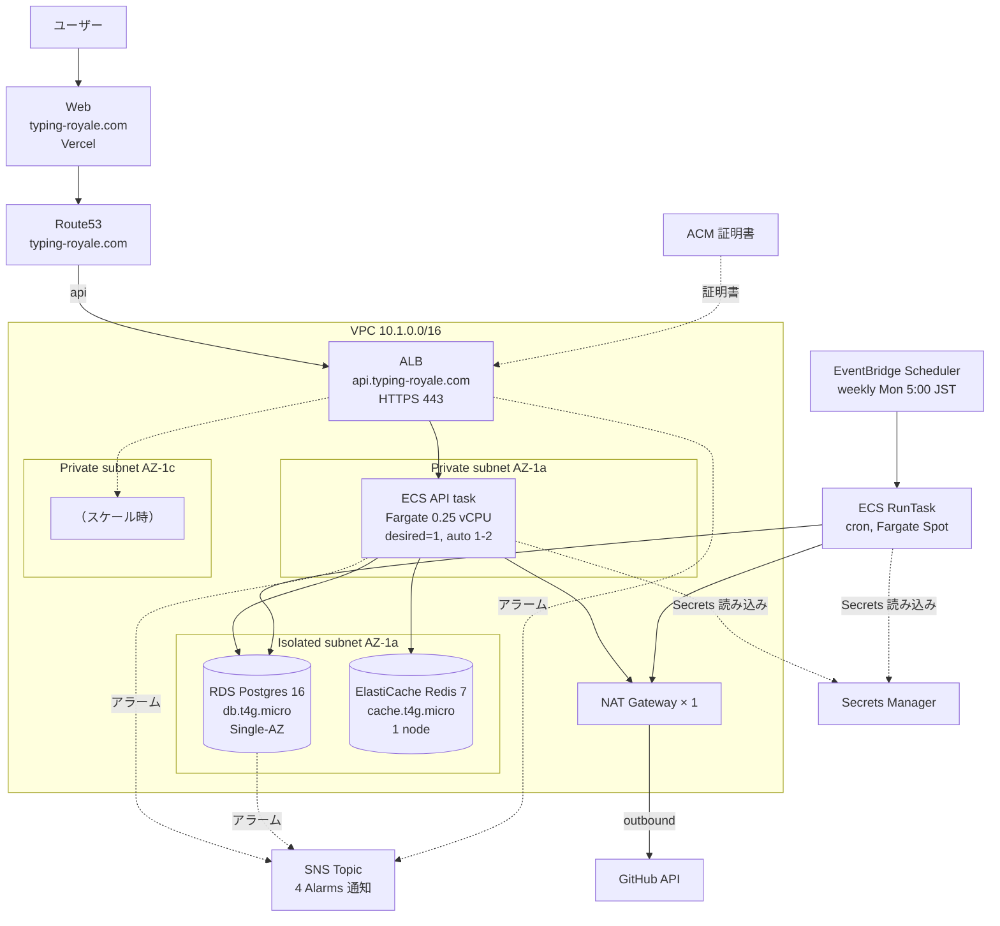
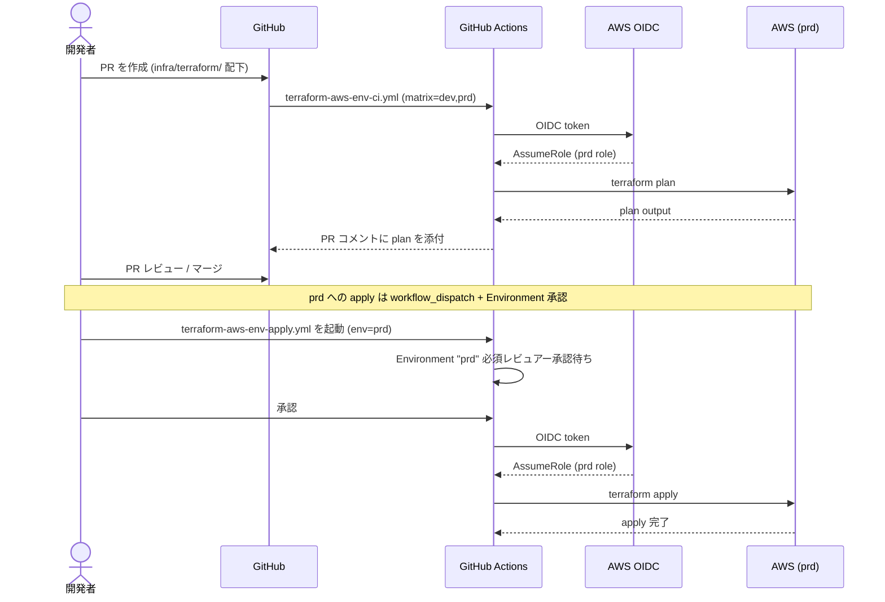

# 本番環境 (prd) の Terraform 構築

`infra/terraform/aws/env/prd/` を新設し、AWS 上に typing-royale の本番環境を構築する。dev 環境（`aws/env/dev/`）の構造を踏襲しつつ、**HTTPS 化・削除保護・最低限の監視** など本番として最低限必要な要素だけを追加する。

**MVP リリース時のコストを最優先**にする方針のため、Multi-AZ / 冗長化 / Reserved Capacity 等は **後追い** とし、初期はほぼ dev に近い構成 + HTTPS + 削除保護で立ち上げる。

このドキュメントは **仕様（What）** と **設計（How）** を分けて記述する：

- **仕様**：本番として最低限満たすべき要件（HTTPS / 削除保護 / バックアップ / 監視最小）
- **設計**：dev との差分、各 AWS リソースの構成、コスト試算、将来のアップグレード経路

## 関連 spec

- [`../../../infra/terraform/CLAUDE.md`](../../../infra/terraform/CLAUDE.md) — Terraform 全体の構造とコマンド・運用フロー
- [`../../../infra/terraform/README.md`](../../../infra/terraform/README.md) — bootstrap / account / env の 3 層構造と初回手順
- 既存実装: `infra/terraform/aws/env/dev/main.tf` — dev 環境のリファレンス
- `infra/terraform/aws/modules/` — 再利用される module 群（vpc / alb / ecs-cluster / ecs-workload / rds / elasticache / acm / route53 / secrets）

## 目次

- [現状分析](#現状分析)
- [コスト最適化方針（重要）](#コスト最適化方針重要)
- [本番環境の確認事項（要レビュー）](#本番環境の確認事項要レビュー)
- [仕様](#仕様)
  - [本番として必須の要件](#本番として必須の要件)
  - [HTTPS](#https)
  - [バックアップとリストア](#バックアップとリストア)
  - [削除保護](#削除保護)
  - [シークレット管理](#シークレット管理)
  - [運用窓・メンテナンス](#運用窓メンテナンス)
- [設計](#設計)
  - [dev との差分一覧](#dev-との差分一覧)
  - [dev 環境からの修正事項（先行整理）](#dev-環境からの修正事項先行整理)
  - [VPC ネットワーク設計](#vpc-ネットワーク設計)
  - [ALB + ACM + Route53](#alb--acm--route53)
  - [ECS workload 一覧](#ecs-workload-一覧)
  - [RDS（Single-AZ で開始）](#rdssingle-az-で開始)
  - [ElastiCache（1 ノードで開始）](#elasticache1-ノードで開始)
  - [Secrets Manager / 環境変数](#secrets-manager--環境変数)
  - [cron アプリの実行方式](#cron-アプリの実行方式)
  - [Web (Next.js) のホスティング方針](#web-nextjs-のホスティング方針)
  - [CloudWatch Logs のコスト対策（重要）](#cloudwatch-logs-のコスト対策重要)
  - [監視・アラート（最小）](#監視アラート最小)
  - [CI/CD 連携](#cicd-連携)
- [必要な AWS リソース](#必要な-aws-リソース)
- [step 一覧](#step-一覧)
- [想定コスト試算](#想定コスト試算)
- [将来のアップグレード経路](#将来のアップグレード経路)
- [フロー図](#フロー図)

---

## 現状分析

### bootstrap / account の状態

| 層 | 状態 | 内容 |
|---|---|---|
| `aws/bootstrap/` | ✅ 適用済み | S3 (tfstate) + DynamoDB (state lock)。**prd でも共有** |
| `aws/account/` | ✅ 適用済み | OIDC Provider + GitHub Actions IAM role (`dev` 用) + ECR 3 本（api / worker / migration）。**prd 用 role を追加適用要** |
| `aws/env/dev/` | ✅ 適用済み | 1 AZ・最小コスト構成。一部に project-template 由来の調整漏れあり（後述） |

### dev 環境に残っている調整漏れ

`aws/env/dev/main.tf` は `project-template` から移植したまま typing-royale 固有に整えきれていない箇所がある。**prd 構築前に dev 側も整える方が望ましい**：

| 項目 | 現状 | 望ましい状態 |
|---|---|---|
| `variables.tf` の `project_name` default | `"project-template"` | `"typing-royale"` |
| Secrets の `secret_keys` | `GOOGLE_*` `LIVEKIT_*` を含む | `GITHUB_*` 追加、`LIVEKIT_*` 削除 |
| `ecs_worker` モジュール | project-template の BullMQ matching-worker 用 | typing-royale には **常駐 worker は無い**（代わりに `cron` あり） |
| RDS の `db_name` / `master_username` | `project_template` / `projecttemplate` | `typing_royale` / `typingroyale` |
| `app_secrets` の name | `/${name_prefix}/app` (= `/project-template-dev/app`) | `/typing-royale-dev/app` |

これらは **prd 構築の前に dev 側で整える** か、**prd は最初から typing-royale 用で書き、dev はあとで合わせる**かを選ぶ必要がある（後述「dev 環境からの修正事項」）。

---

## コスト最適化方針（重要）

MVP リリース時点ではユーザー数が小さく、可用性より **「サービスが動く最低構成 + 必要なときに即座にスケールできる準備」** を優先する。本 spec での主要な選択：

| 観点 | 採用方針 | 理由 |
|---|---|---|
| **RDS Multi-AZ** | ❌ **採用しない**（Single-AZ から開始） | Multi-AZ は instance 料金が倍。MAU 数百〜数千の段階では Single-AZ で十分。AZ 障害時のダウンタイム（〜30 分）は受容 |
| **ElastiCache Multi-AZ** | ❌ **採用しない**（1 ノードから開始） | Redis は session / ticket 用途で、消えても再ログイン or 再プレイで復旧可能。データロストの実害が小さい |
| **ECS API 常駐数** | **1 task**（auto-scaling 1〜2） | 平時 1 task で動かし、CPU/Memory 閾値超でスケールアウト。コストとリスクのバランス |
| **NAT Gateway** | **1 個（コスト優先）** | 2 個運用の HA は MVP では過剰 |
| **CloudWatch Logs** | **3 日保持 + WARN 以上** | ECS 安価ログ環境を維持（後述「CloudWatch Logs のコスト対策」） |
| **HTTPS / ACM / Route53** | ✅ **採用する**（無料・準無料） | ACM は無料、Route53 は ~$1/月。**本番でこれを省略する理由は無い** |
| **削除保護** | ✅ **採用する**（コスト 0） | 誤 destroy 対策。料金はかからない |
| **バックアップ 7 日** | ✅ **採用する**（dev と同じ） | 30 日は MVP には過剰。7 日で十分（snapshot は無料分まで） |
| **Fargate Spot for cron** | ✅ **採用する**（70% off） | cron は中断耐性あり。再実行で復旧可能 |
| **VPC Endpoint** | ❌ **採用しない**（最初は NAT で） | endpoint × 3 で月 $22。MVP の通信量では NAT が安い |
| **WAF / CloudFront** | ❌ **採用しない** | 攻撃検知必要になってから |

**狙う総額: 月 $80 前後**（NAT $32、ALB $22 が固定で約 $54、残り $25 で全部）

---

## 本番環境の確認事項（要レビュー）

実装に入る前に **以下を確認したい**。推奨案を併記してあるので「OK」または「他案」で返事をいただければ設計確定 → 詳細 step 作成に進む。

| # | 項目 | 推奨案（コスト優先） | 代替案 |
|---|---|---|---|
| Q1 | **ドメイン名** | (要指定) 例: `typing-royale.com` / `api.typing-royale.com` | サブドメイン構成、複数 SAN 等は確定情報を待つ |
| Q2 | **Route53 Hosted Zone** | 既存 Hosted Zone がある前提（無ければ新規作成を step に追加） | レジストラ移管含めるなら別途検討 |
| Q3 | **Web (Next.js) のホスト先** | **Vercel** 等の外部 PaaS で運用（dev 同様 AWS には載せない） | AWS Amplify Hosting / CloudFront+S3 / ECS Fargate も可（コスト・運用負荷が増える） |
| Q4 | **NAT Gateway の方式** | **NAT Gateway 1 個（~$32/月）** | NAT インスタンス t4g.nano（~$3/月、運用負荷あり）でさらに $29/月削減可能 |
| Q5 | **RDS インスタンスクラス** | **`db.t4g.micro` Single-AZ**, 20GB gp3（dev と同じ） | MAU 拡大時に `db.t4g.small` Multi-AZ へ昇格 |
| Q6 | **ElastiCache** | **`cache.t4g.micro` × 1 ノード**, TLS in-transit ON | Multi-AZ × 2 ノードは後追い。最初は HA なし |
| Q7 | **ECS API の常駐数** | **`desired_count = 1`** + auto-scaling 1〜2（CPU 70% で +1） | 常時 2 task は安心だが $9/月余分にかかる |
| Q8 | **cron (`apps/cron`) の実行方式** | **EventBridge Scheduler + ECS RunTask + Fargate Spot**（週次、$0.1/月程度） | Fargate 通常価格でも数百円増程度 |
| Q9 | **監視・アラート範囲（MVP）** | ALB 5xx / ECS task 異常停止 / RDS CPU 80% / RDS Storage 80% を CloudWatch Alarm → SNS → メール（4 個 ~$0/月） | Datadog / Sentry 等は MVP 後 |
| Q10 | **CloudWatch Logs 保持** | **3 日（dev と同じ）** + ロガーは prd で **WARN 以上のみ**出力（後述） | 7 日 / 30 日に伸ばすほど Storage コストが線形に増える |
| Q11 | **dev の調整漏れ整理タイミング** | **prd 構築前に dev も typing-royale 用に揃える別 PR を先行** | prd だけ typing-royale 用に書き dev は後追い（dev/prd の変数差分が増えるので非推奨） |
| Q12 | **Bootstrap S3 の bucket 名** | `aws/bootstrap/variables.tf` を確認して typing-royale 命名になっているか要点検 | — |
| Q13 | **削除保護 / final snapshot** | RDS は `deletion_protection = true` / `skip_final_snapshot = false`、ALB も `enable_deletion_protection = true`（**無料**） | コスト関係なく本番では推奨 |

---

## 仕様

### 本番として必須の要件

コスト優先でも **以下は省略しない**：

- HTTPS（ACM は無料）
- RDS 削除保護 + final snapshot（料金 $0）
- ALB 削除保護（料金 $0）
- Secrets Manager の `recovery_window_in_days >= 7`（誤削除復旧、料金 $0）
- RDS 自動バックアップ 7 日保持（無料枠：DB と同サイズまで）
- 最低限のアラート（ALB 5xx, ECS task running, RDS CPU/Storage）

### HTTPS

- ACM で証明書発行（DNS 検証、**無料**）
- Route53 で DNS 管理（A レコード Alias → ALB、~$1/月）
- ALB に HTTPS listener (443) + HTTP→HTTPS リダイレクト

### バックアップとリストア

- **RDS**: 自動バックアップ **7 日保持**、final snapshot 必須、PITR 有効
- **Redis**: 日次 snapshot を **1 日保持**（rdb 形式、cost を抑えるため最小）
- **tfstate**: S3 versioning ON (bootstrap で構成済み)

### 削除保護

- **RDS**: `deletion_protection = true` / `skip_final_snapshot = false`
- **ALB**: `enable_deletion_protection = true`
- **ECR ライフサイクル**: 過去 10 件のタグ付きイメージ保持（dev と同じ）
- **Secrets Manager**: `recovery_window_in_days = 7`（dev は 0、prd は誤削除復旧のため 7）

### シークレット管理

dev と同じ「**箱だけ Terraform / 値は手動 or seed-secrets スクリプト**」方針を踏襲：

- Terraform は Secrets Manager の secret（容器）と初回 JWT（自動生成）だけ管理
- 以降の rotate は Secrets Manager Console / CLI / `scripts/seed-secrets.sh` で手動投入
- `lifecycle.ignore_changes = [secret_string]` で再 apply 時の上書きを防止
- prd は `recovery_window_in_days = 7`（dev は 0）

### 運用窓・メンテナンス

ユーザーの少ない深夜帯（JST 02:00-05:00）に集中：

- RDS バックアップ窓: **JST 02:00-04:00**（= UTC 17:00-19:00）
- RDS メンテナンス窓: **JST 日曜 04:00-06:00**（= UTC 日曜 19:00-21:00）
- Redis snapshot 窓: **JST 03:00-04:00**（= UTC 18:00-19:00）
- Redis メンテナンス窓: **JST 月曜 04:00-05:00**（= UTC 月曜 19:00-20:00）
- cron 実行: **JST 月曜 05:00**（メンテ窓が空いた直後）

---

## 設計

### dev との差分一覧

**コスト優先のため差分は最小化**。HTTPS / 削除保護 / バックアップ強化 / 監視 だけ追加。

| カテゴリ | dev | prd（コスト優先） |
|---|---|---|
| VPC CIDR | `10.0.0.0/16` | `10.1.0.0/16` |
| AZ 数 | 2 | 2（変えない） |
| NAT Gateway | 1 個 | **1 個**（変えない、Q4 で確認） |
| HTTPS | ❌ HTTP only | ✅ **ACM + Route53 + HTTPS** |
| RDS | `db.t4g.micro`, 20GB gp3, **Single-AZ**, backup 7 日, deletion_protection=false | `db.t4g.micro`, 20GB gp3, **Single-AZ**, backup 7 日, **deletion_protection=true** |
| ElastiCache | `cache.t4g.micro`, 1 node, snapshot なし, TLS なし | `cache.t4g.micro`, **1 node**, snapshot 1 日, **TLS ON** |
| ECS API service | `desired_count = 1` | **`desired_count = 1`** + **auto-scaling 1〜2** |
| ECS worker | 別アプリ用に存在 | **削除**（typing-royale には常駐 worker なし） |
| cron | 未配置 | **EventBridge Scheduler + ECS RunTask + Fargate Spot** で週次実行 |
| Secrets | `recovery_window = 0` | `recovery_window = 7` |
| Web hosting | 未配置 | **未配置（Vercel 等の外部運用）**（Q3 で確認） |
| ECR ライフサイクル | tagged 10 件 | tagged 10 件（同じ） |
| CloudWatch ログ保持 | 3 日 | **3 日（同じ）** + prd で WARN+ 出力強制 |
| 監視 Alarm | なし | **CloudWatch Alarm 4 個 + SNS メール通知** |
| ALB | HTTP only, deletion_protection なし | **HTTPS, deletion_protection=true** |
| 名前 prefix | `project-template-dev` | `typing-royale-prd` |

### dev 環境からの修正事項（先行整理）

prd 構築前に **dev 側も typing-royale 用に整える別 PR** を先行することを推奨（Q11 で確認）。以下を整える：

1. `aws/env/dev/variables.tf`: `project_name` default を `"typing-royale"` に
2. `aws/env/dev/main.tf` の secret_keys を typing-royale 用に整理:
   - 残す: `DATABASE_URL` / `REDIS_HOST` / `REDIS_PORT` / `REDIS_DB` / `JWT_*` / `GOOGLE_CLIENT_ID` / `GOOGLE_CLIENT_SECRET` / `NODE_ENV` / `PORT` / `FRONTEND_URL`
   - 追加: `GITHUB_CLIENT_ID` / `GITHUB_CLIENT_SECRET` / `GH_API_TOKEN`（cron 用）
   - 削除: `LIVEKIT_HOST` / `LIVEKIT_API_KEY` / `LIVEKIT_API_SECRET`
3. `ecs_worker` モジュール呼び出しを削除（typing-royale には常駐 worker 無し）
4. RDS の `db_name` を `typing_royale` に、`master_username` を `typingroyale` に
5. ECR の account 側もチェック: `account/ecr.tf` で `worker` リポジトリ削除、`cron` 用 ECR を追加

これらは prd と独立した PR で整える前提。本 spec の step1 はこの整理を前提として進める。

### VPC ネットワーク設計

dev と同じ 3 階層（public / private / isolated）構造を踏襲：

```
VPC 10.1.0.0/16
├── public-1a   10.1.1.0/24    ALB / NAT Gateway
├── public-1c   10.1.2.0/24    ALB
├── private-1a  10.1.11.0/24   ECS task
├── private-1c  10.1.12.0/24   ECS task
├── isolated-1a 10.1.21.0/24   RDS / ElastiCache
└── isolated-1c 10.1.22.0/24   RDS / ElastiCache（未使用、将来用に確保）
```

セキュリティグループは dev と同じ alb / ecs / rds / redis の 4 種類。

### ALB + ACM + Route53

```
Route53 Hosted Zone (typing-royale.com)
└── A record alias (api.typing-royale.com) → ALB
└── A record (typing-royale.com) → Web (Vercel CNAME)

ACM 証明書 (api.typing-royale.com)
└── ALB HTTPS listener (443) で参照

ALB:
- HTTP listener (80): HTTPS にリダイレクト (301)
- HTTPS listener (443): API ECS service へ
- HTTPS listener (9000): Blue/Green テスト用（IP allowlist 推奨）
- enable_deletion_protection = true
```

### ECS workload 一覧

| workload | 種別 | desired_count | Blue/Green | 説明 |
|---|---|---|---|---|
| `api` | Service | **1**（+ auto-scaling 1〜2、CPU 70% で +1） | ✅ | Express API |
| `migration` | Task only (Service なし) | — | — | Prisma migrate deploy、GHA から RunTask で起動 |
| `cron` | Task only + EventBridge Scheduler | — | — | apps/cron を週次起動、**Fargate Spot** |

dev に存在した `worker` は **削除**（typing-royale には常駐 worker 無し）。

### RDS（Single-AZ で開始）

```hcl
module "rds" {
  source = "../../modules/rds"

  name              = "${local.name_prefix}-db"
  engine_version    = "16.6"
  instance_class    = "db.t4g.micro"       # dev と同じ
  allocated_storage = 20                   # dev と同じ
  storage_type      = "gp3"
  db_name           = "typing_royale"
  master_username   = "typingroyale"

  subnet_ids         = [for k in local.isolated_subnet_keys : module.vpc.subnets[k].id]
  security_group_ids = [module.vpc.security_groups["rds"].id]

  multi_az                = false          # ← コスト優先
  backup_retention_period = 7              # 無料枠内

  backup_window      = "17:00-19:00"       # JST 02:00-04:00
  maintenance_window = "sun:19:00-sun:21:00"  # JST 日曜 04:00-06:00

  deletion_protection = true               # ← 本番固有（無料）
  skip_final_snapshot = false              # ← 本番固有（無料）

  tags = local.common_tags
}
```

> **`db.t4g.micro` Single-AZ は dev と同じハード**だが、prd では `deletion_protection` と `skip_final_snapshot` が違うのと、Secrets recovery window で差を付ける。

### ElastiCache（1 ノードで開始）

```hcl
module "elasticache" {
  source = "../../modules/elasticache"

  name           = "${local.name_prefix}-redis"
  engine_version = "7.1"
  node_type      = "cache.t4g.micro"       # dev と同じ

  subnet_ids         = [for k in local.isolated_subnet_keys : module.vpc.subnets[k].id]
  security_group_ids = [module.vpc.security_groups["redis"].id]

  num_cache_clusters         = 1           # ← コスト優先（HA なし）
  automatic_failover_enabled = false
  multi_az_enabled           = false

  snapshot_retention_limit = 1             # 最小コストで snapshot あり
  transit_encryption_enabled = true        # ← TLS は ON（無料、習慣のため）

  snapshot_window    = "18:00-19:00"       # JST 03:00-04:00
  maintenance_window = "mon:19:00-mon:20:00"  # JST 月曜 04:00-05:00

  tags = local.common_tags
}
```

> TLS in-transit を有効にすると Node.js Redis クライアントの接続設定で `tls: {}` オプションが必要。`packages/redis` 側の対応も確認する（typing-royale はおそらく `@repo/redis` で集約）。

### Secrets Manager / 環境変数

`secret_keys` を typing-royale 用に整理（dev の整理タイミング Q11 と連動）：

```hcl
secret_keys = [
  "DATABASE_URL",
  "REDIS_HOST", "REDIS_PORT", "REDIS_DB",
  "REDIS_TLS",                              # ← TLS ON のため追加
  "JWT_ACCESS_SECRET", "JWT_REFRESH_SECRET",
  "JWT_ACCESS_EXPIRATION", "JWT_REFRESH_EXPIRATION",
  "GOOGLE_CLIENT_ID", "GOOGLE_CLIENT_SECRET",
  "GITHUB_CLIENT_ID", "GITHUB_CLIENT_SECRET",  # ← 追加
  "FRONTEND_URL", "NODE_ENV", "PORT",
  "LOG_LEVEL",                              # ← 後述（prd では warn）
  "GH_API_TOKEN",                           # ← cron 用
]
```

### cron アプリの実行方式

```
EventBridge Scheduler (毎週月曜 05:00 JST = UTC 月曜 20:00)
  └── ECS RunTask (Fargate Spot)
       └── cron task definition (apps/cron の Docker image)
            └── crawler:run:typescript を実行
                 └── DB に新規 crawled_repos / problems を投入
```

**Fargate Spot で 70% off**。cron は失敗しても次週まで影響軽微なので Spot 中断耐性問題なし。

実装：
- `aws/modules/ecs-workload` を `create_service = false` で呼び出し、cron 用 task definition だけ作る
- 新規 module 不要：`aws_scheduler_schedule` リソースを直接 main.tf に書く
- 必要に応じて `apps/cron` 用の ECR を `account/ecr.tf` に追加（migration 専用 ECR を流用するパターンもあり、Dockerfile 構造次第）

### Web (Next.js) のホスティング方針

Q3 で「Vercel 等の外部運用」を推奨。dev 環境にも web は無いので、本 spec の範囲外とする。**AWS に web も載せる方針に変更する場合は別 spec で追加**。

Vercel 運用の場合：
- Route53 から CNAME（または ALIAS）で `typing-royale.com` を Vercel に向ける
- ALB は `api.typing-royale.com` のみ受ける（CORS で web のオリジンを許可）

### CloudWatch Logs のコスト対策（重要）

CloudWatch Logs はうっかりすると **API のメインコストになり得る**。typing-royale はリクエストごとに数 KB のログを吐くので、対策を **コード側と Terraform 側の両方** で打つ。

#### 料金の構造

| 項目 | 単価 | 試算（仮に 1 GB/月 取り込んだ場合） |
|---|---|---|
| **取り込み（Ingestion）** | $0.50/GB | $0.50 |
| **保存（Storage）** | $0.03/GB/月 | $0.03（3 日保持） |
| **取り出し（Scan / Insights クエリ）** | $0.005/GB | クエリ時のみ |

**支配的なのは取り込み**。出力量を減らすことが最大のコスト対策。

#### typing-royale 側で打つ対策（コード）

1. **prd の LOG_LEVEL は `"warn"`** にする（`packages/logger` の `pino` レベル切替）
   - dev/local は `"debug"` または `"info"`
   - prd は `"warn"` 以上のみ → 通常リクエストでのログは **エラー時のみ** 出力
2. **request body / response body をログに出さない**（既存方針を継続）
3. **構造化ログ**（JSON）で、エラー時のスタックトレース以外は短文に
4. **健常リクエストの access log は省略**（必要なら ALB access log を S3 に出して安価に保管）
5. cron / migration は実行回数が少ないので INFO で OK

#### Terraform 側で打つ対策

1. **CloudWatch Log Group の retention を 3 日**（dev と同じ）
2. log group ごとに独立（api / migration / cron）→ 不要な group が出ても見える
3. （オプション）ALB access log を **S3 に出す**（CloudWatch Logs に出さない）
4. （将来）Log volume が 5 GB/月を超えたら **Subscription Filter → Kinesis Firehose → S3** で安価層に移送

#### 想定取り込み量

- API: 1 req あたり 1 行 ~200 byte。WARN 以上なら平常時はほぼ出ない。月 ~100 MB と仮定 → **$0.05/月**
- migration: 1 回数 KB × 月数回 → **$0/月** 相当
- cron: 1 回 ~50 KB × 4 回/月 → **$0/月** 相当

**合計 ~$0.1/月以下** に抑えるのが目標。

### 監視・アラート（最小）

CloudWatch Alarm を **4 つ** 設定し、SNS Topic 経由でメール通知（**Alarm 4 個 + SNS は実質無料枠内**）：

1. **ALB 5xx error rate**: 5 分間で 10 件超で Alarm
2. **ECS API task RunningCount**: RunningCount < DesiredCount で Alarm
3. **RDS CPU**: 5 分平均 80% 超で Alarm
4. **RDS Free Storage**: 残り 20% 以下で Alarm

実装は `aws/modules/cloudwatch-alarms` を新設し、`aws_cloudwatch_metric_alarm` をまとめる。SNS Topic と subscription（メール）も同モジュールで管理。

### CI/CD 連携

| 層 | CI (PR で plan) | CD (手動 apply) |
|---|---|---|
| `bootstrap` | なし | ローカルで apply |
| `account` | `terraform-aws-account-ci.yml`（既存） | `terraform-aws-account-apply.yml`（既存） |
| `env/dev` | `terraform-aws-env-ci.yml`（既存） | `terraform-aws-env-apply.yml`（既存、env=dev） |
| **`env/prd`** | **`terraform-aws-env-ci.yml` を prd にも拡張**（matrix 化 or 別ファイル） | **`terraform-aws-env-apply.yml` を prd にも対応**（workflow_dispatch で env 選択） |

GHA からの assume には **prd 用の IAM role** を新規発行する必要がある（`account/github_oidc.tf` 拡張）。GitHub Environment `prd` を作成し、`AWS_ROLE_ARN` シークレットを登録 + **必須レビュアー承認**を強制する。

---

## 必要な AWS リソース

| カテゴリ | リソース |
|---|---|
| ネットワーク | VPC / 6 subnet / NAT Gateway × 1 / IGW / Route Table |
| ALB | ALB / Target Group × 2（Blue/Green）/ HTTPS listener / HTTP→HTTPS redirect listener / Test listener |
| ACM | 証明書 (api.typing-royale.com) |
| Route53 | A record alias (api → ALB) / 必要に応じて typing-royale.com の A |
| ECS | Cluster / Service (api) / Task Definition × 3（api, migration, cron）/ Task Execution Role |
| RDS | DB Subnet Group / Parameter Group / Postgres 16.6 instance (**Single-AZ**) |
| ElastiCache | Subnet Group / Replication Group (**1 node**, TLS ON) |
| Secrets Manager | `/typing-royale-prd/app` |
| EventBridge | Scheduler Rule (cron weekly) + IAM Role |
| CloudWatch | Log Group × 3 (api / migration / cron、**3 日保持**) / Alarm × 4 |
| SNS | Topic + Email Subscription |
| IAM | account/ 経由で prd 用 GitHub Actions Role 追加 |
| ECR | account/ 経由で（必要なら）cron 用 ECR 追加、worker 削除 |

---

## step 一覧

実装は以下の順で進める。各 step は独立した PR を想定。

| step | タイトル | 概要 | ファイル |
|---|---|---|---|
| **step1** | dev 環境を typing-royale 用に整える（先行） | project_name / secret_keys / worker 削除 / DB 名 整理 | [`./step1-align-dev-with-typing-royale.md`](./step1-align-dev-with-typing-royale.md) |
| **step2** | account 層を prd 対応 | prd 用 IAM role 追加、ECR 整理（worker 削除、cron 追加） | [`./step2-account-prd-role.md`](./step2-account-prd-role.md) |
| **step3** | env/prd ベース（VPC + Secrets + RDS + ElastiCache） | dev を踏襲、削除保護のみ追加 | [`./step3-env-prd-base.md`](./step3-env-prd-base.md) |
| **step4** | env/prd の ALB + ACM + Route53 (HTTPS) | ドメインに紐付けて HTTPS 化 | [`./step4-https-with-acm-route53.md`](./step4-https-with-acm-route53.md) |
| **step5** | env/prd の ECS API service (1 task + auto-scaling) | Blue/Green デプロイ込みで起動 | [`./step5-ecs-api-service.md`](./step5-ecs-api-service.md) |
| **step6** | cron の定期実行 (EventBridge Scheduler + Fargate Spot) | apps/cron を週次起動 | [`./step6-cron-scheduler.md`](./step6-cron-scheduler.md) |
| **step7** | CloudWatch Alarms + SNS 通知 + ログ最適化 | 監視 MVP + LOG_LEVEL=warn の徹底 | [`./step7-monitoring-and-log-cost.md`](./step7-monitoring-and-log-cost.md) |
| **step8** | GHA workflow の prd 対応 | 既存 ci/apply ワークフローを prd 環境にも | [`./step8-cicd-prd-workflow.md`](./step8-cicd-prd-workflow.md) |

> step 1〜8 のうち、本 PR では README のみ作成。各 step の詳細は **設計が confirm された後** に別 PR で執筆する。

---

## 想定コスト試算

ap-northeast-1 リージョン、推奨案ベース、月額 USD：

| カテゴリ | 内訳 | 想定 |
|---|---|---|
| **NAT Gateway** | 1 個 × 24h × 30 日 + 通信 5GB 程度 | **~$32** |
| **ALB** | 1 個 + LCU 最小 | **~$22** |
| **ECS Fargate (api × 1 task)** | 0.25 vCPU × 0.5 GB × 1 × 24h × 30 日 | **~$9** |
| **RDS db.t4g.micro Single-AZ** | $0.024/h × 24h × 30 日 + 20GB gp3 | **~$20** |
| **ElastiCache cache.t4g.micro** | $0.022/h × 24h × 30 日 | **~$16** |
| **ACM** | 無料 | **$0** |
| **Route53** | 1 Hosted Zone | **~$1** |
| **CloudWatch Logs (3 日保持 + WARN 以上)** | api / migration / cron 合算 ~0.5 GB/月 | **~$0.3** |
| **CloudWatch Alarm + SNS** | Alarm 4 個（無料枠 10 個まで）+ SNS 数件 | **~$0** |
| **EventBridge Scheduler** | 月 4 回起動 | **~$0** |
| **Secrets Manager** | 1 secret | **~$0.4** |
| **ECR** | ~5GB（10 tagged image） | **~$0.5** |
| **データ転送** | NAT outbound / ALB egress 想定 30GB | **~$3** |
| **合計** | | **~$104/月** |

NAT インスタンス（Q4 で代替案を選んだ場合）採用なら **~$75/月** まで下げられる。

参考: dev 環境のコスト試算（Single-AZ + HTTPS 無し + 監視無し）と比較すると prd は **+$25 程度** で済む。

---

## 将来のアップグレード経路

MAU や負荷が伸びたら以下の順で増強する。Terraform 上は **変数値を変えるだけ** で対応できるように初回から構造化しておく。

| トリガー | 対応 | 想定追加コスト |
|---|---|---|
| RDS CPU が 50% を慢性的に超えた | `instance_class = db.t4g.small` に昇格 | +$13/月 |
| AZ 障害でのダウンタイムを許容できなくなった | `multi_az = true` に変更（apply で自動 failover 化） | RDS 倍 → +$20/月 |
| Redis hit rate が低下 / メモリ逼迫 | `node_type = cache.t4g.small` に昇格 + Multi-AZ 化 | +$30/月 |
| API レスポンス遅延の慢性化 | `desired_count = 2`、auto-scaling max を 4 に | +$9〜18/月 |
| NAT 通信量が月 100 GB を超えた | VPC Endpoint（Secrets / ECR / Logs）を追加 | +$22/月、NAT 減 |
| ログを 7 日以上保持したい | Log Group retention を伸ばす + 大量出力ならば S3 移送を検討 | 数 $/月 |
| WAF が必要になった | ALB に WAF アタッチ | +$8/月 + 100 万リクエストあたり $1 |
| マルチリージョン DR が必要になった | 別 region に env/prd-disaster-recovery/ を新設 | プラン次第 |

---

## フロー図

### 全体構成図（コスト優先版）



### CI/CD フロー


