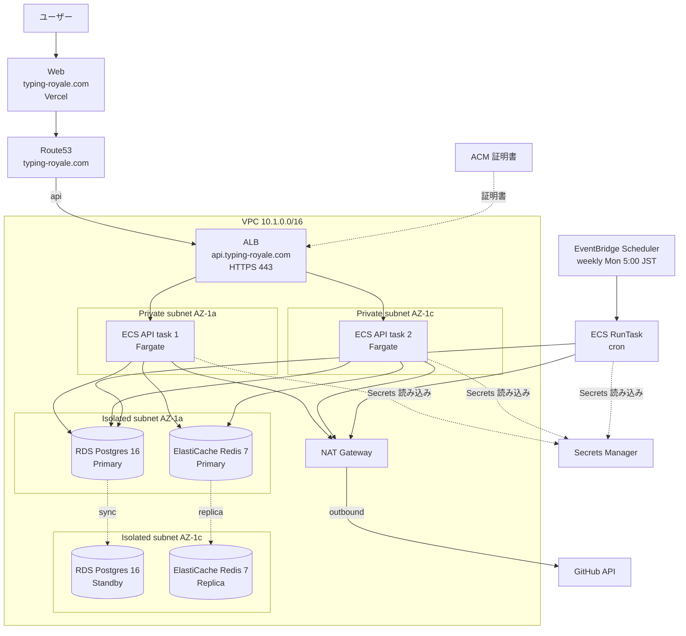
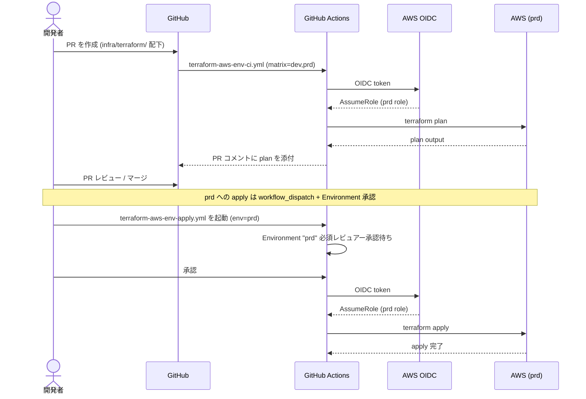

# 本番環境 (prd) の Terraform 構築

`infra/terraform/aws/env/prd/` を新設し、AWS 上に typing-royale の本番環境を構築する。dev 環境（`aws/env/dev/`）の構造を踏襲しつつ、**Multi-AZ / HTTPS / バックアップ強化 / 削除保護** など本番向けの設定差分を加える。

このドキュメントは **仕様（What）** と **設計（How）** を分けて記述する：

- **仕様**：本番環境として満たすべき可用性・セキュリティ・運用上の要件
- **設計**：dev との差分、各 AWS リソースの構成、CI/CD・bootstrap 手順

## 関連 spec

- [`../../../infra/terraform/CLAUDE.md`](../../../infra/terraform/CLAUDE.md) — Terraform 全体の構造とコマンド・運用フロー
- [`../../../infra/terraform/README.md`](../../../infra/terraform/README.md) — bootstrap / account / env の 3 層構造と初回手順
- 既存実装: `infra/terraform/aws/env/dev/main.tf` — dev 環境のリファレンス
- `infra/terraform/aws/modules/` — 再利用される module 群（vpc / alb / ecs-cluster / ecs-workload / rds / elasticache / acm / route53 / secrets）

## 目次

- [現状分析](#現状分析)
- [本番環境の確認事項（要レビュー）](#本番環境の確認事項要レビュー)
- [仕様](#仕様)
  - [可用性目標 (SLO)](#可用性目標-slo)
  - [HTTPS 必須](#https-必須)
  - [バックアップとリストア](#バックアップとリストア)
  - [削除保護](#削除保護)
  - [シークレット管理](#シークレット管理)
  - [運用窓・メンテナンス](#運用窓メンテナンス)
- [設計](#設計)
  - [dev との差分一覧](#dev-との差分一覧)
  - [dev 環境からの修正事項（先行整理）](#dev-環境からの修正事項先行整理)
  - [VPC ネットワーク設計](#vpc-ネットワーク設計)
  - [ALB + ACM + Route53](#alb--acm--route53)
  - [ECS workload 一覧](#ecs-workload-一覧)
  - [RDS Multi-AZ](#rds-multi-az)
  - [ElastiCache Multi-AZ + 自動フェイルオーバー](#elasticache-multi-az--自動フェイルオーバー)
  - [Secrets Manager / 環境変数](#secrets-manager--環境変数)
  - [cron アプリの実行方式](#cron-アプリの実行方式)
  - [Web (Next.js) のホスティング方針](#web-nextjs-のホスティング方針)
  - [監視・アラート（MVP）](#監視アラートmvp)
  - [CI/CD 連携](#cicd-連携)
- [必要な AWS リソース](#必要な-aws-リソース)
- [step 一覧](#step-一覧)
- [想定コスト試算](#想定コスト試算)
- [フロー図](#フロー図)
- [MVP 対象外（将来検討）](#mvp-対象外将来検討)

---

## 現状分析

### bootstrap / account の状態

| 層 | 状態 | 内容 |
|---|---|---|
| `aws/bootstrap/` | ✅ 適用済み | S3 (tfstate) + DynamoDB (state lock)。**prd でも共有** |
| `aws/account/` | ✅ 適用済み | OIDC Provider + GitHub Actions IAM role (`dev` 用) + ECR 3 本（api / worker / migration）。**prd 用 role を追加適用要** |
| `aws/env/dev/` | ✅ 適用済み | 1 AZ・最小コスト構成。一部に project-template 由来の調整漏れあり（後述） |

### dev 環境に残っている調整漏れ

`aws/env/dev/main.tf` は `project-template` から移植したまま typing-royale 固有に整えきれていない箇所がある。**prd 構築前に dev 側も整える方が望ましい**：

| 項目 | 現状 | 望ましい状態 |
|---|---|---|
| `variables.tf` の `project_name` default | `"project-template"` | `"typing-royale"` |
| Secrets の `secret_keys` | `GOOGLE_CLIENT_ID` `GOOGLE_CLIENT_SECRET` `LIVEKIT_*` を含む | typing-royale の OAuth は GitHub + Google の二段構え、LIVEKIT は使わない |
| `ecs_worker` モジュール | project-template の BullMQ matching-worker 用 | typing-royale には **常駐 worker は無い**（代わりに `cron` あり） |
| RDS の `db_name` / `master_username` | `project_template` / `projecttemplate` | `typing_royale` / `typingroyale` |
| `app_secrets` の name | `/${name_prefix}/app` (= `/project-template-dev/app`) | `/typing-royale-dev/app` |

これらは **prd 構築の前に dev 側で整える** か、**prd は最初から typing-royale 用で書き、dev はあとで合わせる**かを選ぶ必要がある（後述「dev 環境からの修正事項」）。

### 本番として必要な追加リソース

dev に **存在しない / 大きく異なる** リソース：

- **ACM 証明書 + Route53 DNS**: HTTPS 必須
- **RDS Multi-AZ + バックアップ 30 日 + final snapshot**: HA + 誤削除復旧
- **ElastiCache Multi-AZ + 自動フェイルオーバー**: HA
- **ECS API service の `desired_count >= 2`**: タスク冗長性
- **NAT Gateway × 2 (AZ ごと)** または NAT × 1 + 単一障害点許容: 可用性とコストのトレードオフ
- **cron app の定期実行設定**: EventBridge Scheduler + ECS Run Task
- **CloudWatch Alarm + SNS 通知**: 障害検知

---

## 本番環境の確認事項（要レビュー）

実装に入る前に **以下を確認したい**。それぞれデフォルト推奨値を併記してあるので「OK」または「他案」で返事をいただければ設計確定 → 詳細 step 作成に進む。

| # | 項目 | 推奨案 | 代替案 / トレードオフ |
|---|---|---|---|
| Q1 | **ドメイン名** | (要指定) 例: `typing-royale.com` / `api.typing-royale.com` | サブドメイン構成、複数 SAN 等は確定情報を待つ |
| Q2 | **Route53 Hosted Zone** | 既存 Hosted Zone がある前提（無ければ新規作成を step に追加） | レジストラ移管含めるなら別途検討 |
| Q3 | **Web (Next.js) のホスト先** | **Vercel** 等の外部 PaaS で運用（現 dev 同様 AWS には載せない） | AWS Amplify Hosting / CloudFront+S3 / ECS Fargate も可（実装量と運用負荷が増える） |
| Q4 | **NAT Gateway 数** | **1 個（コスト優先）**。AZ 障害時に API outbound が止まるリスクは受容 | 2 個（HA、+ ~$30/月） |
| Q5 | **RDS インスタンスクラス** | **`db.t4g.small`** (2 vCPU / 2GB)、`gp3` 50GB | より小さく `db.t4g.micro` でスタートし監視次第で拡張 / または `db.t4g.medium`（高負荷想定時） |
| Q6 | **ElastiCache ノードタイプ / 構成** | **`cache.t4g.small`** × 2 ノード（Multi-AZ、自動フェイルオーバー、TLS in-transit ON） | コスト最優先なら 1 ノード（HA 無し） |
| Q7 | **ECS API の常駐数** | **`desired_count = 2`** + auto-scaling 2〜4 | 1 + auto-scaling 1〜3（最小コスト） |
| Q8 | **cron (`apps/cron`) の実行方式** | **EventBridge Scheduler + ECS RunTask** (1 週間に 1 度、`crawler:run:typescript` を実行) | ECS Service の Schedulable Task / Step Functions も可だが過剰 |
| Q9 | **監視・アラート範囲（MVP）** | ALB 5xx / ECS task 異常停止 / RDS CPU 80% / RDS storage 80% を CloudWatch Alarm → SNS → メール | Datadog / Sentry 等の外部 SaaS 連携は MVP 後 |
| Q10 | **コスト目安** | $80〜120/月（NAT 1 + RDS small + Redis small + ECS API 2 task + ECR + その他） | プラン次第で 1.5〜2 倍 |
| Q11 | **dev の調整漏れ整理タイミング** | **prd 構築前に dev も typing-royale 用に揃える別 PR を先行** | prd だけ typing-royale 用に書き dev は後追い（dev/prd の variables 差分が増えるので非推奨） |
| Q12 | **Bootstrap S3 の bucket 名** | `aws/bootstrap/variables.tf` を確認して typing-royale 命名になっているか要点検（既に正なら何もしない） | — |
| Q13 | **削除保護 / final snapshot** | RDS は `deletion_protection = true` / `skip_final_snapshot = false`、ALB も `enable_deletion_protection = true` | 開発確認の便宜上 `false` にする選択肢もあるが本番ではほぼ常時 `true` 推奨 |

---

## 仕様

### 可用性目標 (SLO)

- **API**: 月間 99.5% 以上の応答可能率（フェイルオーバー時のダウンタイム合計が月 ~3.5 時間まで）
- **DB**: RDS Multi-AZ の自動フェイルオーバー（通常 1〜2 分以内）
- **Redis**: ElastiCache Multi-AZ の自動フェイルオーバー（通常 30 秒〜2 分）
- **デプロイ**: ALB Blue/Green でゼロダウンタイム

### HTTPS 必須

- ACM で証明書発行（DNS 検証）
- Route53 で DNS 管理（A レコード Alias → ALB）
- ALB に HTTPS listener (443) + HTTP→HTTPS リダイレクト

### バックアップとリストア

- **RDS**: 自動バックアップ **30 日保持**、final snapshot 必須、PITR 有効
- **Redis**: 日次 snapshot を **7 日保持**（rdb 形式）
- **tfstate**: S3 versioning ON (bootstrap で構成済み)
- **データロストせず復旧可能であること** が本番要件

### 削除保護

- **RDS**: `deletion_protection = true` / `skip_final_snapshot = false`
- **ALB**: `enable_deletion_protection = true`
- **ECR ライフサイクル**: 過去 30 件のタグ付きイメージ保持（dev は 10 件、prd は復旧用に多めに保持）
- **Secrets Manager**: `recovery_window_in_days = 30`（誤削除から復旧可能）

### シークレット管理

dev と同じ「**箱だけ Terraform / 値は手動 or seed-secrets スクリプト**」方針を踏襲：

- Terraform は Secrets Manager の secret（容器）と初回 JWT（自動生成）だけ管理
- 以降の rotate は Secrets Manager Console / CLI / `scripts/seed-secrets.sh` で手動投入
- `lifecycle.ignore_changes = [secret_string]` で再 apply 時の上書きを防止
- prd は `recovery_window_in_days = 30`（dev は 0）

### 運用窓・メンテナンス

- RDS バックアップ窓: **JST 02:00-04:00**（= UTC 17:00-19:00）
- RDS メンテナンス窓: **JST 日曜 04:00-06:00**（= UTC 日曜 19:00-21:00）
- Redis snapshot 窓: **JST 03:00-04:00**（= UTC 18:00-19:00）
- Redis メンテナンス窓: **JST 月曜 04:00-05:00**（= UTC 月曜 19:00-20:00）
- cron 実行: **JST 月曜 05:00**（メンテ窓が空いた直後）

---

## 設計

### dev との差分一覧

| カテゴリ | dev | prd（推奨） |
|---|---|---|
| VPC CIDR | `10.0.0.0/16` | `10.1.0.0/16` |
| AZ 数 | 2 (`1a`, `1c`) | 2 (`1a`, `1c`) — 同じ |
| NAT Gateway | 1 個 | 1 個（コスト優先、Q4 で確認） |
| HTTPS | ❌ HTTP only | ✅ ACM + Route53 + HTTPS |
| RDS | `db.t4g.micro`, 20GB gp3, Single-AZ, backup 7 日, deletion_protection=false | `db.t4g.small`, 50GB gp3, **Multi-AZ**, backup 30 日, **deletion_protection=true** |
| ElastiCache | `cache.t4g.micro`, 1 node, snapshot なし, TLS なし | `cache.t4g.small`, **2 node + automatic_failover + multi_az**, snapshot 7 日, **TLS ON** |
| ECS API service | `desired_count = 1` | **`desired_count = 2`** + auto-scaling 2〜4 |
| ECS worker | 別アプリ用に存在 | **削除**（typing-royale には常駐 worker なし） |
| cron | 未配置 | **EventBridge Scheduler + ECS RunTask** で週次実行 |
| Secrets | `recovery_window = 0` | `recovery_window = 30` |
| Web hosting | 未配置 | **未配置（Vercel 等の外部運用）**（Q3 で確認） |
| ECR ライフサイクル | tagged 10 件 | tagged 30 件 |
| CloudWatch ログ保持 | 3 日 | **30 日** |
| 監視 Alarm | なし | **CloudWatch Alarm + SNS メール通知** |
| ALB | HTTP only, deletion_protection なし | **HTTPS, deletion_protection=true** |
| 名前 prefix | `project-template-dev` | `typing-royale-prd` |

### dev 環境からの修正事項（先行整理）

prd 構築前に **dev 側も typing-royale 用に整える別 PR** を先行することを推奨（Q11 で確認）。以下を整える：

1. `aws/env/dev/variables.tf`: `project_name` default を `"typing-royale"` に
2. `aws/env/dev/main.tf` の secret_keys を typing-royale 用に整理:
   - 残す: `DATABASE_URL` / `REDIS_HOST` / `REDIS_PORT` / `REDIS_DB` / `JWT_*` / `GOOGLE_CLIENT_ID` / `GOOGLE_CLIENT_SECRET` / `NODE_ENV` / `PORT` / `FRONTEND_URL`
   - 追加: `GITHUB_CLIENT_ID` / `GITHUB_CLIENT_SECRET`
   - 削除: `LIVEKIT_HOST` / `LIVEKIT_API_KEY` / `LIVEKIT_API_SECRET`
3. `ecs_worker` モジュール呼び出しを削除（typing-royale には常駐 worker 無し）
4. RDS の `db_name` を `typing_royale` に、`master_username` を `typingroyale` に
5. ECR の account 側もチェック: `account/ecr.tf` で `worker` リポジトリが要らないなら削除（代わりに `cron` 用 ECR を追加するか、cron は migration 専用 ECR を流用するか検討）

これらは prd と独立した PR で整える前提。本 spec の step1 はこの整理を前提として進める。

### VPC ネットワーク設計

dev と同じ 3 階層（public / private / isolated）構造を踏襲：

```
VPC 10.1.0.0/16
├── public-1a   10.1.1.0/24    ALB / NAT Gateway
├── public-1c   10.1.2.0/24    ALB
├── private-1a  10.1.11.0/24   ECS task
├── private-1c  10.1.12.0/24   ECS task
├── isolated-1a 10.1.21.0/24   RDS / ElastiCache
└── isolated-1c 10.1.22.0/24   RDS / ElastiCache
```

セキュリティグループは dev と同じ alb / ecs / rds / redis の 4 種類。

### ALB + ACM + Route53

```
Route53 Hosted Zone (typing-royale.com)
└── A record alias (api.typing-royale.com) → ALB
└── A record alias (typing-royale.com) → Web (Vercel CNAME or AWS 移行時)

ACM 証明書 (api.typing-royale.com, SAN: typing-royale.com)
└── ALB HTTPS listener (443) で参照

ALB:
- HTTP listener (80): HTTPS にリダイレクト (301)
- HTTPS listener (443): API ECS service へ
- HTTPS listener (9000): Blue/Green テスト用（IP allowlist 推奨）
- enable_deletion_protection = true
```

### ECS workload 一覧

| workload | 種別 | desired_count | Blue/Green | 説明 |
|---|---|---|---|---|
| `api` | Service | 2（+ auto-scaling 2〜4） | ✅ | Express API |
| `migration` | Task only (Service なし) | — | — | Prisma migrate deploy、GHA から RunTask で起動 |
| `cron` | Task only (Service なし) | — | — | EventBridge Scheduler から RunTask で週次起動 |

dev に存在した `worker` は **削除**（typing-royale には常駐 worker 無し）。

### RDS Multi-AZ

```hcl
module "rds" {
  source = "../../modules/rds"

  name              = "${local.name_prefix}-db"
  engine_version    = "16.6"
  instance_class    = "db.t4g.small"      # dev は micro
  allocated_storage = 50                  # dev は 20
  storage_type      = "gp3"
  db_name           = "typing_royale"
  master_username   = "typingroyale"

  subnet_ids         = [for k in local.isolated_subnet_keys : module.vpc.subnets[k].id]
  security_group_ids = [module.vpc.security_groups["rds"].id]

  multi_az                = true          # ← 本番固有
  backup_retention_period = 30            # dev は 7

  backup_window      = "17:00-19:00"      # JST 02:00-04:00
  maintenance_window = "sun:19:00-sun:21:00"  # JST 日曜 04:00-06:00

  deletion_protection = true              # ← 本番固有
  skip_final_snapshot = false             # ← 本番固有

  tags = local.common_tags
}
```

### ElastiCache Multi-AZ + 自動フェイルオーバー

```hcl
module "elasticache" {
  source = "../../modules/elasticache"

  name           = "${local.name_prefix}-redis"
  engine_version = "7.1"
  node_type      = "cache.t4g.small"      # dev は micro

  subnet_ids         = [for k in local.isolated_subnet_keys : module.vpc.subnets[k].id]
  security_group_ids = [module.vpc.security_groups["redis"].id]

  num_cache_clusters         = 2          # ← 本番固有
  automatic_failover_enabled = true       # ← 本番固有
  multi_az_enabled           = true       # ← 本番固有

  snapshot_retention_limit = 7            # dev は 0
  transit_encryption_enabled = true       # ← 本番固有 (TLS in-transit)

  snapshot_window    = "18:00-19:00"      # JST 03:00-04:00
  maintenance_window = "mon:19:00-mon:20:00"  # JST 月曜 04:00-05:00

  tags = local.common_tags
}
```

> TLS in-transit を有効にすると Node.js Redis クライアントの接続設定で `tls: {}` オプションが必要になる。`packages/redis` 側の確認も必要（typing-royale はおそらく `@repo/redis` で集約）。

### Secrets Manager / 環境変数

`secret_keys` を typing-royale 用に整理（dev の整理タイミング Q11 と連動）：

```ts
secret_keys = [
  "DATABASE_URL",
  "REDIS_HOST", "REDIS_PORT", "REDIS_DB",
  "JWT_ACCESS_SECRET", "JWT_REFRESH_SECRET",
  "JWT_ACCESS_EXPIRATION", "JWT_REFRESH_EXPIRATION",
  "GOOGLE_CLIENT_ID", "GOOGLE_CLIENT_SECRET",
  "GITHUB_CLIENT_ID", "GITHUB_CLIENT_SECRET",  // ← 追加
  "FRONTEND_URL", "NODE_ENV", "PORT",
  "GH_API_TOKEN",                              // ← cron 用（GitHub Search/Repos/Tree API）
]
```

cron の `crawler:run:typescript` は GitHub API を叩くため、運営アカウントの PAT（`GH_API_TOKEN`）が必要。

### cron アプリの実行方式

```
EventBridge Scheduler (毎週月曜 05:00 JST)
  └── ECS RunTask
       └── cron task definition (apps/cron の Docker image)
            └── crawler:run:typescript を実行
                 └── DB に新規 crawled_repos / problems を投入
```

実装:
- `aws/modules/ecs-workload` を `create_service = false` で呼び出し、cron 用 task definition だけ作る（migration と同じパターン）
- 新規 module `aws/modules/eventbridge-scheduler`（または inline で `aws_scheduler_schedule` を定義）で `target.arn = ecs cluster arn` / `target.role_arn = scheduler が ECS RunTask を呼べる role` / `target.input` で task overrides を渡す
- 必要に応じて `apps/cron` 用の ECR を `account/ecr.tf` に追加

### Web (Next.js) のホスティング方針

Q3 で「Vercel 等の外部運用」を推奨。dev 環境にも web は無いので、本 spec の範囲外とする。**AWS に web も載せる方針に変更する場合は別 spec で追加**。

Vercel 運用の場合：
- Route53 から CNAME（または ALIAS）で `typing-royale.com` を Vercel に向ける
- ALB は `api.typing-royale.com` のみ受ける（CORS で web のオリジンを許可）

### 監視・アラート（MVP）

CloudWatch Alarm を **4 つ** 設定し、SNS Topic 経由でメール通知：

1. **ALB 5xx error rate**: 5 分間で 10 件超で Alarm
2. **ECS API task 異常停止**: RunningCount < DesiredCount で Alarm
3. **RDS CPU**: 5 分平均 80% 超で Alarm
4. **RDS Free Storage**: 残り 20% 以下で Alarm

実装は `aws/modules/cloudwatch-alarms` を新設し、`aws_cloudwatch_metric_alarm` をまとめる。SNS Topic と subscription（メール）も同モジュールで管理。

### CI/CD 連携

| 層 | CI (PR で plan) | CD (手動 apply) |
|---|---|---|
| `bootstrap` | なし | ローカルで apply |
| `account` | `terraform-aws-account-ci.yml`（既存） | `terraform-aws-account-apply.yml`（既存） |
| `env/dev` | `terraform-aws-env-ci.yml`（既存） | `terraform-aws-env-apply.yml`（既存、env=dev） |
| **`env/prd`** | **`terraform-aws-env-ci.yml` を prd にも拡張**（matrix 化 or 別ファイル） | **`terraform-aws-env-apply.yml` を prd にも対応**（workflow_dispatch で env 選択） |

GHA からの assume には **prd 用の IAM role** を新規発行する必要がある（`account/github_oidc.tf` 拡張）。GitHub Environment `prd` を作成し、`AWS_ROLE_ARN` シークレットを登録 + **必須レビュアー承認**を強制する。

---

## 必要な AWS リソース

| カテゴリ | リソース |
|---|---|
| ネットワーク | VPC / 6 subnet / NAT Gateway × 1 / IGW / Route Table |
| ALB | ALB / Target Group × 2（Blue/Green）/ HTTPS listener / HTTP→HTTPS redirect listener / Test listener / Listener Rule |
| ACM | 証明書 (api.typing-royale.com, SAN: typing-royale.com) |
| Route53 | A record alias (api → ALB) / 必要に応じて typing-royale.com の A |
| ECS | Cluster / Service (api) / Task Definition × 3（api, migration, cron）/ Task Execution Role |
| RDS | DB Subnet Group / Parameter Group / Postgres 16.6 instance (Multi-AZ) |
| ElastiCache | Subnet Group / Replication Group (2 node, multi-AZ) |
| Secrets Manager | `/typing-royale-prd/app` |
| EventBridge | Scheduler Rule (cron weekly) + IAM Role |
| CloudWatch | Log Group × 3 (api / migration / cron) / Alarm × 4 |
| SNS | Topic + Email Subscription |
| IAM | account/ 経由で prd 用 GitHub Actions Role 追加 |
| ECR | account/ 経由で（必要なら）cron 用 ECR 追加、worker 削除 |

---

## step 一覧

実装は以下の順で進める。各 step は独立した PR を想定。

| step | タイトル | 概要 | ファイル |
|---|---|---|---|
| **step1** | dev 環境を typing-royale 用に整える（先行） | project_name / secret_keys / worker 削除 / DB 名 整理 | [`./step1-align-dev-with-typing-royale.md`](./step1-align-dev-with-typing-royale.md) |
| **step2** | account 層を prd 対応 | prd 用 IAM role 追加、必要なら ECR 整理 | [`./step2-account-prd-role.md`](./step2-account-prd-role.md) |
| **step3** | env/prd ベース（VPC + Secrets + RDS + ElastiCache） | dev を踏襲しつつ Multi-AZ / 削除保護を反映 | [`./step3-env-prd-base.md`](./step3-env-prd-base.md) |
| **step4** | env/prd の ALB + ACM + Route53 (HTTPS) | ドメインに紐付けて HTTPS 化 | [`./step4-https-with-acm-route53.md`](./step4-https-with-acm-route53.md) |
| **step5** | env/prd の ECS API service (desired_count + auto-scaling) | Blue/Green デプロイ込みで起動 | [`./step5-ecs-api-service.md`](./step5-ecs-api-service.md) |
| **step6** | cron の定期実行 (EventBridge Scheduler + ECS RunTask) | apps/cron を週次起動 | [`./step6-cron-scheduler.md`](./step6-cron-scheduler.md) |
| **step7** | CloudWatch Alarms + SNS 通知 | 監視 MVP | [`./step7-monitoring-alarms.md`](./step7-monitoring-alarms.md) |
| **step8** | GHA workflow の prd 対応 | 既存 ci/apply ワークフローを prd 環境にも | [`./step8-cicd-prd-workflow.md`](./step8-cicd-prd-workflow.md) |

> step 1〜8 のうち、本 PR では README のみ作成。各 step の詳細は **設計が confirm された後** に別 PR で執筆する。

---

## 想定コスト試算

ap-northeast-1 リージョン、推奨案ベース、月額 USD：

| カテゴリ | 内訳 | コスト |
|---|---|---|
| NAT Gateway | 1 個 × 24h × 30 日 + 通信 | ~$32 |
| ALB | 1 個 + LCU | ~$22 |
| ECS Fargate (api × 2 task) | 0.25 vCPU × 0.5 GB × 2 × 24h × 30 日 | ~$18 |
| RDS db.t4g.small Multi-AZ | $0.068/h × 2 instance × 24h × 30 日 + 50GB gp3 | ~$104 |
| ElastiCache cache.t4g.small × 2 | $0.032/h × 2 × 24h × 30 日 | ~$46 |
| ACM | 無料 | $0 |
| Route53 | 1 Hosted Zone + クエリ | ~$1 |
| CloudWatch Logs (30 日) | 全 task 合計 ~5GB/月 | ~$3 |
| SNS / EventBridge | 微小 | ~$1 |
| Secrets Manager | 1 secret | ~$0.4 |
| ECR | ~5GB | ~$0.5 |
| データ転送 (NAT outbound, ALB egress) | 想定 50GB | ~$5 |
| **合計** | | **~$233/月** |

> RDS Multi-AZ がコストの半分弱を占める。dev のように Single-AZ なら ~$50 削減できるが本番では推奨しない。HA をやめる選択肢は「コスト最優先」のときの代替案として残しておく（Q5 補足）。

---

## フロー図

### 全体構成図



### CI/CD フロー



---

## MVP 対象外（将来検討）

| 項目 | 理由 |
|---|---|
| **CloudFront による静的アセット配信高速化** | Vercel/Next.js が CDN を提供するため当面不要 |
| **WAF** | 攻撃検知が必要になるまで保留（コストとレスポンスタイムのトレードオフ） |
| **VPC Endpoint (Interface) for ECR / Secrets / Logs** | NAT trafic 削減のため将来検討。MVP では NAT 経由でコスト見合い |
| **Cross-Region DR** | 国内 1 リージョンで開始 |
| **Reserved Instance / Savings Plan** | 半年運用してパターンが見えてから契約 |
| **Aurora Serverless v2** | 通常の Multi-AZ RDS で十分。負荷パターンが見えたら検討 |
| **ECS Service Connect / App Mesh** | 単一サービス構成では過剰 |
| **CloudWatch Synthetics（外形監視）** | 監視 MVP の次フェーズ |
