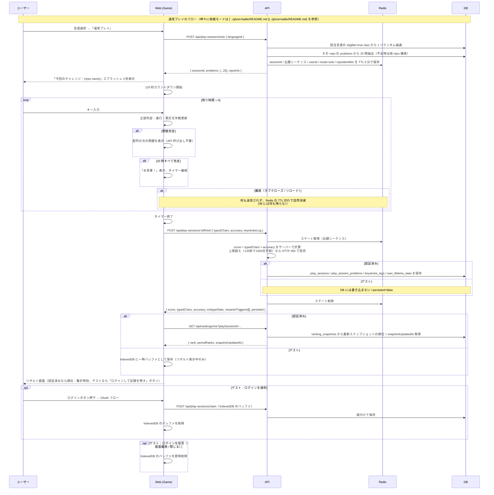

# タイピングコアエンジン

ユーザーが画面に表示されたコードをキーボードで入力し、進行・正誤・スコアが算出されるゲーム本体。プロダクトの体験中核。**120 秒制限内に何文字打てるか** を競う方式。

## 関連 spec

ゲームプレイ中の API・データフローは以下と密接に連動する。**API 実装時はこの 2 つを必ず併読** すること：

- [`../ghost-battle/README.md`](../ghost-battle/README.md) — 「神々に挑戦」モード時のゴーストデータ取得・出題シーケンス引き継ぎ、および **`keystrokeLog` データ構造の正本**（型定義・具体例・サイズ感はここに集約）
- [`../replay-viewer/README.md`](../replay-viewer/README.md) — `keystroke_logs` の用途・保存ポリシー・再生方式（**動画ファイルなし・キーストロークログ再生**）

## 目次

- [仕様](#仕様)
  - [ゲーム方式：120 秒制限](#ゲーム方式120-秒制限)
  - [モード：通常 と「神々に挑戦」](#モード通常-と神々に挑戦)
  - [出題内容（問題プールから受け取るもの）](#出題内容問題プールから受け取るもの)
  - [プレイ開始前の「今日の挑戦」表示](#プレイ開始前の今日の挑戦表示)
  - [言語選択](#言語選択)
  - [入力判定](#入力判定)
  - [スコア計算](#スコア計算)
  - [誤打鍵集計（ニガテ文字）](#誤打鍵集計ニガテ文字)
  - [セッション保存ポリシー](#セッション保存ポリシー)
  - [リザルト画面に表示する順位](#リザルト画面に表示する順位)
  - [アクセシビリティ要件](#アクセシビリティ要件)
- [設計](#設計)
  - [タイマー実装](#タイマー実装)
  - [出題シーケンスの一括取得](#出題シーケンスの一括取得)
  - [Redis 揮発ステート](#redis-揮発ステート)
  - [不正対策（基本のみ）](#不正対策基本のみ)
  - [IME ON 時の挙動](#ime-on-時の挙動)
  - [Redis 障害時のフォールバック](#redis-障害時のフォールバック)
  - [MVP 対象外（将来検討）](#mvp-対象外将来検討)
- [必要な画面](#必要な画面)
- [必要な API](#必要な-api)
- [必要な DB 設計](#必要な-db-設計)
- [フロー図](#フロー図)

---

## 仕様

### ゲーム方式：120 秒制限

- 1 セッション = **120 秒固定**。寿司打の「お勧めコース」と同様の体験。
- 開始時にカウントダウンが始まり、終了時にプレイ終了 → リザルト画面へ。
- 関数を 1 つ打ち終わったら **自動的に次の関数が出題** され、120 秒が尽きるまで連続で続く。
- 120 秒経過時点で関数の途中だった場合、そこまでに **正しく入力できた文字数を含めて** 集計する。
- セッション中に出題された問題数（`problemsPlayed`）と完走した問題数（`problemsCompleted`）も記録する。

### モード：通常 と「神々に挑戦」

言語選択画面から **2 つのボタン** でゲームを開始できる：

| モード | 動作 |
| --- | --- |
| **通常モード**（既定） | ランダムに出題された問題を 120 秒で打鍵する 1 人プレイ |
| **神々に挑戦**（ボタン） | 該当言語の **オールタイムトップ 10 からランダムに 1 人** を選び、その人の過去セッションの **問題シーケンス** を引き継いでゴースト併走する |

- 「神々に挑戦」ボタンを押した場合のみ、ゴースト併走 UI（累計文字数の対比表示等）が有効になる（[`../ghost-battle/README.md`](../ghost-battle/README.md)）。
- 「神々に挑戦」が成立しないケース（例：トップ 10 がまだ存在しないリリース直後）はボタンを無効化し、通常モードに誘導。
- 「神々に挑戦」モードでも自分のスコアはランキングに加算される。

### 出題内容（問題プールから受け取るもの）

タイピングコアエンジンは [`../problem-pool/README.md`](../problem-pool/README.md) から **同一 repo の関数 20 問 + `repoInfo`** を受け取り、それを 120 秒間で出題する責任を持つ。

問題抽出ルール（関数の選別条件、AST、依存型の扱い、repo 抽選ロジック等）は **すべて problem-pool に集約** する。本ドキュメントでは「何を受け取って、どう見せるか」だけを扱う。

| typing-engine が知っておくべき性質 | 詳細リンク |
| --- | --- |
| 1 問 = 1 つの関数（関数宣言・アロー関数・メソッド） | [`../problem-pool/README.md#関数単位の抽出方針`](../problem-pool/README.md#関数単位の抽出方針) |
| 関数長は 80〜1500 文字に正規化済み | [`../problem-pool/README.md#問題として採用する条件`](../problem-pool/README.md#問題として採用する条件) |
| **1 セッション = 同一 repo の 20 問**。サーバーが純粋ランダムに 1 repo を抽選 | [`../problem-pool/README.md#セッション単位の-repo-抽選ルール`](../problem-pool/README.md#セッション単位の-repo-抽選ルール) |
| eligible repo は最低 30 問保証されているため fallback は持たず、20 問取れない場合は 404 で 1 回失敗→再試行 | （同上） |
| 同一セッション内では同じ問題は出題されない | （同上） |
| `repoInfo` がレスポンスに同梱される（owner / repo / stars / description / homepage / topics） | [`../problem-pool/README.md#repo-メタ情報の取得`](../problem-pool/README.md#repo-メタ情報の取得) |
| 関数本体のみが表示される（依存型は同梱しない） | （同上） |
| TypeScript の場合、`User` 等の未解決型名はテキストにそのまま現れる | （同上） |
| **問題テキストからコメントは除去済み**（JSDoc・行コメント・行末コメントすべて） | [`../problem-pool/README.md#コメントの除去ポリシー`](../problem-pool/README.md#コメントの除去ポリシー) |
| 各問題に **出典 GitHub URL（ファイル + 行範囲ハイライト付き）** が紐付いている | [`../problem-pool/README.md#出典情報の保存ファイル行範囲`](../problem-pool/README.md#出典情報の保存ファイル行範囲) |

1 セッションで使用した問題 ID のシーケンスは `play_session_problems` に保存され、ゴースト対戦・リプレイ閲覧で再現可能。

### プレイ開始前の「今日の挑戦」表示

- `/solo` または `/challenge-gods` のレスポンスを受け取ったあと、120 秒タイマーが走り出す前に **「今回のチャレンジ：{repo name}」スプラッシュ** を 2 秒程度表示する。
- スプラッシュには repo 名 + GitHub Star 数 + description のサマリを表示（すべて `repoInfo` 由来）。
- ユーザーに「今から打つコードの素性」を意識させ、ゲーム前の気持ちを高める。

### 言語選択

- 言語選択画面で **TypeScript / JavaScript** から選ぶ（対応言語自体の方針は [`../problem-pool/README.md#対応言語mvp`](../problem-pool/README.md#対応言語mvp)）。
- 言語選択以外の分類軸は持たない（コース制なし）。
- 多言語拡張時も UI は言語ボタンを増やすだけで済む形にしておく。

### 入力判定

- 1 文字単位で前から順に判定。誤入力時は次の正解文字が入力されるまで進まない。
- インデントは元のスタイル（タブ／スペース）を保持し、タイピング対象に含める（エンジニア向けプロダクトとしてリアルさを優先）。
- 改行は **Enter キー** で進行。
- 入力中の文字を「打鍵済み」「現在位置」「未打鍵」で視覚的に区別。
- 関数の最終文字を入力した瞬間に「完走」扱いとし、即座に次の関数を出題する。

### スコア計算

```
score = typedChars × accuracy
typedChars : 120 秒間で正しく入力できた累計文字数（複数問題にまたがる合計）
accuracy   : 正解打鍵数 / 総打鍵数（0.0 〜 1.0）
```

- ランキング順位の基準：`score` の降順。同点時は `accuracy` 降順、次に `playedAt` 昇順。
- 特典の閾値：`累計 typedChars`（生涯打鍵）を主指標に置く。
- 120 秒固定 = 時間あたりの打鍵文字数評価のため、引いた関数の長短はスコアに影響しない。

### 誤打鍵集計（ニガテ文字）

リザルト画面に「よく間違える文字」セクションを表示するため、誤打鍵を **文字単位で集計** して保存する。

- 集計の元データは `keystroke_logs` の各エントリ。データ構造は [`../ghost-battle/README.md` の「キーストロークログの記録」](../ghost-battle/README.md#キーストロークログの記録) を参照。
- 集計単位：「**期待されていた正解文字** ごとに、その文字で誤入力した回数」。
  - 例：`"a"` を打つべきところを別キーで打った回数を `mistypeStats["a"]` に加算
- 大文字小文字は区別する（`A` と `a` は別カウント）。記号もそのままキーにする。
- セッション単位の集計値を `play_sessions.mistypeStats(jsonb)` に保存。形式例：`{ "a": 3, ";": 5, "{": 2, "_": 4 }`
- 同時に `user_lifetime_stats.lifetimeMistypeStats(jsonb)` に **加算更新** し、生涯のニガテ文字傾向もマイページで参照可能にする。
- リザルト画面では上位 5〜10 文字をリスト or 横棒グラフで表示。0 回の文字は表示しない。

### セッション保存ポリシー

ゲストプレイがあるため、保存先は認証状態で分岐する。途中離脱では何も残らない。

| 認証状態 | 完走時 | 途中離脱時 |
| --- | --- | --- |
| **GitHub 認証済み** | DB に保存（ランキング集計対象） | 何も保存しない |
| **ゲスト** | DB には保存しない。リザルト画面表示中だけ IndexedDB に **一時バッファ** として保持 | 何も保存しない |

ゲストのリザルト画面では「ログインして記録を残す」ボタンを表示する。

| ユーザーの選択 | データの扱い |
| --- | --- |
| **ログインする** → OAuth 成功 | IndexedDB のデータをサーバーに送ってアカウントへ紐付け、IndexedDB からは削除 |
| **ログインを拒否**（ボタンを押さずに画面遷移 / 閉じる / 「やめる」を押す） | **即時に IndexedDB から削除** |

つまりゲストのプレイデータが永続化されるのは「ログインして記録を残す」を選んだ場合のみ。それ以外は完走直後に消える。これにより：

- 「離脱の山」も DB を汚さない
- ログイン拒否されたデータがブラウザに残り続けない（プライバシー観点でも望ましい）
- 後日 IndexedDB のデータをマージする複雑なロジックが不要

### リザルト画面に表示する順位

- リアルタイム集計は行わず、**直近の集計バッチで決まった順位** を表示する。
- 「集計時刻 XX:XX 時点の順位」と `snapshotUpdatedAt` を併記し、リアルタイムではないことを明示する。
- 表示する順位は、当該プレイヤーの **言語別 × 期間別（日 / 週 / 月 / 全期間）の現在順位**。
- リザルト画面は **即座に開く**。順位はバックグラウンドでフェッチして遅延描画してよい。

### アクセシビリティ要件

- マウス操作なしで完結（キーボードのみで全フロー可能）。
- キーボードフォーカス可視化。
- 配色は WCAG AA。
- ペーストイベント（`paste`）は無効化（ペーストによる入力は不可）。

---

## 設計

### タイマー実装

MVP はカジュアルタイピングゲームとして **「寿司打レベルの体感」** を確保できればよく、競技用の厳密なタイマー精度や環境差吸収は持ち込まない（将来検討は [`./deferred-competitive-integrity.md`](./deferred-competitive-integrity.md) 参照）。

- **体感基準**：寿司打（PC ブラウザ版）と並走テストして同等以上であることを最終確認とする。数値目標は設けない。
- **描画ループ**：`requestAnimationFrame` で統一する。
- **経過時間計測**：`performance.now()` を使う（`Date.now()` はシステム時刻変更に弱いため不可）。
- **カウントダウン UI**：`setInterval` / `setTimeout` ではなく rAF 内で `performance.now()` の差分を毎フレーム計算して表示。
- 120 秒の経過時間判定は **クライアントが行い、その値をサーバーに送る**。MVP では信用ベースで運用する（厳密検証は将来）。

### 出題シーケンスの一括取得

`/start` 時点で **20 問** の関数問題をまとめてクライアントに返す。プレイ中は追加 API を呼ばずクライアント内の配列を順に消費するだけ。

- **問題数 20 問の根拠**：120 秒のプレイで現実的に消化できる上限は 15 問前後（短い関数ばかり引いてもこの程度）。バッファ込みで 20 問あれば足切りされる心配がない。
- **データサイズ**：20 問 × 平均 400 文字 ≒ 8KB（生）→ gzip で 3〜4KB。初期ペイロード増は無視できる範囲。
- **メリット**：
  - プレイ中のネットワーク依存ゼロ。問題切替時のラグもゼロ。
  - サーバー API 呼び出しが `/start` と `/finish` の 2 回のみ。
  - クライアントは配列を順に読むだけ。非同期フェッチ・キャッシュ・先読み制御が不要。
- **超過時の挙動**：20 問を打ち切ってもタイマーが残っている場合、追加問題は出さず「お見事！全問完走」のメッセージを表示してそのまま終了させる（このケースは MVP では稀と想定）。
- **神々に挑戦モード**：ゴーストの出題シーケンスの先頭 20 問を同じ仕組みで返す。

### Redis 揮発ステート

プレイ中のステートを Redis に揮発保持することで、離脱時に DB を汚さず、再起動でも自然消滅させる。

- **保存内容**：`sessionId`, `userId(nullable)`, `languageId`, `mode`, `ghostSessionId(nullable)`, `出題シーケンス（20 問の問題 ID 配列）`
- **TTL**：5 分（120 秒のプレイ + バッファ）
- **ライフサイクル**：`/start` で作成 → `/finish` で読み取り → DB 書き込み完了後に削除
- TTL 切れで自然消滅したセッションはクリーンアップ不要。
- プレイ中にサーバーへ追加 API は飛ばないため、Redis ステートはセッション開始から終了までイミュータブル。

### 不正対策（基本のみ）

MVP では最小限の対策に絞る。より厳密な対策は [`./deferred-competitive-integrity.md`](./deferred-competitive-integrity.md) 参照。

- **`paste` イベントを無効化**（`preventDefault`）：コピー＆ペーストでの瞬間入力を防ぐ。
- **サーバー側でスコア上限チェック**：`/finish` でクライアントから受け取った `typedChars` / `accuracy` から `score = typedChars × accuracy` を **サーバーで計算** し、人間の物理限界を超える値（例：120 秒で 1500 文字以上）を弾く。
  - クライアントが `score` を直接送っても無視する（サーバー計算値で上書き）。
  - 上限を超えていたら HTTP 400 で拒否し、DB には書き込まない。
- これ以上の対策（キーストローク間隔の異常検知、サーバー権威タイマー、タブ非アクティブ検知、出題シーケンス整合性検証）は MVP では行わない。

### IME ON 時の挙動

- MVP では IME OFF 前提で動作させ、`compositionstart` イベントを検知して **ON 時は警告表示**。
- IME ON 状態のプレイは入力判定がうまく動かないため、ユーザーに OFF を促す。

### Redis 障害時のフォールバック

プレイ中に Redis 障害が発生した場合、`/finish` でセッションステートが取得できないため記録不可。MVP では「もう一度プレイしてください」のエラーメッセージで割り切る（プレイ中の Redis 障害は稀と仮定）。

### MVP 対象外（将来検討）

以下は **MVP では実装しない**。ユーザーからの問い合わせ・トップ 10 への不正スコア出現・コミュニティでの不正対策言及 などが発生した場合に着手する。設計詳細とトリガー条件は別ドキュメントにまとめている。

- サーバー権威タイマー（`startAt` / `elapsed` 検証による厳密な 120 秒判定）
- タブ非アクティブ時のセッション無効化（`visibilitychange` → `/invalidate`）
- キーストローク間隔の異常検知
- 出題シーケンスとクライアント送信値の整合性検証
- INP / Lighthouse による回帰検知の数値ベースライン
- Bluetooth キーボード / 低スペック端末への警告・別ランキング分け

詳細：[`./deferred-competitive-integrity.md`](./deferred-competitive-integrity.md)

---

## 必要な画面

| 画面 | 概要 |
| --- | --- |
| 言語選択 | TypeScript / JavaScript を選ぶ。同画面に「通常プレイ」と「神々に挑戦」の 2 ボタンを配置 |
| 今日の挑戦スプラッシュ | `/solo` または `/challenge-gods` のレスポンス受信後、120 秒タイマー開始前に「今回のチャレンジ：{repo name}」を 2 秒程度表示。Star 数と description のサマリも併記 |
| プレイ画面 | 現在の関数表示・進行カーソル・**残り時間カウントダウン**・累計文字数・正確率・ゴースト併走（神々に挑戦モード時のみ）・サイドに repo 名と関数名を控えめに表示 |
| リザルト画面 | 累計文字数・スコア・正確率・出題数 / 完走数・**現在のエンジニアグレードと次グレードまでの進捗**（即時表示）・**直近バッチ集計時点の全期間順位**（1000 位以内のみ、圏外なら「圏外」表示と集計タイムスタンプ併記）・**よく間違える文字（上位 5〜10）**・**ちなみに今回のリポジトリは XXX… コメント**（`repoInfo` の description / homepage / topics を使用）・特典獲得通知（グレードアップ時は特大演出）・シェアボタン |

## 必要な API

| メソッド | パス | 説明 |
| --- | --- | --- |
| POST | `/api/play-sessions/solo` | **通常モード**のセッション開始。Body：`{ languageId }`。サーバーが該当言語の `eligible=true` repo から **1 つを純粋ランダム抽選** し、その repo の関数から 20 問を抽出してレスポンスに同梱。Redis にステート（sessionId / userId / 出題シーケンス / `mode=solo` / 選定 repo の identifier）を TTL 5 分で保持。レスポンス：`{ sessionId, problems: [...20], repoInfo }`（`repoInfo` の型は [`../problem-pool/README.md`](../problem-pool/README.md) 参照） |
| POST | `/api/play-sessions/challenge-gods` | **「神々に挑戦」モード**のセッション開始。Body：`{ languageId }`。該当言語のオールタイムトップ 10 からランダム 1 人を選定し、その人の出題シーケンス先頭 20 問を抽出。神が打った repo の `repoInfo` も継承して同梱。Redis に `mode=challenge_gods` / `ghostSessionId` / repo identifier を保持。レスポンス：`{ sessionId, problems: [...20], ghostSessionId, ghostUserDisplay, repoInfo }`。トップ 10 不在時は HTTP 409 を返し、クライアントはボタン無効化＋ソロ誘導 |
| POST | `/api/play-sessions/:id/finish` | 120 秒終了時のプレイ結果集計。クライアントから `{ typedChars, accuracy, keystrokeLog }` を受け取り、**サーバーで `score = typedChars × accuracy` を計算**。**人間の物理限界（120 秒で 1500 文字）を超えるスコアは HTTP 400 で拒否**し DB に書かない。**正当な認証済みセッションなら DB へ書き込み**（`play_sessions` / `play_session_problems` / `keystroke_logs` / `user_lifetime_stats`）。**ゲストの場合は DB に書かず、集計結果のみレスポンスで返す**（クライアントが IndexedDB に保存）。サーバー側で誤打鍵を文字単位で集計し `mistypeStats` を生成。`bestScore` 更新時はグレード再判定（[`../score-ranking/README.md` 「グレード判定の実装」](../score-ranking/README.md#グレード判定の実装)）。順位はレスポンスに含めない。レスポンス：`{ score, typedChars, accuracy, problemsPlayed, problemsCompleted, mistypeStats, rewardsTriggered[], persisted: boolean, gradeUp?: { from, to } }` |
| GET | `/api/rankings/me` | リザルト画面用。`playSessionId` を指定すると、直近バッチで集計済みの順位を返す。レスポンスに `snapshotUpdatedAt` を含めて「いつ時点の順位か」を明示する。ゲストの呼び出しはランキング非対象なので `null` を返す |

`/finish` / `/api/rankings/me` 等の **モードに依存しない API は `sessionId` で内部参照** する。サーバーは Redis から `mode` を取得して挙動を切り替える。

「セッション作成 + Redis 保存 + 20 問抽出」は両エンドポイントで共通のため、内部ヘルパー `createSession(...)` に切り出して責務分離する想定。

詳細は [`../problem-pool/README.md`](../problem-pool/README.md) と [`../score-ranking/README.md`](../score-ranking/README.md) を参照。

## 必要な DB 設計

| テーブル | 主要カラム | 説明 |
| --- | --- | --- |
| `play_sessions` | `id`, `userId(nullable)`, `languageId`, `mode(solo/challenge_gods)`, `ghostSessionId(nullable)`, `crawledRepoId(FK)`, `typedChars`, `accuracy`, `score`, `problemsPlayed`, `problemsCompleted`, `mistypeStats(jsonb)`, `playedAt` | プレイ結果 1 件。`crawledRepoId` はそのセッションのメイン repo（神々モードは神が打った repo を継承）。`playedAt` は `/finish` のサーバー時刻 |
| `play_session_problems` | `id`, `playSessionId`, `problemId`, `orderIndex`, `charsTyped`, `completed(bool)` | セッション中に出題された問題のシーケンス |
| `keystroke_logs` | `playSessionId(PK)`, `compressedLog(bytea)` | キーストロークログ（ゴースト・リプレイで利用） |

詳細スキーマは [`../score-ranking/README.md`](../score-ranking/README.md) と [`../ghost-battle/README.md`](../ghost-battle/README.md) を参照。

## フロー図


