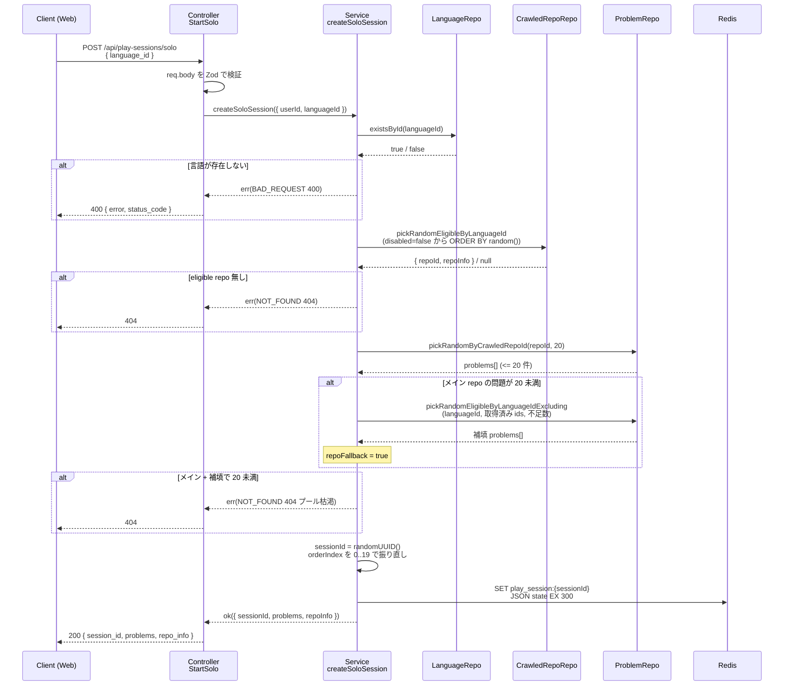

# step2: API `POST /api/play-sessions/solo`（通常モードのセッション開始）

通常モード（`/solo`）の **セッション開始 API** を `apps/api` に実装する。step1 で追加した DB スキーマには **この step ではまだ書き込まない**（`/finish` の step3 で書く）。

## 目次

- [対象 API](#対象-api)
- [リクエスト](#リクエスト)
  - [Body](#body)
- [レスポンス](#レスポンス)
  - [200 OK](#200-ok)
  - [エラー](#エラー)
- [処理フロー](#処理フロー)
  - [処理の流れ](#処理の流れ)
- [Redis ステート](#redis-ステート)
- [設計方針](#設計方針)
- [対応内容](#対応内容)
- [動作確認](#動作確認)
- [次の step での利用](#次の-step-での利用)

## 対象 API

| 項目 | 値 |
|---|---|
| メソッド / パス | `POST /api/play-sessions/solo` |
| 認証 | **必須**（Bearer JWT、`req.userId` 確定済み前提） |
| 副作用 | Redis に揮発ステート 1 件作成（TTL 300 秒）。DB 書き込みなし |
| 呼び出し元 | apps/web 言語選択画面の「通常プレイ」ボタン（step4） |
| 連携 step | state は step3 の `/finish` で読み出されて DB に書き込まれる |

## リクエスト

### Body

```json
{
  "language_id": 1
}
```

| フィールド | 型 | 必須 | 制約 | 説明 |
|---|---|---|---|---|
| `language_id` | number | ✓ | int / positive | プレイ言語の ID（DB の `languages.id`） |

## レスポンス

### 200 OK

```json
{
  "session_id": "550e8400-e29b-41d4-a716-446655440000",
  "problems": [
    {
      "id": 1234,
      "order_index": 0,
      "function_name": "createUser",
      "code_block": "const createUser = (...) => { ... }",
      "char_count": 187,
      "line_count": 8,
      "source_url": "https://github.com/owner/repo/blob/abc/src/users.ts#L42-L49"
    },
    "... 残り 19 問"
  ],
  "repo_info": {
    "owner": "vercel",
    "name": "next.js",
    "stars": 130000,
    "description": "The React Framework",
    "homepage": "https://nextjs.org",
    "topics": ["react", "ssr"],
    "fallback": false
  }
}
```

| フィールド | 型 | 説明 |
|---|---|---|
| `session_id` | string (uuid v4) | Redis ステートの識別子。`/finish` でも使う |
| `problems` | array (length=20) | 出題シーケンス。`order_index` は 0..19 |
| `repo_info.fallback` | boolean | メイン repo だけで 20 問揃わず他 repo から補填されたら true |

### エラー

| Status | type | 条件 | クライアント挙動 |
|---|---|---|---|
| 400 | BAD_REQUEST | `language_id` が存在しない / 形式不正 | エラー表示、トップへ戻す |
| 401 | UNAUTHORIZED | 認証なし / トークン期限切れ | サインイン画面へ |
| 404 | NOT_FOUND | eligible repo が 0 件 / メイン+補填で 20 問揃わない（プール枯渇） | 「もう少しお待ちください」表示 |
| 500 | — | DB / Redis 障害 | リトライ案内 |

## 処理フロー



### 処理の流れ

1. リクエスト Body を Zod スキーマで検証
2. `languageId` の存在チェック（NG なら 400 BAD_REQUEST）
3. `disabled=false` の eligible repo を `ORDER BY random()` で 1 件抽選（NG なら 404）
4. メイン repo の `disabled=false` 問題から最大 20 問をランダム抽選
5. 20 問に満たなければ他 repo の同言語問題から不足分を補填し `repoFallback=true` に
6. 補填しても 20 問揃わなければ 404（プール枯渇）
7. `sessionId` を UUID v4 で発行し、`PlaySessionState` を Redis に TTL 300 秒で保存
8. クライアントに `{ session_id, problems[20], repo_info }` を返却

## Redis ステート

| Key | `play_session:{sessionId}` |
|---|---|
| TTL | **300 秒**（120 秒プレイ + バッファ） |
| Value | JSON シリアライズした `PlaySessionState` |

```json
{
  "userId": 42,
  "languageId": 1,
  "mode": "solo",
  "crawledRepoId": 17,
  "repoFallback": false,
  "ghostSessionId": null,
  "problemIds": [1234, 1235, 1236, "... 計 20 個"]
}
```

## 設計方針

- **`sessionId` は UUID v4 を Node 標準 `crypto.randomUUID()` で発行**。DB の auto-increment id とは別系統。Redis キー `play_session:{sessionId}` に紐づくだけの揮発トークンとして扱う
- **Redis 値は JSON シリアライズ**（`SET play_session:{sessionId} '{...}' EX 300`）。`HSET` ではなく単純な `SET` にする理由は、`problemIds` が配列のため `HSET` だと別途 JSON エンコードが必要で実質メリットがないため。`refresh_token` リポジトリと同じ流派
- **抽選はすべて Postgres の `ORDER BY random()` LIMIT** で行う。eligible repo は数百件 / 1 repo の problems は最大 100 件なので、`random()` の cost は無視できる。インデックス追加や複雑な確率テーブルは持ち込まない
- **Repo 選定の eligible 条件は `disabled=false` のみ**。問題プール仕様より「採用候補 30 個未満の repo は `disabled=true` + `disabledReason="too_few_problems"`」なので、`disabled=false` の repo は最低 30 問持つことが保証される
- **`storedCount >= 20` は条件に入れない**。`crawled_repos.storedCount` はクロール時の値で、後から `problems.disabled=true` で個別に絞られても更新されない。**実際の出題可能数は `SELECT count(*) FROM problems WHERE crawled_repo_id=? AND disabled=false` でしか分からない**ため、抽選後に問題数を見て fallback 判定する設計にする
- **Fallback ロジックは "足りない分を他 repo からランダム抽出して補填"**。`repoFallback=true` をステートに残し、`/finish` で `play_sessions.repoFallback` に反映する。**メイン repo の identifier はあくまで最初に抽選された repo**（fallback で補填した repo の identifier は保持しない / リザルト画面の「ちなみに今回のリポジトリは」コメントは最初に引いた repo を表示する仕様のため）
- **認証必須**（ゲストプレイは Phase 2 以降）。`req.userId!` 前提で実装し、`PUBLIC_PATHS` には入れない。ゲスト対応は将来 step で `userId nullable` の Redis ステートに拡張する
- **言語存在チェックは Service で行う**。`languageId` 不正は **400（BAD_REQUEST）** を返す（パスパラメータでなく body なので Zod スキーマでは「正の整数」までしか検証できない）
- **eligible repo / problems が 0 件の場合は 503 相当だが、本プロジェクトの `Result` 型は `BAD_REQUEST | CONFLICT | FORBIDDEN | NOT_FOUND | UNAUTHORIZED` のみサポート**。新しい型を増やすのは影響範囲が広いので、**`NOT_FOUND`** で代用しメッセージで状況を表現する（運用ローンチ後にプール枯渇が起きたら別途検討）

## 対応内容

### `packages/schema/src/api-schema/play-session.ts`（新規）

`/solo` のリクエスト・レスポンス Zod スキーマ。`repo_info` と各 `problem` の構造は **問題プール側のレスポンス契約と一致させる**（[`../problem-pool/README.md#repo-メタ情報の取得`](../problem-pool/README.md#repo-メタ情報の取得)）。

```typescript
import { z } from "zod"

/**
 * 問題プール由来の repo メタ情報
 * リザルト画面の「ちなみに今回のリポジトリは XXX で…」コメントに利用
 */
const repoInfoSchema = z.object({
  description: z.string().nullable(),
  fallback: z.boolean(),
  homepage: z.string().nullable(),
  name: z.string(),
  owner: z.string(),
  stars: z.number().int().nonnegative(),
  topics: z.array(z.string()),
})

/**
 * 出題する問題 1 件
 * 関数本体はコメント除去済み（problem-pool 仕様）
 */
const playSessionProblemSchema = z.object({
  id: z.number().int().positive(),
  char_count: z.number().int().positive(),
  code_block: z.string(),
  function_name: z.string(),
  line_count: z.number().int().positive(),
  order_index: z.number().int().nonnegative(),
  source_url: z.string().url(),
})

/** POST /api/play-sessions/solo - Request */
export const startSoloPlaySessionRequestSchema = z.object({
  language_id: z.number().int().positive(),
})

/** POST /api/play-sessions/solo - Response */
export const startSoloPlaySessionResponseSchema = z.object({
  problems: z.array(playSessionProblemSchema).length(20),
  repo_info: repoInfoSchema,
  session_id: z.string().uuid(),
})

export type StartSoloPlaySessionRequest = z.infer<typeof startSoloPlaySessionRequestSchema>
export type StartSoloPlaySessionResponse = z.infer<typeof startSoloPlaySessionResponseSchema>
```

### `packages/schema/src/api-schema/index.ts` から re-export

```typescript
export * from "./play-session"
```

### `packages/schema` のビルド

```bash
cd packages/schema && pnpm build
```

### `apps/api/src/types/domain/play-session.ts`（新規）

API 内部で扱うドメイン型。`api-schema` の Zod 型とは独立に定義し、Repository / Service はこちらだけを参照する（apps/api 内のレイヤー間で `@repo/api-schema` 依存を持ち回らないため）。

```typescript
/**
 * プレイセッションのモード
 * step2 では "solo" のみ。"challenge_gods" は step5 で追加
 */
export type PlaySessionMode = "solo" | "challenge_gods"

/**
 * Redis に揮発保持するセッションステート
 *
 * `/solo` で作成し、`/finish` で読み出して DB に書き込んだ後に削除する
 * TTL 切れで自然消滅したセッションはクリーンアップ不要
 */
export type PlaySessionState = {
  crawledRepoId: number
  ghostSessionId: number | null
  languageId: number
  mode: PlaySessionMode
  /**
   * 抽選した 20 問の Problem.id を出題順に並べた配列
   * インデックス = orderIndex（0..19）
   */
  problemIds: number[]
  repoFallback: boolean
  userId: number
}

/**
 * クライアントに返す問題 1 件
 */
export type PlaySessionProblem = {
  id: number
  charCount: number
  codeBlock: string
  functionName: string
  lineCount: number
  orderIndex: number
  sourceUrl: string
}

/**
 * クライアントに返す repo メタ情報
 */
export type RepoInfo = {
  description: string | null
  fallback: boolean
  homepage: string | null
  name: string
  owner: string
  stars: number
  topics: string[]
}
```

### `apps/api/src/types/domain/index.ts` への追加

```typescript
export type {
  PlaySessionMode,
  PlaySessionProblem,
  PlaySessionState,
  RepoInfo,
} from "./play-session"
```

### `apps/api/src/repository/prisma/language-repository.ts`（新規）

`languageId` の存在確認用。書き込みは行わない。

```typescript
import { PrismaClient } from "@repo/db"

export interface LanguageRepository {
  existsById(id: number): Promise<boolean>
}

export class PrismaLanguageRepository implements LanguageRepository {
  private _prisma: PrismaClient

  constructor(prisma: PrismaClient) {
    this._prisma = prisma
  }

  async existsById(id: number): Promise<boolean> {
    const lang = await this._prisma.language.findUnique({
      select: { id: true },
      where: { id },
    })
    return lang !== null
  }
}
```

### `apps/api/src/repository/prisma/crawled-repo-repository.ts`（新規）

eligible 抽選用。`apps/cron` 側の Repository とは別物（cron は書き込み専用、api は読み込み専用）。

```typescript
import { PrismaClient } from "@repo/db"

import { RepoInfo } from "../../types/domain"

export interface CrawledRepoRepository {
  /**
   * 指定言語の eligible（disabled=false）repo から 1 件をランダム選択
   * eligible な repo が 0 件の場合は null
   */
  pickRandomEligibleByLanguageId(languageId: number): Promise<{
    id: number
    repoInfo: Omit<RepoInfo, "fallback">
  } | null>
}

export class PrismaCrawledRepoRepository implements CrawledRepoRepository {
  private _prisma: PrismaClient

  constructor(prisma: PrismaClient) {
    this._prisma = prisma
  }

  async pickRandomEligibleByLanguageId(languageId: number): Promise<{
    id: number
    repoInfo: Omit<RepoInfo, "fallback">
  } | null> {
    /**
     * eligible 件数は数百のオーダーなので ORDER BY random() で十分軽量
     * Prisma の orderBy では random() を直接書けないため $queryRaw を使う
     */
    const rows = await this._prisma.$queryRaw<Array<{
      id: number
      owner: string
      name: string
      description: string | null
      homepage: string | null
      stars: number
      topics: unknown
    }>>`
      SELECT id, owner, name, description, homepage, stars, topics
      FROM crawled_repos
      WHERE language_id = ${languageId} AND disabled = false
      ORDER BY random()
      LIMIT 1
    `
    if (rows.length === 0) return null
    const row = rows[0]
    return {
      id: row.id,
      repoInfo: {
        description: row.description,
        homepage: row.homepage,
        name: row.name,
        owner: row.owner,
        stars: row.stars,
        /** topics は jsonb 由来。string[] であることはクローラ側で保証 */
        topics: Array.isArray(row.topics) ? row.topics as string[] : [],
      },
    }
  }
}
```

### `apps/api/src/repository/prisma/problem-repository.ts`（新規）

20 問抽選用。メイン repo / fallback 用の 2 つのクエリを生やす。

```typescript
import { PrismaClient } from "@repo/db"

import { PlaySessionProblem } from "../../types/domain"

export interface ProblemRepository {
  /**
   * 指定 repo から disabled=false の problems を最大 limit 件ランダム抽選
   */
  pickRandomByCrawledRepoId(crawledRepoId: number, limit: number): Promise<PlaySessionProblem[]>

  /**
   * fallback 用: excludeIds に含まれない eligible problems から最大 limit 件ランダム抽選
   * 言語スコープを保つため languageId で絞る
   */
  pickRandomEligibleByLanguageIdExcluding(
    languageId: number,
    excludeIds: number[],
    limit: number,
  ): Promise<PlaySessionProblem[]>
}

export class PrismaProblemRepository implements ProblemRepository {
  private _prisma: PrismaClient

  constructor(prisma: PrismaClient) {
    this._prisma = prisma
  }

  async pickRandomByCrawledRepoId(
    crawledRepoId: number,
    limit: number,
  ): Promise<PlaySessionProblem[]> {
    const rows = await this._prisma.$queryRaw<Array<{
      id: number
      char_count: number
      code_block: string
      function_name: string
      line_count: number
      source_url: string
    }>>`
      SELECT id, char_count, code_block, function_name, line_count, source_url
      FROM problems
      WHERE crawled_repo_id = ${crawledRepoId} AND disabled = false
      ORDER BY random()
      LIMIT ${limit}
    `
    /** orderIndex は呼び出し側で連番付与する（fallback と結合する都合上） */
    return rows.map((row) => ({
      charCount: row.char_count,
      codeBlock: row.code_block,
      functionName: row.function_name,
      id: row.id,
      lineCount: row.line_count,
      orderIndex: 0,
      sourceUrl: row.source_url,
    }))
  }

  async pickRandomEligibleByLanguageIdExcluding(
    languageId: number,
    excludeIds: number[],
    limit: number,
  ): Promise<PlaySessionProblem[]> {
    /**
     * excludeIds が空配列だと `NOT IN ()` で SQL エラーになるため
     * sentinel として -1 を入れて常に非空にする（problems.id は positive）
     */
    const safeExcludeIds = excludeIds.length > 0 ? excludeIds : [-1]
    const rows = await this._prisma.$queryRaw<Array<{
      id: number
      char_count: number
      code_block: string
      function_name: string
      line_count: number
      source_url: string
    }>>`
      SELECT id, char_count, code_block, function_name, line_count, source_url
      FROM problems
      WHERE language_id = ${languageId}
        AND disabled = false
        AND id NOT IN (${Prisma.join(safeExcludeIds)})
      ORDER BY random()
      LIMIT ${limit}
    `
    return rows.map((row) => ({
      charCount: row.char_count,
      codeBlock: row.code_block,
      functionName: row.function_name,
      id: row.id,
      lineCount: row.line_count,
      orderIndex: 0,
      sourceUrl: row.source_url,
    }))
  }
}
```

> `Prisma.join` は `@repo/db` 経由で import する。同 file 冒頭の import を以下に置き換える：
>
> ```typescript
> import { Prisma, PrismaClient } from "@repo/db"
> ```

### `apps/api/src/repository/prisma/index.ts` への追加

```typescript
export {
  PrismaCrawledRepoRepository,
  type CrawledRepoRepository,
} from "./crawled-repo-repository"
export { PrismaLanguageRepository, type LanguageRepository } from "./language-repository"
export { PrismaProblemRepository, type ProblemRepository } from "./problem-repository"
```

### `apps/api/src/repository/redis/play-session-state-repository.ts`（新規）

`/solo` で書き込み、`/finish`（step3）で読み出し → 削除する。

```typescript
import type { Redis } from "@repo/redis"

import { PlaySessionState } from "../../types/domain"

/**
 * プレイ中の揮発ステートを管理する Repository
 *
 * - Key: `play_session:{sessionId}`
 * - Value: JSON シリアライズした PlaySessionState
 * - TTL: 300 秒（120 秒のプレイ + バッファ）
 *
 * セッション開始から終了までイミュータブルなので、更新メソッドは持たせない
 */
export interface PlaySessionStateRepository {
  delete(sessionId: string): Promise<void>
  findById(sessionId: string): Promise<PlaySessionState | null>
  save(sessionId: string, state: PlaySessionState, ttlSeconds: number): Promise<void>
}

const keyOf = (sessionId: string): string => `play_session:${sessionId}`

export class IoRedisPlaySessionStateRepository implements PlaySessionStateRepository {
  private _redis: Redis

  constructor(redis: Redis) {
    this._redis = redis
  }

  async save(sessionId: string, state: PlaySessionState, ttlSeconds: number): Promise<void> {
    await this._redis.set(keyOf(sessionId), JSON.stringify(state), "EX", ttlSeconds)
  }

  async findById(sessionId: string): Promise<PlaySessionState | null> {
    const raw = await this._redis.get(keyOf(sessionId))
    if (raw === null) return null
    return JSON.parse(raw) as PlaySessionState
  }

  async delete(sessionId: string): Promise<void> {
    await this._redis.del(keyOf(sessionId))
  }
}
```

### `apps/api/src/repository/redis/index.ts` への追加

```typescript
export {
  IoRedisPlaySessionStateRepository,
  type PlaySessionStateRepository,
} from "./play-session-state-repository"
```

### `apps/api/src/const/index.ts` への定数追加

```typescript
/**
 * プレイ中ステートの Redis TTL（秒）
 * 120 秒のプレイ + バッファ。/finish で明示削除するため通常は TTL 切れ前に消える
 */
export const PLAY_SESSION_TTL_SECONDS = 300

/**
 * 1 セッションで出題する問題数
 */
export const PROBLEMS_PER_SESSION = 20
```

### `apps/api/src/service/play-session-service.ts`（新規）

`createSoloSession` を実装。Repository 集合は `repo: { ... }` で 1 オブジェクトに束ねる（既存方針）。

```typescript
import { randomUUID } from "node:crypto"

import { badRequestError, err, notFoundError, ok, Result } from "@repo/errors"
import { logger } from "@repo/logger"

import { PLAY_SESSION_TTL_SECONDS, PROBLEMS_PER_SESSION } from "../const"
import {
  CrawledRepoRepository,
  LanguageRepository,
  ProblemRepository,
} from "../repository/prisma"
import { PlaySessionStateRepository } from "../repository/redis"
import {
  PlaySessionProblem,
  PlaySessionState,
  RepoInfo,
} from "../types/domain"

type SoloSessionRepo = {
  crawledRepoRepository: CrawledRepoRepository
  languageRepository: LanguageRepository
  playSessionStateRepository: PlaySessionStateRepository
  problemRepository: ProblemRepository
}

export type CreateSoloSessionInput = {
  languageId: number
  userId: number
}

export type CreateSoloSessionOutput = {
  problems: PlaySessionProblem[]
  repoInfo: RepoInfo
  sessionId: string
}

/**
 * `POST /api/play-sessions/solo` 本体
 *
 * 1. 言語存在チェック → なければ 400
 * 2. eligible repo を 1 件抽選 → 無ければ 404
 * 3. その repo から最大 20 問抽選
 * 4. 不足分は同言語の他 repo から補填（repoFallback=true）
 * 5. それでも 20 問揃わなければ 404（プールが致命的に枯渇）
 * 6. Redis にステート保存（TTL 300 秒）
 */
export const createSoloSession = async (
  input: CreateSoloSessionInput,
  repo: SoloSessionRepo,
): Promise<Result<CreateSoloSessionOutput>> => {
  logger.debug("PlaySessionService: Creating solo session", { ...input })

  /** 1. 言語存在チェック */
  const languageExists = await repo.languageRepository.existsById(input.languageId)
  if (!languageExists) {
    return err(badRequestError("Invalid language_id"))
  }

  /** 2. eligible repo を 1 件抽選 */
  const mainRepo = await repo.crawledRepoRepository.pickRandomEligibleByLanguageId(input.languageId)
  if (mainRepo === null) {
    return err(notFoundError("No eligible repository for the given language"))
  }

  /** 3. メイン repo から問題を抽選 */
  const primaryProblems = await repo.problemRepository.pickRandomByCrawledRepoId(
    mainRepo.id,
    PROBLEMS_PER_SESSION,
  )

  /** 4. 足りなければ他 repo から補填 */
  let problems = primaryProblems
  let repoFallback = false
  if (problems.length < PROBLEMS_PER_SESSION) {
    const remaining = PROBLEMS_PER_SESSION - problems.length
    const fallbackProblems = await repo.problemRepository.pickRandomEligibleByLanguageIdExcluding(
      input.languageId,
      problems.map((p) => p.id),
      remaining,
    )
    problems = [...problems, ...fallbackProblems]
    repoFallback = fallbackProblems.length > 0
    logger.info("PlaySessionService: Filled with fallback problems", {
      crawledRepoId: mainRepo.id,
      fallbackCount: fallbackProblems.length,
      primaryCount: primaryProblems.length,
    })
  }

  /** 5. それでも 20 問揃わない → プール枯渇 */
  if (problems.length < PROBLEMS_PER_SESSION) {
    logger.warn("PlaySessionService: Problem pool exhausted", {
      available: problems.length,
      languageId: input.languageId,
    })
    return err(notFoundError("Insufficient problems available"))
  }

  /** orderIndex を 0..19 で振り直す */
  const orderedProblems: PlaySessionProblem[] = problems.map((p, i) => ({
    ...p,
    orderIndex: i,
  }))

  /** 6. Redis にステート保存 */
  const sessionId = randomUUID()
  const state: PlaySessionState = {
    crawledRepoId: mainRepo.id,
    ghostSessionId: null,
    languageId: input.languageId,
    mode: "solo",
    problemIds: orderedProblems.map((p) => p.id),
    repoFallback,
    userId: input.userId,
  }
  await repo.playSessionStateRepository.save(sessionId, state, PLAY_SESSION_TTL_SECONDS)

  logger.debug("PlaySessionService: Solo session created", {
    crawledRepoId: mainRepo.id,
    problemCount: orderedProblems.length,
    repoFallback,
    sessionId,
  })

  return ok({
    problems: orderedProblems,
    repoInfo: { ...mainRepo.repoInfo, fallback: repoFallback },
    sessionId,
  })
}
```

### `apps/api/src/service/index.ts` への追加

```typescript
export * as playSession from "./play-session-service"
```

### `apps/api/src/controller/play-session/start-solo.ts`（新規）

```typescript
import { Response } from "express"

import { ErrorResponse, startSoloPlaySessionRequestSchema, startSoloPlaySessionResponseSchema } from "@repo/api-schema"
import { logger } from "@repo/logger"

import { AuthRequest } from "../../middleware/auth"
import {
  CrawledRepoRepository,
  LanguageRepository,
  ProblemRepository,
} from "../../repository/prisma"
import { PlaySessionStateRepository } from "../../repository/redis"
import * as service from "../../service"

/**
 * POST /api/play-sessions/solo
 *
 * 認証必須。req.userId は authMiddleware が確定済みの前提
 */
export class PlaySessionStartSoloController {
  constructor(
    private crawledRepoRepository: CrawledRepoRepository,
    private languageRepository: LanguageRepository,
    private playSessionStateRepository: PlaySessionStateRepository,
    private problemRepository: ProblemRepository,
  ) {}

  async execute(req: AuthRequest, res: Response) {
    const { language_id } = startSoloPlaySessionRequestSchema.parse(req.body)

    logger.info("PlaySessionStartSoloController: Starting solo session", {
      languageId: language_id,
      userId: req.userId,
    })

    const result = await service.playSession.createSoloSession(
      { languageId: language_id, userId: req.userId! },
      {
        crawledRepoRepository: this.crawledRepoRepository,
        languageRepository: this.languageRepository,
        playSessionStateRepository: this.playSessionStateRepository,
        problemRepository: this.problemRepository,
      },
    )

    if (!result.ok) {
      const errorResponse: ErrorResponse = {
        error: result.error.message,
        status_code: result.error.statusCode,
      }
      return res.status(result.error.statusCode).json(errorResponse)
    }

    const response = startSoloPlaySessionResponseSchema.parse({
      problems: result.value.problems.map((p) => ({
        char_count: p.charCount,
        code_block: p.codeBlock,
        function_name: p.functionName,
        id: p.id,
        line_count: p.lineCount,
        order_index: p.orderIndex,
        source_url: p.sourceUrl,
      })),
      repo_info: result.value.repoInfo,
      session_id: result.value.sessionId,
    })
    return res.status(200).json(response)
  }
}
```

### `apps/api/src/routes/play-session-router.ts`（新規）

`/finish`・`/challenge-gods` は **後続 step で同じ router に optional 追加**するため、controllers オブジェクトを optional で設計する。

```typescript
import { Router } from "express"

import { PlaySessionStartSoloController } from "../controller/play-session/start-solo"

type PlaySessionRouterControllers = {
  startSolo?: PlaySessionStartSoloController
}

/**
 * /api/play-sessions 配下のルーター
 * step2: /solo のみ。step3 で /:id/finish、step5 で /challenge-gods を追加
 */
export const playSessionRouter = (controllers: PlaySessionRouterControllers): Router => {
  const router = Router()

  /** POST /api/play-sessions/solo */
  if (controllers.startSolo) {
    const controller = controllers.startSolo
    router.post("/solo", async (req, res) => controller.execute(req, res))
  }

  return router
}
```

### `apps/api/src/index.ts` の DI 組み立て

import 追加：

```typescript
import { PlaySessionStartSoloController } from "./controller/play-session/start-solo"
import {
  PrismaCrawledRepoRepository,
  PrismaLanguageRepository,
  PrismaProblemRepository,
} from "./repository/prisma"
import { IoRedisPlaySessionStateRepository } from "./repository/redis"
import { playSessionRouter } from "./routes/play-session-router"
```

Repository / Controller の DI assembly（既存 Memo 直後あたりに追加）：

```typescript
/**
 * Play Session 関連 Repository
 */
const languageRepository = new PrismaLanguageRepository(prisma)
const crawledRepoRepository = new PrismaCrawledRepoRepository(prisma)
const problemRepository = new PrismaProblemRepository(prisma)
const playSessionStateRepository = new IoRedisPlaySessionStateRepository(redis)

/**
 * Play Session Controller のインスタンス化
 */
const playSessionStartSoloController = new PlaySessionStartSoloController(
  crawledRepoRepository,
  languageRepository,
  playSessionStateRepository,
  problemRepository,
)
```

ルート登録（既存 memo router 直後）：

```typescript
app.use(
  "/api/play-sessions",
  playSessionRouter({
    startSolo: playSessionStartSoloController,
  })
)
```

`PUBLIC_PATHS` には **追加しない**（認証必須のため）。

## 動作確認

### Service ユニットテスト

`apps/api/test/service/play-session-service/create-solo-session.test.ts`

```typescript
import {
  CrawledRepoRepository,
  LanguageRepository,
  ProblemRepository,
} from "../../../src/repository/prisma"
import { PlaySessionStateRepository } from "../../../src/repository/redis"
import { createSoloSession } from "../../../src/service/play-session-service"
import { PlaySessionProblem, PlaySessionState } from "../../../src/types/domain"

const mockExistsById = vi.fn<(_0: number) => Promise<boolean>>()
const mockPickRandomEligibleByLanguageId = vi.fn<(_0: number) => Promise<{
  id: number
  repoInfo: { description: string | null; homepage: string | null; name: string; owner: string; stars: number; topics: string[] }
} | null>>()
const mockPickRandomByCrawledRepoId = vi.fn<(_0: number, _1: number) => Promise<PlaySessionProblem[]>>()
const mockPickRandomEligibleByLanguageIdExcluding = vi.fn<(_0: number, _1: number[], _2: number) => Promise<PlaySessionProblem[]>>()
const mockSave = vi.fn<(_0: string, _1: PlaySessionState, _2: number) => Promise<void>>()

const mockLanguageRepository: LanguageRepository = { existsById: mockExistsById }
const mockCrawledRepoRepository: CrawledRepoRepository = {
  pickRandomEligibleByLanguageId: mockPickRandomEligibleByLanguageId,
}
const mockProblemRepository: ProblemRepository = {
  pickRandomByCrawledRepoId: mockPickRandomByCrawledRepoId,
  pickRandomEligibleByLanguageIdExcluding: mockPickRandomEligibleByLanguageIdExcluding,
}
const mockPlaySessionStateRepository: PlaySessionStateRepository = {
  delete: vi.fn(),
  findById: vi.fn(),
  save: mockSave,
}

const buildProblem = (id: number): PlaySessionProblem => ({
  charCount: 100,
  codeBlock: `function f${id}() {}`,
  functionName: `f${id}`,
  id,
  lineCount: 1,
  orderIndex: 0,
  sourceUrl: `https://github.com/owner/repo/blob/main/f${id}.ts`,
})

const buildRepo = () => ({
  id: 1,
  repoInfo: {
    description: "desc",
    homepage: null,
    name: "repo",
    owner: "owner",
    stars: 1000,
    topics: ["react"],
  },
})

describe("createSoloSession", () => {
  beforeEach(() => {
    vi.clearAllMocks()
  })

  describe("正常系", () => {
    it("メイン repo から 20 問揃った場合、ok: true と repoFallback=false の state を返す", async () => {
      mockExistsById.mockResolvedValue(true)
      mockPickRandomEligibleByLanguageId.mockResolvedValue(buildRepo())
      mockPickRandomByCrawledRepoId.mockResolvedValue(
        Array.from({ length: 20 }, (_, i) => buildProblem(i + 1)),
      )

      const result = await createSoloSession(
        { languageId: 1, userId: 42 },
        {
          crawledRepoRepository: mockCrawledRepoRepository,
          languageRepository: mockLanguageRepository,
          playSessionStateRepository: mockPlaySessionStateRepository,
          problemRepository: mockProblemRepository,
        },
      )

      expect(result.ok).toBe(true)
      if (result.ok) {
        expect(result.value.problems).toHaveLength(20)
        expect(result.value.repoInfo.fallback).toBe(false)
        expect(result.value.sessionId).toMatch(/^[0-9a-f-]{36}$/)
      }
      expect(mockSave).toHaveBeenCalledTimes(1)
      expect(mockPickRandomEligibleByLanguageIdExcluding).not.toHaveBeenCalled()
    })

    it("メイン repo が 18 問しか返さない場合、他 repo から 2 問補填して repoFallback=true", async () => {
      mockExistsById.mockResolvedValue(true)
      mockPickRandomEligibleByLanguageId.mockResolvedValue(buildRepo())
      mockPickRandomByCrawledRepoId.mockResolvedValue(
        Array.from({ length: 18 }, (_, i) => buildProblem(i + 1)),
      )
      mockPickRandomEligibleByLanguageIdExcluding.mockResolvedValue([
        buildProblem(101),
        buildProblem(102),
      ])

      const result = await createSoloSession(
        { languageId: 1, userId: 42 },
        {
          crawledRepoRepository: mockCrawledRepoRepository,
          languageRepository: mockLanguageRepository,
          playSessionStateRepository: mockPlaySessionStateRepository,
          problemRepository: mockProblemRepository,
        },
      )

      expect(result.ok).toBe(true)
      if (result.ok) {
        expect(result.value.problems).toHaveLength(20)
        expect(result.value.repoInfo.fallback).toBe(true)
        expect(result.value.problems[19].orderIndex).toBe(19)
      }
    })
  })

  describe("異常系", () => {
    it("存在しない language_id の場合、ok: false / 400 / BAD_REQUEST を返す", async () => {
      mockExistsById.mockResolvedValue(false)

      const result = await createSoloSession(
        { languageId: 999, userId: 42 },
        {
          crawledRepoRepository: mockCrawledRepoRepository,
          languageRepository: mockLanguageRepository,
          playSessionStateRepository: mockPlaySessionStateRepository,
          problemRepository: mockProblemRepository,
        },
      )

      expect(result.ok).toBe(false)
      if (!result.ok) {
        expect(result.error.statusCode).toBe(400)
        expect(result.error.type).toBe("BAD_REQUEST")
      }
      expect(mockSave).not.toHaveBeenCalled()
    })

    it("eligible repo が 0 件の場合、ok: false / 404 / NOT_FOUND を返す", async () => {
      mockExistsById.mockResolvedValue(true)
      mockPickRandomEligibleByLanguageId.mockResolvedValue(null)

      const result = await createSoloSession(
        { languageId: 1, userId: 42 },
        {
          crawledRepoRepository: mockCrawledRepoRepository,
          languageRepository: mockLanguageRepository,
          playSessionStateRepository: mockPlaySessionStateRepository,
          problemRepository: mockProblemRepository,
        },
      )

      expect(result.ok).toBe(false)
      if (!result.ok) {
        expect(result.error.statusCode).toBe(404)
        expect(result.error.type).toBe("NOT_FOUND")
      }
    })

    it("メイン+補填で 20 問揃わない場合、ok: false / 404 を返す", async () => {
      mockExistsById.mockResolvedValue(true)
      mockPickRandomEligibleByLanguageId.mockResolvedValue(buildRepo())
      mockPickRandomByCrawledRepoId.mockResolvedValue([buildProblem(1), buildProblem(2)])
      mockPickRandomEligibleByLanguageIdExcluding.mockResolvedValue([buildProblem(3)])

      const result = await createSoloSession(
        { languageId: 1, userId: 42 },
        {
          crawledRepoRepository: mockCrawledRepoRepository,
          languageRepository: mockLanguageRepository,
          playSessionStateRepository: mockPlaySessionStateRepository,
          problemRepository: mockProblemRepository,
        },
      )

      expect(result.ok).toBe(false)
      if (!result.ok) {
        expect(result.error.statusCode).toBe(404)
      }
      expect(mockSave).not.toHaveBeenCalled()
    })

    it("Redis 書き込み失敗時にエラーをスローする", async () => {
      mockExistsById.mockResolvedValue(true)
      mockPickRandomEligibleByLanguageId.mockResolvedValue(buildRepo())
      mockPickRandomByCrawledRepoId.mockResolvedValue(
        Array.from({ length: 20 }, (_, i) => buildProblem(i + 1)),
      )
      mockSave.mockRejectedValue(new Error("Redis connection failed"))

      await expect(
        createSoloSession(
          { languageId: 1, userId: 42 },
          {
            crawledRepoRepository: mockCrawledRepoRepository,
            languageRepository: mockLanguageRepository,
            playSessionStateRepository: mockPlaySessionStateRepository,
            problemRepository: mockProblemRepository,
          },
        ),
      ).rejects.toThrow()
    })
  })
})
```

### Controller インテグレーションテスト

`apps/api/test/controller/play-session/start-solo.test.ts`

実 Postgres + 実 Redis を使う（既存方針）。テスト前に `crawled_repos` / `problems` / `languages` / `users` を seed してから `POST /api/play-sessions/solo` を叩き、Redis に意図したステートが書かれることを確認する。

```typescript
import request from "supertest"

import { PlaySessionStartSoloController } from "../../../src/controller/play-session/start-solo"
import {
  PrismaCrawledRepoRepository,
  PrismaLanguageRepository,
  PrismaProblemRepository,
} from "../../../src/repository/prisma"
import { IoRedisPlaySessionStateRepository } from "../../../src/repository/redis"
import { playSessionRouter } from "../../../src/routes/play-session-router"
import { attachErrorHandler, createTestApp, createTestUser } from "../helper"
import {
  cleanupTestData,
  cleanupTestRedis,
  disconnectTestDb,
  disconnectTestRedis,
  testPrisma,
  testRedis,
} from "../setup"

const languageRepository = new PrismaLanguageRepository(testPrisma)
const crawledRepoRepository = new PrismaCrawledRepoRepository(testPrisma)
const problemRepository = new PrismaProblemRepository(testPrisma)
const playSessionStateRepository = new IoRedisPlaySessionStateRepository(testRedis)

const app = createTestApp()
app.use(
  "/api/play-sessions",
  playSessionRouter({
    startSolo: new PlaySessionStartSoloController(
      crawledRepoRepository,
      languageRepository,
      playSessionStateRepository,
      problemRepository,
    ),
  }),
)
attachErrorHandler(app)

beforeEach(async () => {
  await cleanupTestData()
  await cleanupTestRedis()
})

afterAll(async () => {
  await cleanupTestData()
  await cleanupTestRedis()
  await disconnectTestDb()
  await disconnectTestRedis()
})

/**
 * languages / crawled_repos / problems を seed
 * crawledRepoOverrides で disabled 等を切り替えられる
 */
const seedRepoWithProblems = async (problemCount: number, options?: {
  disabled?: boolean
}) => {
  const language = await testPrisma.language.create({
    data: { name: "TypeScript", slug: "typescript" },
  })
  const repo = await testPrisma.crawledRepo.create({
    data: {
      candidatesCount: problemCount,
      commitSha: "abc123",
      crawledAt: new Date(),
      defaultBranch: "main",
      description: "Test repo",
      disabled: options?.disabled ?? false,
      fullName: "owner/repo",
      githubId: BigInt(123456),
      languageId: language.id,
      license: "MIT",
      name: "repo",
      owner: "owner",
      stars: 1500,
      storedCount: problemCount,
      topics: ["typescript", "framework"],
    },
  })
  await testPrisma.problem.createMany({
    data: Array.from({ length: problemCount }, (_, i) => ({
      astHash: `hash${i}`,
      charCount: 100,
      codeBlock: `function f${i}() { return ${i} }`,
      crawledRepoId: repo.id,
      functionName: `f${i}`,
      languageId: language.id,
      lineCount: 1,
      sourceFilePath: `src/f${i}.ts`,
      sourceLineEnd: 1,
      sourceLineStart: 1,
      sourceUrl: `https://github.com/owner/repo/blob/main/src/f${i}.ts#L1`,
    })),
  })
  return { language, repo }
}

describe("POST /api/play-sessions/solo", () => {
  describe("正常系", () => {
    it("eligible repo に 20 問以上ある場合、200 と 20 問のシーケンスを返し Redis にステートが保存される", async () => {
      const { language, repo } = await seedRepoWithProblems(30)
      const { token, user } = await createTestUser()

      const res = await request(app)
        .post("/api/play-sessions/solo")
        .set("Authorization", `Bearer ${token}`)
        .send({ language_id: language.id })

      expect(res.status).toBe(200)
      expect(res.body).toEqual({
        problems: expect.any(Array),
        repo_info: {
          description: "Test repo",
          fallback: false,
          homepage: null,
          name: "repo",
          owner: "owner",
          stars: 1500,
          topics: ["typescript", "framework"],
        },
        session_id: expect.stringMatching(/^[0-9a-f-]{36}$/),
      })
      expect(res.body.problems).toHaveLength(20)
      expect(res.body.problems.map((p: { order_index: number }) => p.order_index)).toEqual(
        Array.from({ length: 20 }, (_, i) => i),
      )

      /** Redis に書き込まれていることを確認 */
      const state = await playSessionStateRepository.findById(res.body.session_id)
      expect(state).toMatchObject({
        crawledRepoId: repo.id,
        ghostSessionId: null,
        languageId: language.id,
        mode: "solo",
        repoFallback: false,
        userId: user.id,
      })
      expect(state!.problemIds).toHaveLength(20)
    })

    it("メイン repo に 18 問しかない場合、他 repo から補填して fallback=true", async () => {
      /** メイン repo: 18 問 */
      const { language, repo: mainRepo } = await seedRepoWithProblems(18)
      /** 補填先 repo: 同言語で 20 問 */
      const fallbackRepo = await testPrisma.crawledRepo.create({
        data: {
          candidatesCount: 20,
          commitSha: "def456",
          crawledAt: new Date(),
          defaultBranch: "main",
          fullName: "owner2/repo2",
          githubId: BigInt(789012),
          languageId: language.id,
          license: "MIT",
          name: "repo2",
          owner: "owner2",
          stars: 800,
          storedCount: 20,
          topics: [],
        },
      })
      await testPrisma.problem.createMany({
        data: Array.from({ length: 20 }, (_, i) => ({
          astHash: `hashB${i}`,
          charCount: 100,
          codeBlock: `function g${i}() {}`,
          crawledRepoId: fallbackRepo.id,
          functionName: `g${i}`,
          languageId: language.id,
          lineCount: 1,
          sourceFilePath: `src/g${i}.ts`,
          sourceLineEnd: 1,
          sourceLineStart: 1,
          sourceUrl: `https://github.com/owner2/repo2/blob/main/src/g${i}.ts#L1`,
        })),
      })

      const { token } = await createTestUser()
      const res = await request(app)
        .post("/api/play-sessions/solo")
        .set("Authorization", `Bearer ${token}`)
        .send({ language_id: language.id })

      expect(res.status).toBe(200)
      expect(res.body.problems).toHaveLength(20)
      expect(res.body.repo_info).toMatchObject({
        fallback: true,
        name: "repo",  /** メイン repo の identifier は維持 */
        owner: "owner",
      })

      const state = await playSessionStateRepository.findById(res.body.session_id)
      expect(state).toMatchObject({
        crawledRepoId: mainRepo.id,  /** メイン repo の id を保持 */
        repoFallback: true,
      })
    })
  })

  describe("異常系", () => {
    it("認証なしの場合、401 を返す", async () => {
      const { language } = await seedRepoWithProblems(30)

      const res = await request(app)
        .post("/api/play-sessions/solo")
        .send({ language_id: language.id })

      expect(res.status).toBe(401)
      expect(res.body.error).toBeDefined()
    })

    it("language_id が無い場合、400 を返す", async () => {
      const { token } = await createTestUser()

      const res = await request(app)
        .post("/api/play-sessions/solo")
        .set("Authorization", `Bearer ${token}`)
        .send({})

      expect(res.status).toBe(400)
      expect(res.body).toEqual({ error: expect.any(String), status_code: 400 })
    })

    it("存在しない language_id の場合、400 を返す", async () => {
      const { token } = await createTestUser()

      const res = await request(app)
        .post("/api/play-sessions/solo")
        .set("Authorization", `Bearer ${token}`)
        .send({ language_id: 99999 })

      expect(res.status).toBe(400)
    })

    it("eligible repo が無い（全 disabled）場合、404 を返す", async () => {
      const { language } = await seedRepoWithProblems(30, { disabled: true })
      const { token } = await createTestUser()

      const res = await request(app)
        .post("/api/play-sessions/solo")
        .set("Authorization", `Bearer ${token}`)
        .send({ language_id: language.id })

      expect(res.status).toBe(404)
    })
  })
})
```

### 手動 curl での疎通確認

```bash
/** dev-login で token を取得 */
TOKEN=$(curl -s -X POST http://localhost:8080/api/auth/dev-login | jq -r .access_token)

/** /solo を叩く */
curl -X POST http://localhost:8080/api/play-sessions/solo \
  -H "Authorization: Bearer $TOKEN" \
  -H "Content-Type: application/json" \
  -d '{"language_id":1}' | jq .

/** Redis に書かれていることを確認 */
SESSION_ID=$(...上のレスポンスから session_id を抜く...)
docker exec typing-royale-redis redis-cli -n 0 GET "play_session:$SESSION_ID"
docker exec typing-royale-redis redis-cli -n 0 TTL "play_session:$SESSION_ID"
```

期待値：

- レスポンスに `session_id`（UUID）/ `problems[20]` / `repo_info` が含まれる
- Redis に `play_session:{sessionId}` が JSON で保存され、TTL が 300 秒前後

### Lint / Build / Test

```bash
pnpm lint
pnpm build
cd apps/api && pnpm test
```

すべて緑。

## 次の step での利用

- **step3（`POST /api/play-sessions/:id/finish`）**: Redis から `PlaySessionState` を読み出し、`{ typedChars, accuracy, keystrokeLog }` を受け取って `score = typedChars × accuracy` をサーバー計算 → `play_sessions` / `play_session_problems` / `keystroke_logs` / `user_lifetime_stats` に書き込み → Redis 削除。`PrismaPlaySessionRepository` / `PrismaPlaySessionProblemRepository` / `PrismaKeystrokeLogRepository` / `PrismaUserLifetimeStatsRepository` を新規追加する
- **step4（Web）**: 言語選択 → `/solo` 叩く → 「今日の挑戦」スプラッシュ → プレイ画面 → リザルト。`apps/web` 側で実装
- **step5（`POST /api/play-sessions/challenge-gods`）**: 神々モード。トップ 10 抽選はランキング集計（別 feature）依存のため後回し。Redis ステートに `ghostSessionId` を入れる形は本 step で既に確保済み
