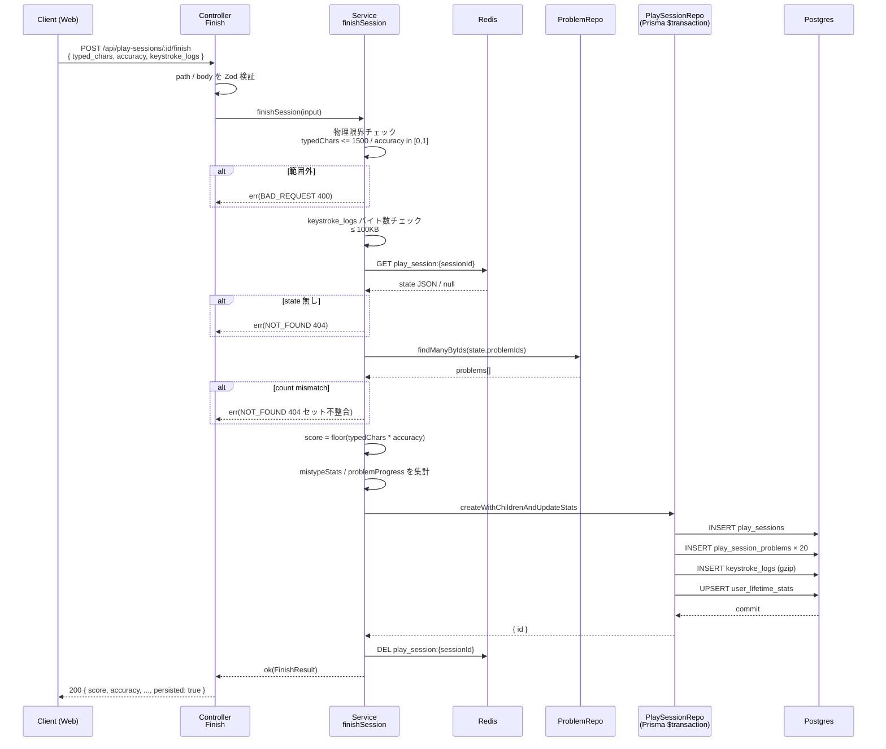

# step3: API `POST /api/play-sessions/:id/finish`（プレイ結果集計と DB 書き込み）

120 秒タイマー終了時にクライアントから集計値とキーストロークログを受け取り、サーバー側で **スコア再計算 → 物理限界チェック → DB 書き込み → Redis 削除** を行う API。step1 で追加した 4 テーブル（`play_sessions` / `play_session_problems` / `keystroke_logs` / `user_lifetime_stats`）にすべて書き込む。

## 目次

- [対象 API](#対象-api)
- [リクエスト](#リクエスト)
  - [Path Param](#path-param)
  - [Body](#body)
- [レスポンス](#レスポンス)
  - [200 OK](#200-ok)
  - [エラー](#エラー)
- [サーバー集計ロジック（純粋関数）](#サーバー集計ロジック純粋関数)
- [処理フロー](#処理フロー)
  - [処理の流れ](#処理の流れ)
- [設計方針](#設計方針)
- [対応内容](#対応内容)
- [動作確認](#動作確認)
- [次の step での利用](#次の-step-での利用)

## 対象 API

| 項目 | 値 |
|---|---|
| メソッド / パス | `POST /api/play-sessions/:id/finish` |
| 認証 | **必須**（Bearer JWT） |
| 冪等性 | **非冪等**。1 セッションにつき 1 回のみ呼ぶ前提（成功後に Redis 削除されるため、2 回目は 404） |
| 副作用 | Postgres 4 テーブルへの書き込み（1 transaction） + Redis ステート削除 |
| 呼び出し元 | apps/web プレイ画面のタイマー終了時（step4） |

書き込み先テーブル：

| テーブル | 操作 | 内容 |
|---|---|---|
| `play_sessions` | INSERT | 集計後の 1 行（`score = floor(typedChars * accuracy)`） |
| `play_session_problems` | INSERT × 20 | 各問題の `charsTyped` / `completed` |
| `keystroke_logs` | INSERT | gzip 圧縮した keystrokeLog バイナリ |
| `user_lifetime_stats` | UPSERT | `totalTypedChars` / `bestScore` / `lifetimeMistypeStats` を累積 |

## リクエスト

### Path Param

| パラメータ | 型 | 制約 | 説明 |
|---|---|---|---|
| `id` | string | uuid v4 | step2 の `/solo` で発行された `session_id` |

### Body

```json
{
  "typed_chars": 320,
  "accuracy": 0.95,
  "keystroke_logs": [
    { "elapsed_ms": 145.2, "problem_index": 0, "input_char": "h", "is_correct": true },
    { "elapsed_ms": 312.8, "problem_index": 0, "input_char": "k", "is_correct": false },
    { "elapsed_ms": 478.1, "problem_index": 0, "input_char": "e", "is_correct": true }
  ]
}
```

| フィールド | 型 | 制約 | 説明 |
|---|---|---|---|
| `typed_chars` | number | 0..1500 | 120 秒で正しく打鍵できた累計文字数 |
| `accuracy` | number | 0.0..1.0 | `correctKeystrokes / totalKeystrokes` |
| `keystroke_logs` | array | 最大 2000 要素 / 生 JSON 100KB 以下 | 各キー入力イベント |
| `keystroke_logs[].elapsed_ms` | number | >= 0 | セッション開始からの経過 ms（`performance.now()` 起点）。combo-time-bonus 連携で許容上限超過時は 400 で reject（cheat 検知） |
| `keystroke_logs[].problem_index` | number | 0..19 | 何問目を打っていたか（`order_index`） |
| `keystroke_logs[].input_char` | string | 1..20 文字 | 入力された文字（または "Enter"/"Backspace" 等の特殊キー名） |
| `keystroke_logs[].is_correct` | boolean | — | クライアント時点での期待文字との一致フラグ（サーバー側で `input_char === expected` を再判定するため信用しない） |

> `score` はクライアントから受け取らない。送られても無視してサーバーで再計算する。

## レスポンス

### 200 OK

```json
{
  "score": 304,
  "typed_chars": 320,
  "accuracy": 0.95,
  "problems_played": 5,
  "problems_completed": 3,
  "mistype_stats": { "l": 2, ";": 1, "{": 1 },
  "persisted": true,
  "best_score_updated": true,
  "grade_up": false,
  "new_rank": 43,
  "top_ten_boundary_score": 580,
  "total_ranked_players": 1234,
  "monthly_top_ten_boundary_score": 320
}
```

| フィールド | 型 | 説明 |
|---|---|---|
| `score` | number (int) | **サーバー計算値**：`floor(typed_chars × accuracy)` |
| `typed_chars` | number | 受け取った値をそのまま返す |
| `accuracy` | number | 受け取った値をそのまま返す |
| `problems_played` | number | `new Set(keystroke_logs.map(e => e.problem_index)).size`（出てきた問題のユニーク数） |
| `problems_completed` | number | 各問題の codeBlock 末尾までを `input_char === expected` で踏みきった問題数 |
| `mistype_stats` | object | サーバー集計のニガテ文字マップ（正解期待文字 → カウント） |
| `persisted` | boolean | 認証済みプレイなら true。ゲスト経路は false |
| `best_score_updated` | boolean | 今回のスコアで `user_language_best` が更新されたか |
| `grade_up` | boolean | 今回のスコアで `current_grade` が上昇したか |
| `new_rank` | number \| null | `user_language_best` リアルタイム集計で算出した全期間順位（ランキング対象外なら null） |
| `top_ten_boundary_score` | number \| null | 全期間ランキング 10 位のスコア（TOP 10 入り判定 UI 用） |
| `total_ranked_players` | number | ランキング登録対象プレイヤー総数 |
| `monthly_top_ten_boundary_score` | number \| null | 月間ランキング 10 位のスコア |

### エラー

| Status | type | 条件 |
|---|---|---|
| 400 | BAD_REQUEST | `typed_chars > 1500` / `accuracy` が 0..1 範囲外 / `keystroke_logs` 100KB 超 |
| 400 | — | Zod 検証失敗（型不一致、必須欠落） |
| 401 | UNAUTHORIZED | 認証なし |
| 404 | NOT_FOUND | Redis ステート無し（TTL 切れ / 既に finish 済み / sessionId 不正） |
| 404 | NOT_FOUND | 問題セット mismatch（state.problemIds の一部が DB から消えた） |
| 500 | — | DB transaction 失敗 |

## サーバー集計ロジック（純粋関数）

| ロジック | 入力 | 出力 |
|---|---|---|
| `computeScore` | `typedChars`, `accuracy` | `floor(typedChars * accuracy)` |
| `isWithinPhysicalLimits` | `typedChars`, `accuracy` | `0 <= typedChars <= 1500 && 0 <= accuracy <= 1` |
| `aggregateMistypeStats` | `keystrokeLog`, `codeBlocks` | `isCorrect=false` 時の **正解期待文字** をキーに +1 |
| `aggregateProblemProgress` | `keystrokeLog`, `codeBlocks` | 各 `orderIndex` の `charsTyped`（正解打鍵数）と `completed`（末尾到達） |

## 処理フロー



### 処理の流れ

1. Path Param と Body を Zod スキーマで検証
2. 物理限界チェック（`typed_chars <= 1500` / `accuracy ∈ [0,1]` / keystroke_logs <= 100KB）
3. Redis から `PlaySessionState` を取得（無ければ 404：TTL 切れ or 既 finish 済み）
4. `state.problemIds` から問題本体を取得し、件数 mismatch なら 404（プール側で disabled 化等）
5. サーバーで `score = floor(typedChars × accuracy)` を計算
6. keystrokeLog から `mistypeStats` と問題別の `charsTyped` / `completed` を集計
7. Prisma `$transaction` で 4 テーブル（`play_sessions` / `play_session_problems` / `keystroke_logs` / `user_lifetime_stats`）にアトミック書き込み
8. Redis の state を削除（書き込み成功時のみ）
9. クライアントに `FinishResult` を返却

## 設計方針

- **`/finish` パスの `:id` は Redis sessionId（UUID）**。DB の `play_sessions.id` ではない。クライアントは `/solo` で受け取った `session_id` をそのまま投げる
- **スコア計算はサーバー権威**。クライアントから受け取った `score` は一切信用しない（送られても無視）。`score = floor(typedChars * accuracy)` で計算する。`floor` 採用理由：DB は `Int`、`typedChars × accuracy` は小数になり得るため、最終的に整数化が必要。`round` ではなく `floor` を選ぶのは「ユーザーに有利になる丸めを排除」のため
- **物理限界チェック**：`typedChars > 1500` または `accuracy > 1.0` または `accuracy < 0.0` は HTTP 400 で拒否し DB に書かない。`typedChars < 0` も拒否
- **DB 書き込みは Prisma transaction で 4 テーブルをアトミックに**。途中失敗で部分書き込みになるとマイページの累計値がずれるため。`PrismaTransactionRunner`（既存）を Service 経由で使う
- **`mistypeStats` はサーバーで keystrokeLog から集計**。クライアントの `is_correct` は信用せず、**サーバー側で `input_char === expected` を再判定** する（cheat 防止）。再判定で false になったエントリについて「**そのとき期待されていた正解文字**（= 出題シーケンスから引ける）」をキーに 1 加算する。誤入力された文字（`input_char`）ではなく **正解文字** で集計する（仕様 [`./README.md#誤打鍵集計ニガテ文字`](./README.md#誤打鍵集計ニガテ文字) より）
- **`problemsPlayed` / `problemsCompleted` はキーストロークログから算出**。`problemsPlayed = new Set(keystrokeLogs.map((e) => e.problemIndex)).size`（ログに登場した問題のユニーク数）、`problemsCompleted` は「各問題の `codeBlock` 末尾までサーバー再判定で踏みきった問題数」
- **`play_session_problems` の `charsTyped` / `completed` はキーストロークログから問題別に集計**。完走判定は「その問題の `codeBlock` 末尾文字までを `input_char === expected` で踏み終えたか」（サーバー再判定）
- **`user_lifetime_stats` は upsert**。初回プレイで row が無い場合は作成、ある場合は加算。`bestScore` は max、`bestScoreByLanguage` は JSON で言語別の max
- **`currentGrade` / `currentGradeReachedAt` の更新は step3 では実装しない**（Phase 4 の score-ranking 機能で実装）。`bestScore` 更新だけ行い、グレード判定は将来 step で追加
- **`keystroke_logs.compressedLog` は gzip 圧縮**。Node 標準 `zlib.gzipSync(JSON.stringify(log))` を使う。バイト列をそのまま `bytea` カラムに突っ込む
- **キーストロークログのサイズ制限**：1 セッション 120 秒で最大 1500 文字打鍵 → 1500 entry。1 entry あたり JSON で ~50 byte → 75KB 程度。gzip 後 20-30KB 程度の想定。サーバー側で **生 JSON 100KB 超は 400 で拒否**（大量データでの DoS 防御 + 物理限界からの逸脱検知）

## 対応内容

### `packages/schema/src/api-schema/play-session.ts` への追加

`/solo` のスキーマに加えて `/finish` を追加。`keystroke_logs` のエントリスキーマはここで定義する（ghost-battle の README に書かれた構造の Zod 化）。

```typescript
const keystrokeEntrySchema = z.object({
  input_char: z.string().min(1).max(20),  /** 通常 1 文字。"Enter" / "Backspace" 等の特殊キー名は最大 20 文字 */
  is_correct: z.boolean(),
  problem_index: z.number().int().nonnegative().max(19),  /** orderIndex 0..19 */
  elapsed_ms: z.number().nonnegative(),  /** 経過 ms */
})

/** POST /api/play-sessions/:id/finish - Path param */
export const finishPlaySessionPathParamSchema = z.object({
  id: z.string().uuid(),
})

/** POST /api/play-sessions/:id/finish - Request */
export const finishPlaySessionRequestSchema = z.object({
  accuracy: z.number().min(0).max(1),
  keystroke_logs: z.array(keystrokeEntrySchema).max(2000),  /** 物理限界の安全側上限 */
  typed_chars: z.number().int().nonnegative().max(1500),
})

/** POST /api/play-sessions/:id/finish - Response */
const mistypeStatsSchema = z.record(z.string(), z.number().int().nonnegative())

export const finishPlaySessionResponseSchema = z.object({
  accuracy: z.number(),
  mistype_stats: mistypeStatsSchema,
  persisted: z.boolean(),
  problems_completed: z.number().int().nonnegative(),
  problems_played: z.number().int().nonnegative(),
  score: z.number().int().nonnegative(),
  typed_chars: z.number().int().nonnegative(),
})

export type FinishPlaySessionPathParam = z.infer<typeof finishPlaySessionPathParamSchema>
export type FinishPlaySessionRequest = z.infer<typeof finishPlaySessionRequestSchema>
export type FinishPlaySessionResponse = z.infer<typeof finishPlaySessionResponseSchema>
```

### `apps/api/src/types/domain/play-session.ts` への追加

```typescript
export type KeystrokeEntry = {
  inputChar: string
  isCorrect: boolean
  problemIndex: number
  elapsedMs: number
}

export type KeystrokeLogs = KeystrokeEntry[]

export type MistypeStats = Record<string, number>

/** /finish のサーバー集計結果（クライアント送信値を再計算したもの） */
export type FinishResult = {
  accuracy: number
  mistypeStats: MistypeStats
  persisted: boolean
  problemsCompleted: number
  problemsPlayed: number
  score: number
  typedChars: number
}
```

### Repository 構成（TransactionRunner + 単一責務 Repository 5 個）

`/finish` 系の DB 書き込みは **責務分離** されており、Service が `TransactionRunner` で transaction context を確保したうえで、以下 5 つの単一責務 Repository を順に呼ぶ：

| Repository | メソッド | 担当テーブル |
|---|---|---|
| `PlaySessionRepository` | `create(tx, input)` | `play_sessions`（INSERT × 1） |
| `PlaySessionProblemRepository` | `createMany(tx, input)` | `play_session_problems`（INSERT × 20） |
| `KeystrokeLogRepository` | `create(tx, input)` | `keystroke_logs`（gzip 済み bytea） |
| `UserLifetimeStatsRepository` | `upsertOnFinish(tx, input)` | `user_lifetime_stats`（累計加算 + best 更新） |
| `UserLanguageBestRepository` | `upsertIfBest(tx, input)` | `user_language_best`（言語別ベストの正本。ランキング順位はこのテーブルをリアルタイム集計） |

設計詳細・型定義のサンプルは以下の通り（旧版の `PlaySessionRepository.createWithChildrenAndUpdateStats` を残しておくが、現行実装は上記 5 Repository に分かれている点に注意）：

```typescript
import { PrismaClient } from "@repo/db"

import { KeystrokeLogs, MistypeStats } from "../../types/domain"

export type CreatePlaySessionInput = {
  accuracy: number
  crawledRepoId: number
  ghostSessionId: number | null
  languageId: number
  languageSlug: string
  mode: "solo" | "challenge_gods"
  mistypeStats: MistypeStats
  playedAt: Date
  problemsCompleted: number
  problemsPlayed: number
  score: number
  typedChars: number
  userId: number
}

export type CreatePlaySessionProblemInput = {
  charsTyped: number
  completed: boolean
  orderIndex: number
  problemId: number
}

/** 旧版インターフェース（参考）。現行実装は単一責務 5 Repository に分かれている */
export interface PlaySessionRepository {
  /**
   * play_sessions + play_session_problems + keystroke_logs を 1 transaction で作成
   * user_lifetime_stats の upsert もこの中で実行する（旧版）
   */
  createWithChildrenAndUpdateStats(input: {
    keystrokeLog: KeystrokeLogs
    problems: CreatePlaySessionProblemInput[]
    session: CreatePlaySessionInput
  }): Promise<{ id: number }>
}

export class PrismaPlaySessionRepository implements PlaySessionRepository {
  private _prisma: PrismaClient

  constructor(prisma: PrismaClient) {
    this._prisma = prisma
  }

  async createWithChildrenAndUpdateStats(input: {
    keystrokeLog: KeystrokeLogs
    problems: CreatePlaySessionProblemInput[]
    session: CreatePlaySessionInput
  }): Promise<{ id: number }> {
    return this._prisma.$transaction(async (tx) => {
      /** 1. play_sessions 作成 */
      const session = await tx.playSession.create({
        data: {
          accuracy: input.session.accuracy,
          crawledRepoId: input.session.crawledRepoId,
          ghostSessionId: input.session.ghostSessionId,
          languageId: input.session.languageId,
          mistypeStats: input.session.mistypeStats,
          mode: input.session.mode,
          playedAt: input.session.playedAt,
          problemsCompleted: input.session.problemsCompleted,
          problemsPlayed: input.session.problemsPlayed,
          score: input.session.score,
          typedChars: input.session.typedChars,
          userId: input.session.userId,
        },
      })

      /** 2. play_session_problems を一括作成 */
      if (input.problems.length > 0) {
        await tx.playSessionProblem.createMany({
          data: input.problems.map((p) => ({
            charsTyped: p.charsTyped,
            completed: p.completed,
            orderIndex: p.orderIndex,
            playSessionId: session.id,
            problemId: p.problemId,
          })),
        })
      }

      /** 3. keystroke_logs は zlib gzip 済みバイナリを保存 */
      const { gzipSync } = await import("node:zlib")
      const compressed = gzipSync(Buffer.from(JSON.stringify(input.keystrokeLog)))
      await tx.keystrokeLog.create({
        data: { compressedLog: compressed, playSessionId: session.id },
      })

      /** 4. user_lifetime_stats の upsert（言語別 bestScore も JSON で更新） */
      await this._upsertLifetimeStats(tx, input.session)

      return { id: session.id }
    })
  }

  private async _upsertLifetimeStats(
    tx: PrismaClient,
    s: CreatePlaySessionInput,
  ): Promise<void> {
    const existing = await tx.userLifetimeStats.findUnique({ where: { userId: s.userId } })

    /** bestScoreByLanguage のキーは **languageSlug**（"typescript" / "javascript"）にする。
     *  Service 層で LanguageRepository から slug を引いてから本 Repository に渡す方針。
     *  数値 ID をキーにすると Web 側で言語表示する際に毎回 join が必要になり面倒なため */
    const langKey = s.languageSlug

    if (!existing) {
      await tx.userLifetimeStats.create({
        data: {
          bestScore: s.score,
          bestScoreByLanguage: { [langKey]: s.score },
          lifetimeMistypeStats: s.mistypeStats,
          totalSessions: 1,
          totalTypedChars: BigInt(s.typedChars),
          userId: s.userId,
        },
      })
      return
    }

    /** 既存値とのマージ */
    const currentByLang = existing.bestScoreByLanguage as Record<string, number>
    const newByLang = {
      ...currentByLang,
      [langKey]: Math.max(currentByLang[langKey] ?? 0, s.score),
    }
    const currentMistype = existing.lifetimeMistypeStats as MistypeStats
    const newMistype: MistypeStats = { ...currentMistype }
    for (const [key, count] of Object.entries(s.mistypeStats)) {
      newMistype[key] = (newMistype[key] ?? 0) + count
    }

    await tx.userLifetimeStats.update({
      data: {
        bestScore: Math.max(existing.bestScore, s.score),
        bestScoreByLanguage: newByLang,
        lifetimeMistypeStats: newMistype,
        totalSessions: existing.totalSessions + 1,
        totalTypedChars: existing.totalTypedChars + BigInt(s.typedChars),
      },
      where: { userId: s.userId },
    })
  }
}
```

> `PrismaClient` を transaction context で型表現するため、実装では `Prisma.TransactionClient` を import して `_upsertLifetimeStats` のシグネチャを `tx: Prisma.TransactionClient` に置き換える（コンパイル都合）。

### `apps/api/src/repository/prisma/index.ts` への追加

```typescript
export {
  PrismaPlaySessionRepository,
  type CreatePlaySessionInput,
  type CreatePlaySessionProblemInput,
  type PlaySessionRepository,
} from "./play-session-repository"
```

### `apps/api/src/lib/score.ts`（新規 — 純粋関数）

```typescript
import { KeystrokeLogs, MistypeStats } from "../types/domain"

/**
 * 物理的に到達不可能なスコアを弾くための上限
 * 120 秒 × 12 打鍵/秒 ≒ 1440 → 安全側で 1500 を採用
 */
export const PHYSICAL_LIMIT_TYPED_CHARS = 1500

/**
 * keystroke_logs の生 JSON サイズ上限（DoS 防御）
 */
export const MAX_KEYSTROKE_LOG_BYTES = 100 * 1024  /** 100KB */

/**
 * サーバー権威スコア計算
 * floor で整数化することでユーザーに有利な丸めを防ぐ
 */
export const computeScore = (typedChars: number, accuracy: number): number => {
  return Math.floor(typedChars * accuracy)
}

/**
 * クライアント値が物理限界内かチェック
 */
export const isWithinPhysicalLimits = (typedChars: number, accuracy: number): boolean => {
  return (
    typedChars >= 0 &&
    typedChars <= PHYSICAL_LIMIT_TYPED_CHARS &&
    accuracy >= 0 &&
    accuracy <= 1
  )
}

/**
 * keystroke_logs から問題別の進捗を集計
 *
 * problemCodeBlocks: orderIndex (0..19) → codeBlock の Map
 * 各 orderIndex について「打鍵された char 数」「完走したか（末尾文字を isCorrect=true で踏んだか）」を返す
 */
export const aggregateProblemProgress = (
  log: KeystrokeLogs,
  problemCodeBlocks: Map<number, string>,
): Map<number, { charsTyped: number; completed: boolean }> => {
  const progress = new Map<number, { charsTyped: number; completed: boolean }>()

  for (const [orderIndex, codeBlock] of problemCodeBlocks) {
    const entries = log.filter((e) => e.p === orderIndex)
    const correctEntries = entries.filter((e) => e.ok)
    const charsTyped = correctEntries.length
    /** 完走判定: 正解打鍵数が codeBlock の長さに到達したか */
    const completed = charsTyped >= codeBlock.length
    progress.set(orderIndex, { charsTyped, completed })
  }

  return progress
}

/**
 * keystroke_logs からニガテ文字（mistypeStats）を集計
 *
 * 「isCorrect=false の打鍵について、そのとき期待されていた正解文字を 1 加算」
 * 期待文字は問題の codeBlock の「現在位置」から引く
 */
export const aggregateMistypeStats = (
  log: KeystrokeLogs,
  problemCodeBlocks: Map<number, string>,
): MistypeStats => {
  const stats: MistypeStats = {}

  /** orderIndex ごとに「現在位置（次に期待する文字 index）」を持つ */
  const cursor = new Map<number, number>()
  for (const orderIndex of problemCodeBlocks.keys()) cursor.set(orderIndex, 0)

  for (const entry of log) {
    const code = problemCodeBlocks.get(entry.p)
    if (!code) continue
    const pos = cursor.get(entry.p) ?? 0
    const expected = code[pos]
    if (expected === undefined) continue  /** 末尾を超えたエントリは無視 */

    if (entry.ok) {
      cursor.set(entry.p, pos + 1)
    } else {
      /** 正解期待文字をキーに 1 加算 */
      stats[expected] = (stats[expected] ?? 0) + 1
    }
  }

  return stats
}
```

### `apps/api/src/service/play-session-service.ts` への追加

```typescript
import { badRequestError, err, notFoundError, ok, Result } from "@repo/errors"
import { logger } from "@repo/logger"

import { MAX_KEYSTROKE_LOG_BYTES, aggregateMistypeStats, aggregateProblemProgress, computeScore, isWithinPhysicalLimits } from "../lib/score"
import { PlaySessionRepository, ProblemRepository } from "../repository/prisma"
import { PlaySessionStateRepository } from "../repository/redis"
import { FinishResult, KeystrokeLogs } from "../types/domain"

type FinishSessionRepo = {
  playSessionRepository: PlaySessionRepository
  playSessionStateRepository: PlaySessionStateRepository
  problemRepository: ProblemRepository
}

export type FinishSessionInput = {
  accuracy: number
  keystrokeLog: KeystrokeLogs
  sessionId: string
  typedChars: number
}

export const finishSession = async (
  input: FinishSessionInput,
  repo: FinishSessionRepo,
): Promise<Result<FinishResult>> => {
  logger.debug("PlaySessionService: Finishing session", { sessionId: input.sessionId })

  /** 1. 物理限界チェック */
  if (!isWithinPhysicalLimits(input.typedChars, input.accuracy)) {
    return err(badRequestError("Out of physical limits"))
  }
  /** keystroke_logs の生 JSON サイズチェック */
  const logSize = Buffer.byteLength(JSON.stringify(input.keystrokeLog), "utf8")
  if (logSize > MAX_KEYSTROKE_LOG_BYTES) {
    return err(badRequestError("Keystroke log too large"))
  }

  /** 2. Redis から state 取得 */
  const state = await repo.playSessionStateRepository.findById(input.sessionId)
  if (state === null) {
    return err(notFoundError("Play session not found or expired"))
  }

  /** 3. 問題 codeBlock を取得（mistype 集計と完走判定に必要） */
  const problems = await repo.problemRepository.findManyByIds(state.problemIds)
  if (problems.length !== state.problemIds.length) {
    /** 問題が disabled 化されたなど。希少ケース。state の整合性が崩れたので 404 */
    logger.warn("PlaySessionService: Problem set mismatch", {
      expected: state.problemIds.length,
      found: problems.length,
    })
    return err(notFoundError("Problem set mismatch"))
  }
  /** orderIndex 順に並べる（state.problemIds の順序に合わせる） */
  const codeBlockByOrder = new Map<number, string>()
  for (let i = 0; i < state.problemIds.length; i++) {
    const pid = state.problemIds[i]
    const p = problems.find((x) => x.id === pid)!
    codeBlockByOrder.set(i, p.codeBlock)
  }

  /** 4. サーバー再集計 */
  const score = computeScore(input.typedChars, input.accuracy)
  const mistypeStats = aggregateMistypeStats(input.keystrokeLog, codeBlockByOrder)
  const progress = aggregateProblemProgress(input.keystrokeLog, codeBlockByOrder)
  const problemsCompleted = [...progress.values()].filter((v) => v.completed).length
  /** problemsPlayed は「ログに何問目の entry が出てきたか」のユニーク数 */
  const playedSet = new Set(input.keystrokeLog.map((e) => e.p))
  const problemsPlayed = playedSet.size

  /** 5. DB 書き込み（4 テーブルアトミックに） */
  await repo.playSessionRepository.createWithChildrenAndUpdateStats({
    keystrokeLog: input.keystrokeLog,
    problems: [...codeBlockByOrder.keys()].map((orderIndex) => ({
      charsTyped: progress.get(orderIndex)!.charsTyped,
      completed: progress.get(orderIndex)!.completed,
      orderIndex,
      problemId: state.problemIds[orderIndex],
    })),
    session: {
      accuracy: input.accuracy,
      crawledRepoId: state.crawledRepoId,
      ghostSessionId: state.ghostSessionId,
      languageId: state.languageId,
      mistypeStats,
      mode: state.mode,
      playedAt: new Date(),
      problemsCompleted,
      problemsPlayed,
      score,
      typedChars: input.typedChars,
      userId: state.userId,
    },
  })

  /** 6. Redis ステート削除（書き込み成功後のみ） */
  await repo.playSessionStateRepository.delete(input.sessionId)

  logger.info("PlaySessionService: Session finished", {
    score,
    sessionId: input.sessionId,
    userId: state.userId,
  })

  return ok({
    accuracy: input.accuracy,
    mistypeStats,
    persisted: true,
    problemsCompleted,
    problemsPlayed,
    score,
    typedChars: input.typedChars,
  })
}
```

### `apps/api/src/repository/prisma/problem-repository.ts` への追加

step2 で作った `ProblemRepository` interface に `findManyByIds` を追加。

```typescript
export interface ProblemRepository {
  findManyByIds(ids: number[]): Promise<Array<{ id: number; codeBlock: string }>>
  pickRandomByCrawledRepoId(crawledRepoId: number, limit: number): Promise<PlaySessionProblem[]>
  pickRandomEligibleByLanguageIdExcluding(languageId: number, excludeIds: number[], limit: number): Promise<PlaySessionProblem[]>
}
```

実装：

```typescript
async findManyByIds(ids: number[]): Promise<Array<{ id: number; codeBlock: string }>> {
  if (ids.length === 0) return []
  const rows = await this._prisma.problem.findMany({
    select: { codeBlock: true, id: true },
    where: { id: { in: ids } },
  })
  return rows
}
```

### `apps/api/src/controller/play-session/finish.ts`（新規）

```typescript
import { Response } from "express"

import { ErrorResponse, finishPlaySessionPathParamSchema, finishPlaySessionRequestSchema, finishPlaySessionResponseSchema } from "@repo/api-schema"
import { logger } from "@repo/logger"

import { AuthRequest } from "../../middleware/auth"
import { PlaySessionRepository, ProblemRepository } from "../../repository/prisma"
import { PlaySessionStateRepository } from "../../repository/redis"
import * as service from "../../service"

export class PlaySessionFinishController {
  constructor(
    private playSessionRepository: PlaySessionRepository,
    private playSessionStateRepository: PlaySessionStateRepository,
    private problemRepository: ProblemRepository,
  ) {}

  async execute(req: AuthRequest, res: Response) {
    const { id } = finishPlaySessionPathParamSchema.parse(req.params)
    const { accuracy, keystroke_logs, typed_chars } = finishPlaySessionRequestSchema.parse(req.body)

    logger.info("PlaySessionFinishController: Finishing", { sessionId: id, userId: req.userId })

    const result = await service.playSession.finishSession(
      {
        accuracy,
        keystrokeLog: keystroke_logs,
        sessionId: id,
        typedChars: typed_chars,
      },
      {
        playSessionRepository: this.playSessionRepository,
        playSessionStateRepository: this.playSessionStateRepository,
        problemRepository: this.problemRepository,
      },
    )

    if (!result.ok) {
      const errorResponse: ErrorResponse = {
        error: result.error.message,
        status_code: result.error.statusCode,
      }
      return res.status(result.error.statusCode).json(errorResponse)
    }

    const response = finishPlaySessionResponseSchema.parse({
      accuracy: result.value.accuracy,
      mistype_stats: result.value.mistypeStats,
      persisted: result.value.persisted,
      problems_completed: result.value.problemsCompleted,
      problems_played: result.value.problemsPlayed,
      score: result.value.score,
      typed_chars: result.value.typedChars,
    })
    return res.status(200).json(response)
  }
}
```

### `apps/api/src/routes/play-session-router.ts` への追加

```typescript
type PlaySessionRouterControllers = {
  finish?: PlaySessionFinishController
  startSolo?: PlaySessionStartSoloController
}

if (controllers.finish) {
  const controller = controllers.finish
  router.post("/:id/finish", async (req, res) => controller.execute(req, res))
}
```

### `apps/api/src/index.ts` の DI 追加

```typescript
const playSessionRepository = new PrismaPlaySessionRepository(prisma)

const playSessionFinishController = new PlaySessionFinishController(
  playSessionRepository,
  playSessionStateRepository,
  problemRepository,
)

app.use(
  "/api/play-sessions",
  playSessionRouter({
    finish: playSessionFinishController,
    startSolo: playSessionStartSoloController,
  })
)
```

## 動作確認

### Service ユニットテスト（`finishSession`）

`apps/api/test/service/play-session-service/finish-session.test.ts`

カバーする境界条件：
- 正常系：完走済みセッション、途中完走、mistype 集計、`bestScore` 更新（初回）、`bestScore` 更新（既存値を上回る／下回る）
- 異常系：物理限界超え（`typed_chars=1501`）、`accuracy>1.0`、`accuracy<0`、Redis state 無し（TTL 切れ）、問題セット mismatch（一部 problem が消えた）、keystroke_logs が 100KB 超

```typescript
describe("finishSession", () => {
  describe("正常系", () => {
    it("有効な集計値で 4 テーブルへの書き込みが要求され、Redis state が削除される", async () => {
      /** ... */
    })

    it("keystroke_logs の isCorrect=false から expected 文字単位で mistypeStats が集計される", async () => {
      /** "hello" を打鍵中に "k" を誤入力 → mistypeStats["l"] = 1 */
    })
  })

  describe("異常系", () => {
    it("typedChars=1501 の場合、ok: false / 400 を返し DB に書き込まれない", async () => {})
    it("accuracy=1.5 の場合、400 を返す", async () => {})
    it("Redis state が存在しない場合、404 を返す", async () => {})
    it("問題セット mismatch の場合、404 を返す", async () => {})
    it("keystroke_logs が 100KB 超の場合、400 を返す", async () => {})
  })
})
```

### Score 純粋関数のユニットテスト

`apps/api/test/lib/score.test.ts`

- `computeScore(100, 0.5)` → `50`
- `computeScore(100, 0.999)` → `99`（floor）
- `aggregateMistypeStats`：複数問題にまたがるログでも `p` ごとに cursor 管理されることを確認
- `aggregateProblemProgress`：codeBlock 全文を isCorrect=true で踏みきれば `completed=true`、足りなければ `false`

### Controller インテグレーションテスト

`apps/api/test/controller/play-session/finish.test.ts`

実 Postgres + 実 Redis。事前に `/solo` を呼んで Redis state を作っておき、`/finish` を叩いて DB に 4 テーブル全てが書かれているかを `testPrisma.playSession.findUnique` 等で確認する。

```typescript
describe("POST /api/play-sessions/:id/finish", () => {
  describe("正常系", () => {
    it("有効なセッションで 200 と集計値を返し、4 テーブルが全て埋まる", async () => {
      /** /solo の結果から session_id を取り出して /finish を叩く */
      /** play_sessions / play_session_problems / keystroke_logs / user_lifetime_stats を Prisma で読んで確認 */
    })

    it("2 回目プレイで user_lifetime_stats が加算 upsert される", async () => {
      /** totalSessions, totalTypedChars, lifetimeMistypeStats のマージを確認 */
    })

    it("ベストスコア更新時に bestScore / bestScoreByLanguage が max 更新される", async () => {})
  })

  describe("異常系", () => {
    it("認証なしは 401", async () => {})
    it("typed_chars=2000 は 400", async () => {})
    it("存在しない sessionId は 404", async () => {})
    it("/finish を 2 回叩くと 2 回目は 404（Redis 削除済み）", async () => {})
  })
})
```

### 手動 curl 連携

```bash
TOKEN=$(curl -s -X POST http://localhost:8080/api/auth/dev-login | jq -r .access_token)

/** /solo */
SOLO=$(curl -s -X POST http://localhost:8080/api/play-sessions/solo \
  -H "Authorization: Bearer $TOKEN" -H "Content-Type: application/json" \
  -d '{"language_id":1}')
SESSION_ID=$(echo "$SOLO" | jq -r .session_id)

/** /finish - ダミーログで */
curl -X POST "http://localhost:8080/api/play-sessions/$SESSION_ID/finish" \
  -H "Authorization: Bearer $TOKEN" -H "Content-Type: application/json" \
  -d '{
    "typed_chars": 320,
    "accuracy": 0.95,
    "keystroke_logs": [
      {"elapsed_ms": 145.2, "problem_index": 0, "input_char": "h", "is_correct": true},
      {"elapsed_ms": 312.8, "problem_index": 0, "input_char": "k", "is_correct": false},
      {"elapsed_ms": 478.1, "problem_index": 0, "input_char": "e", "is_correct": true}
    ]
  }' | jq .

/** DB 確認 */
docker exec typing-royale-postgres psql -U postgres -d project-template_dev \
  -c "SELECT id, score, typed_chars, accuracy, problems_played, problems_completed FROM play_sessions ORDER BY id DESC LIMIT 1"
docker exec typing-royale-postgres psql -U postgres -d project-template_dev \
  -c "SELECT total_sessions, total_typed_chars, best_score, best_score_by_language FROM user_lifetime_stats"
```

期待値：`score = floor(320 * 0.95) = 304`、`user_lifetime_stats.totalSessions = 1`、`bestScore = 304`。

### Lint / Build / Test

```bash
pnpm lint && pnpm build
cd apps/api && pnpm test
```

すべて緑。

## 次の step での利用

- **step4（Web 言語選択 + プレイ画面）**: `/solo` を叩いて 20 問とスプラッシュ用 `repo_info` を受け取り、プレイ画面でタイマー / 入力判定 / keystroke log 蓄積を実装。120 秒終了時に `/finish` を叩く
- **step5（Web リザルト画面 + ゲスト IndexedDB）**: `/finish` のレスポンスから `score` / `mistype_stats` を表示。**ゲスト IndexedDB バッファ方式は廃止** （feat/guest-play で確定）→ サーバー側で `state.userId === null` 分岐により DB スキップする方式に変更。詳細は [`README.md` 「セッション保存ポリシー」](README.md#セッション保存ポリシー)
- **score-ranking 機能（別 feature の step）**: `bestScore` 更新を見て `currentGrade` / `currentGradeReachedAt` を再計算する処理を `finishSession` 内に追加する想定（本 step では実装しない）
