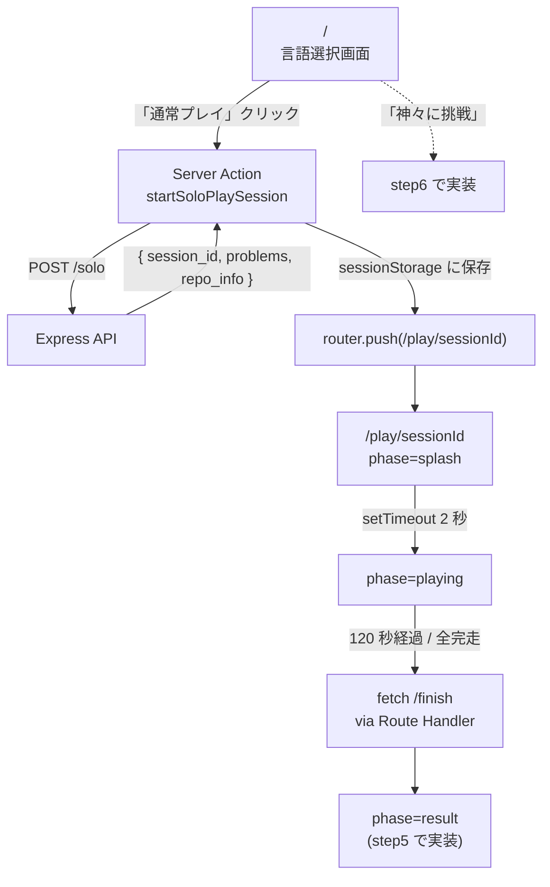
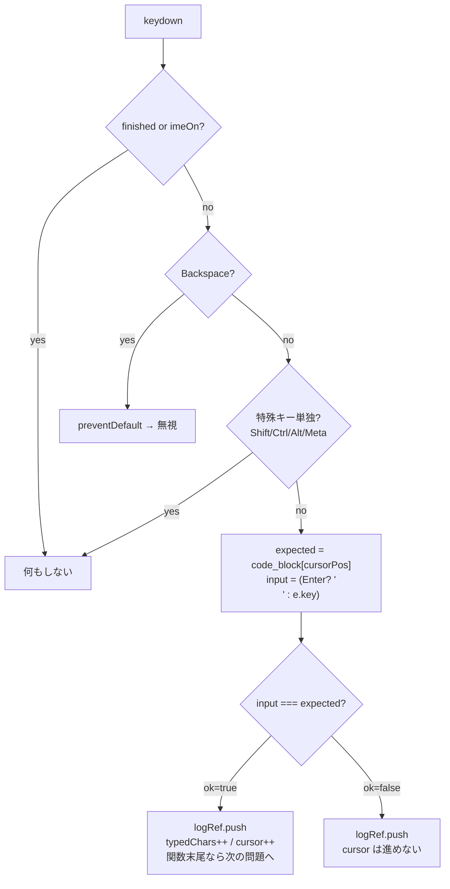
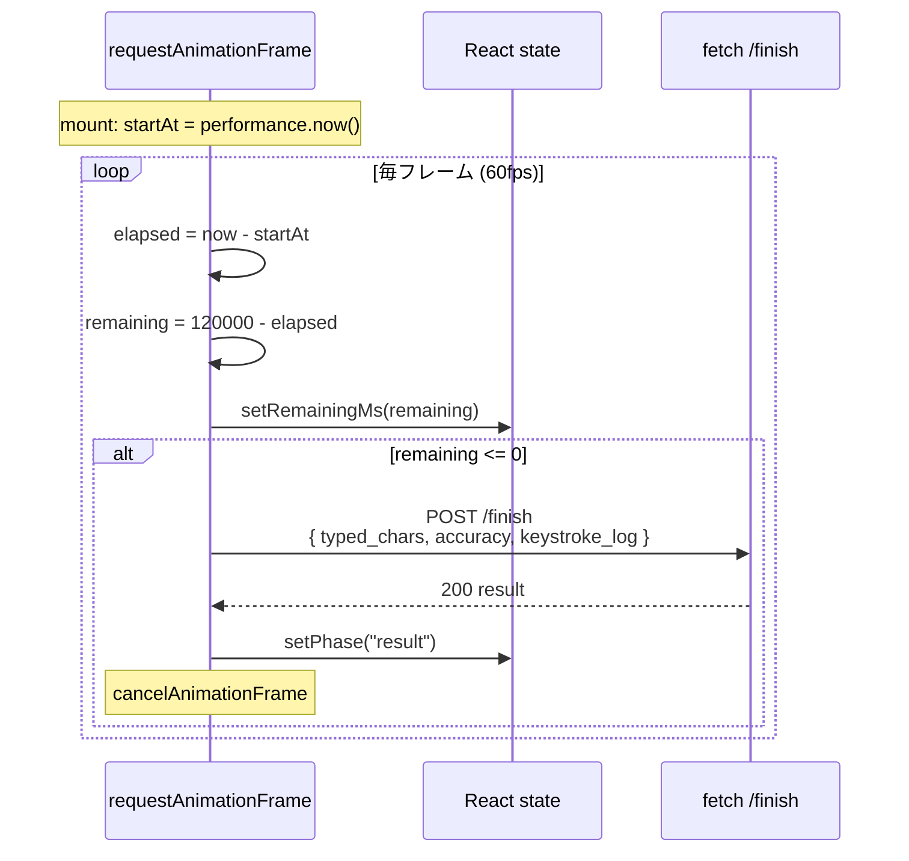
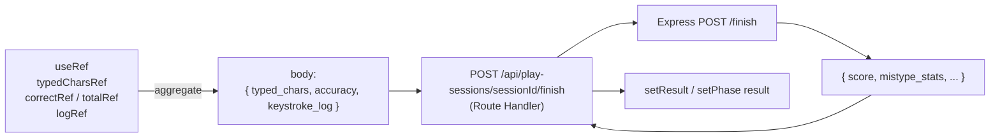

# step4: Web 言語選択 + 「今日の挑戦」スプラッシュ + プレイ画面

ユーザーが言語を選んで `/solo` を叩き、`repo_info` のスプラッシュを 2 秒挟んでから 120 秒プレイ画面に入るまでの **フロントエンド一連** を `apps/web` に実装する。step5 のリザルト画面でこのプレイの結果（typedChars / accuracy / keystrokeLog）を消費する。

step3 で実装した `/finish` を 120 秒タイマー終了時に呼ぶ部分も本 step に含める（API 側の作業は step3 で完了済み、ここはクライアント呼び出しのみ）。**ゲストプレイは Phase 2 以降**で、本 step では認証済みユーザーのみを対象にする。

## 目次

- [対象画面・呼び出し API](#対象画面呼び出し-api)
  - [画面（Next.js Route）](#画面nextjs-route)
  - [呼び出す API](#呼び出す-api)
- [画面遷移フロー](#画面遷移フロー)
  - [処理の流れ](#処理の流れ)
- [プレイ画面の状態モデル](#プレイ画面の状態モデル)
- [入力判定ロジック](#入力判定ロジック)
- [120 秒タイマー（rAF ループ）](#120-秒タイマーraf-ループ)
- [/finish 呼び出し時のデータフロー](#finish-呼び出し時のデータフロー)
- [設計方針](#設計方針)
- [対応内容](#対応内容)
- [動作確認](#動作確認)
- [次の step での利用](#次の-step-での利用)

## 対象画面・呼び出し API

### 画面（Next.js Route）

| Route | コンポーネント | 概要 |
|---|---|---|
| `/` | Server + Client | 言語選択画面（TypeScript / JavaScript × 通常 / 神々） |
| `/play/[sessionId]` | Client（phase 切替） | スプラッシュ → プレイ → リザルト（リザルトは step5） |
| `/api/play-sessions/[id]/finish` | Route Handler | ブラウザから Express API に proxy するためのラッパー |

### 呼び出す API

| メソッド / パス | 呼び出すタイミング | 経路 |
|---|---|---|
| `POST /api/play-sessions/solo` | 「通常プレイ」ボタン押下時 | Server Action → Express API |
| `POST /api/play-sessions/:id/finish` | 120 秒タイマー終了時 | Client → Route Handler → Express API |
| `POST /api/play-sessions/challenge-gods` | 「神々に挑戦」ボタン押下時 | **step6 で有効化**（本 step では無効化＋トースト） |

## 画面遷移フロー



### 処理の流れ

1. `/`（Server Component）が認証チェックを行い、TypeScript / JavaScript の言語ボタンを描画
2. ユーザーが「通常プレイ」をクリック → Server Action `startSoloPlaySession` 起動
3. Server Action が Express の `POST /api/play-sessions/solo` を叩いて `{ session_id, problems, repo_info }` を取得
4. クライアント側で `sessionStorage` に `repo_info` と `problems` を保存（`router.push` 後も復元可能にするため）
5. `router.push("/play/[sessionId]")` でプレイページに遷移
6. `PlayScreen`（Client）が sessionStorage から復元し `phase=splash`
7. `Splash` が 2 秒間 `repo_info` を表示、setTimeout 完了で `phase=playing`
8. `PlayLoop` マウントで `performance.now()` を `startAtRef` に保存し `requestAnimationFrame` ループ開始
9. `document` の keydown を捕捉、`code_block[cursor]` と照合して `KeystrokeEntry` を `logRef` に push（cursor 進行は ok=true 時のみ）
10. 関数末尾到達で次の問題へ自動切替、20 問全完走で「お見事！」表示
11. 残り 0 秒で Route Handler 経由 `POST /finish` を 1 回だけ叩き、レスポンスを受けて `phase=result`（step5 で UI 実装）

## プレイ画面の状態モデル

| phase | 何を表示 | トリガー |
|---|---|---|
| `loading` | スピナー | `useEffect` で sessionStorage 読み込み中 |
| `splash` | 「今回のチャレンジ：{owner}/{name}」 | sessionStorage から復元成功 |
| `playing` | カウントダウン + 関数本体 + cursor | スプラッシュ 2 秒経過 |
| `result` | リザルト UI（step5） | 120 秒経過 OR 20 問全完走 → `/finish` 完了 |

### プレイ中に refs で保持する mutable state

| ref | 用途 | 更新タイミング |
|---|---|---|
| `startAtRef` | `performance.now()` 起点 | mount 時 1 回 |
| `problemIndexRef` / `cursorPosRef` | 現在打鍵中の問題と位置 | keydown ハンドラ内 |
| `typedCharsRef` / `correctRef` / `totalRef` | 累計 | keydown ハンドラ内 |
| `logRef` (`KeystrokeEntry[]`) | keystroke log の蓄積 | keydown ごとに push |
| `finishedRef` | `/finish` 二重呼び出し防止 | rAF タイマー切れ時 |

## 入力判定ロジック



## 120 秒タイマー（rAF ループ）



## /finish 呼び出し時のデータフロー



## 設計方針

- **ルート設計**：`/` を「言語選択画面」とし、`/play/[sessionId]` を 1 つのルートで「スプラッシュ → プレイ → /finish 後にリザルトへ遷移」までを保持する。URL に sessionId を載せることで **リロード = やり直し（Redis state は揮発）** となり、設計上自然
- **プレイ画面は完全 Client Component**。タイマー / 入力判定 / keystroke log 蓄積はブラウザでのみ動く（SSR 不要）。`page.tsx`（Server Component）が初回 `/solo` を叩き、結果を Client Component に props で渡す
- **API 呼び出しの経路**：プレイ画面で `/finish` を叩くのは **Route Handler 経由**（`app/api/play-sessions/[id]/finish/route.ts`）。理由：Server Action は mutation 用途と合致するが、120 秒プレイ後の重い同期処理（POST 1 回で完結）を双方向性なしの Route Handler で扱う方が単純。`/solo` は Server Component 側で `apiClient.post` で叩く
- **タイマー実装**：`requestAnimationFrame` で 1 ループ、毎フレーム `performance.now()` の差分で残り時間を計算（[`./README.md#タイマー実装`](./README.md#タイマー実装)）。`setInterval` は使わない
- **入力判定**：`window` ではなく **`document` レベルで `keydown` を購読**（フォーカス管理を簡略化）。`preventDefault()` で `Tab` キーや `Space` のスクロール等を抑止。プレイ画面ではフォーム要素を持たないため `document` 直結が単純
- **`paste` イベント無効化**：プレイ画面マウント時に `document.addEventListener("paste", e => e.preventDefault())` を仕掛ける。アンマウント時に剥がす
- **`compositionstart` 検知で IME 警告**：日本語 IME ON の状態で打鍵されると正誤判定が壊れるため、`compositionstart` を検知して画面に「IME を OFF にしてください」のオーバーレイを出す。`compositionend` で消す
- **keystroke log のメモリ管理**：1500 entry × 50 byte ≒ 75KB をメモリに保持する想定。`useRef<KeystrokeEntry[]>` に push して再レンダリングを発生させない
- **状態と再レンダリングの分離**：表示用 state（残り時間、累計文字数、正確率）は `useState` で 60fps の頻度で更新するが、進行ロジック（現在の問題 index、各問題の cursor 位置）は `useRef` で持って必要なときだけ `setState` をトリガーする。**タイマー rAF の中で毎フレーム `setState` するとパフォーマンス劣化**するため、表示用は 100ms 程度のスロットルで反映
- **アクセシビリティ**：マウス操作不要（[`./README.md#アクセシビリティ要件`](./README.md#アクセシビリティ要件)）。言語選択ボタンは `tab` でフォーカス → `Enter` で選択。プレイ画面はマウントと同時に `document` で `keydown` を拾うのでフォーカス操作なしで打鍵開始できる
- **`/finish` レスポンスは URL クエリで持ち回らずクライアントメモリで受け渡し**：リザルト画面（step5）は `/play/[sessionId]/result` ではなく `/play/[sessionId]` の同一画面上で **画面切替** する（Router 遷移なし）。理由：`/finish` レスポンスを URL に載せるとブックマーク・共有でゴミ URL が生まれるため。同一 React コンポーネントツリー内で「プレイ → リザルト」を state 切替する形にする
- **`/solo` 失敗時の挙動**：404（eligible repo 無し）/ 400（無効な language_id）はトップに戻ってエラーメッセージ表示。API 障害（5xx）はリトライボタンを出す

## 対応内容

### `apps/web/src/app/page.tsx`（言語選択画面、改修）

既存の `/` page は存在するため、内容を **言語選択画面に置き換え**。

```typescript
import { redirect } from "next/navigation"

import { apiClient } from "@/libs/api-client"
import { isAuthenticated } from "@/libs/auth"

import { LanguageSelector } from "./language-selector"

/** 言語マスタは将来 /api/languages 経由で取りに行く。MVP では typing-engine のみが利用するので
 *  ハードコードで TypeScript / JavaScript を出す（DB 上の id 1/2 と一致させる）*/
const SUPPORTED_LANGUAGES = [
  { id: 1, name: "TypeScript", slug: "typescript" },
  { id: 2, name: "JavaScript", slug: "javascript" },
] as const

export default async function HomePage() {
  if (!(await isAuthenticated())) {
    redirect("/sign-in")
  }

  return (
    <main className="min-h-screen bg-zinc-50 px-6 py-16 dark:bg-black">
      <div className="mx-auto w-full max-w-2xl space-y-10">
        <header className="space-y-2 text-center">
          <h1 className="text-3xl font-bold">Typing Royale</h1>
          <p className="text-sm text-gray-500">
            120 秒で OSS の関数をどれだけ打鍵できるか。
          </p>
        </header>

        <LanguageSelector languages={SUPPORTED_LANGUAGES} />
      </div>
    </main>
  )
}
```

### `apps/web/src/app/language-selector.tsx`（新規 Client Component）

```typescript
"use client"

import { useRouter } from "next/navigation"
import { useState, useTransition } from "react"

import { startSoloPlaySession } from "./actions"

type Props = {
  languages: ReadonlyArray<{ id: number; name: string; slug: string }>
}

export function LanguageSelector({ languages }: Props) {
  const router = useRouter()
  const [isPending, startTransition] = useTransition()
  const [error, setError] = useState<string | null>(null)

  const handleStart = (languageId: number, mode: "solo" | "challenge_gods") => {
    setError(null)
    startTransition(async () => {
      const result = await startSoloPlaySession(languageId, mode)
      if (result.error) {
        setError(result.error)
        return
      }
      router.push(`/play/${result.sessionId}`)
    })
  }

  return (
    <div className="space-y-6">
      {languages.map((lang) => (
        <section
          className="rounded-lg border border-gray-200 bg-white p-6 dark:border-zinc-800 dark:bg-zinc-900"
          key={lang.id}
        >
          <h2 className="mb-4 text-xl font-semibold">{lang.name}</h2>
          <div className="flex gap-3">
            <button
              className="rounded bg-blue-600 px-4 py-2 text-sm font-medium text-white hover:bg-blue-700 disabled:opacity-50"
              disabled={isPending}
              onClick={() => handleStart(lang.id, "solo")}
              type="button"
            >
              通常プレイ
            </button>
            <button
              className="rounded border border-purple-500 px-4 py-2 text-sm font-medium text-purple-700 hover:bg-purple-50 disabled:opacity-50 dark:text-purple-300"
              disabled={isPending}
              onClick={() => handleStart(lang.id, "challenge_gods")}
              type="button"
            >
              神々に挑戦
            </button>
          </div>
        </section>
      ))}

      {error && (
        <p className="rounded bg-red-50 px-4 py-3 text-sm text-red-700">{error}</p>
      )}
    </div>
  )
}
```

### `apps/web/src/app/actions.ts`（新規）

Server Action で `/solo`（と将来の `/challenge-gods`）を叩いて `session_id` を返す。

```typescript
"use server"

import { StartSoloPlaySessionResponse } from "@repo/api-schema"

import { apiClient } from "@/libs/api-client"

/**
 * /solo を叩いて session_id を返す
 * /play/[sessionId] ページで repo_info と problems を改めて取り直すのは無駄なので、
 * Server Action のレスポンスでクライアントに渡せる形にしておきたいが、現状の Server Action
 * は state の persist が難しいため、本 step では sessionId だけ返してプレイ画面で再フェッチ
 * せず、in-memory に置く構成にする（後述：playStartCache を使う）
 *
 * MVP: sessionId と repo_info / problems を全部 Server Action のレスポンスに含めて返す
 */
export const startSoloPlaySession = async (
  languageId: number,
  mode: "solo" | "challenge_gods",
): Promise<
  | { error: string }
  | { problems: StartSoloPlaySessionResponse["problems"]; repoInfo: StartSoloPlaySessionResponse["repo_info"]; sessionId: string }
> => {
  if (mode === "challenge_gods") {
    /** step6 で /challenge-gods 実装後にここを書き換える */
    return { error: "「神々に挑戦」は近日公開予定です。" }
  }

  try {
    const res = await apiClient.post<StartSoloPlaySessionResponse>(
      "/api/play-sessions/solo",
      { language_id: languageId },
    )
    return {
      problems: res.problems,
      repoInfo: res.repo_info,
      sessionId: res.session_id,
    }
  } catch {
    return { error: "セッションを開始できませんでした。時間を空けて再試行してください。" }
  }
}
```

> **問題**：Server Action の戻り値は client 側に渡せるが、Router 遷移後に消える。`/play/[sessionId]` ページに遷移すると `problems` / `repoInfo` を失う。
>
> **解決策**：`router.push("/play/[sessionId]")` する前に、クライアント側で **sessionStorage** に `repoInfo` と `problems` を保存し、`/play/[sessionId]` ページ初回マウント時に読み出す。リロード時は sessionStorage から再復元できる（Redis state はサーバー側で生きているので問題ない）。`localStorage` でなく `sessionStorage` を使うのは「タブを閉じたら消える」のが望ましいため。
>
> 言語選択画面の `handleStart` を以下に修正：
>
> ```typescript
> startTransition(async () => {
>   const result = await startSoloPlaySession(languageId, mode)
>   if ("error" in result) { setError(result.error); return }
>   sessionStorage.setItem(`play:${result.sessionId}`, JSON.stringify({
>     problems: result.problems,
>     repoInfo: result.repoInfo,
>   }))
>   router.push(`/play/${result.sessionId}`)
> })
> ```

### `apps/web/src/app/play/[sessionId]/page.tsx`（新規 Server Component）

認証チェックだけして Client Component に渡す。`/solo` のリクエストは既に Server Action 経由で済んでいるため、ここでは追加 API 呼び出しなし。

```typescript
import { redirect } from "next/navigation"

import { isAuthenticated } from "@/libs/auth"

import { PlayScreen } from "./play-screen"

export default async function PlayPage({ params }: { params: Promise<{ sessionId: string }> }) {
  if (!(await isAuthenticated())) {
    redirect("/sign-in")
  }
  const { sessionId } = await params

  return <PlayScreen sessionId={sessionId} />
}
```

### `apps/web/src/app/play/[sessionId]/play-screen.tsx`（新規 Client Component）

スプラッシュ → プレイ → `/finish` 呼び出し → リザルトの 4 状態を 1 コンポーネントツリーで持つ。リザルト UI は step5 で実装するため、本 step では `<ResultScreen />` という placeholder を返すところまで作る。

```typescript
"use client"

import { useEffect, useState } from "react"

import { StartSoloPlaySessionResponse } from "@repo/api-schema"

import { PlayLoop } from "./play-loop"
import { Splash } from "./splash"

type CachedStart = {
  problems: StartSoloPlaySessionResponse["problems"]
  repoInfo: StartSoloPlaySessionResponse["repo_info"]
}

type Phase = "loading" | "splash" | "playing" | "result"

export function PlayScreen({ sessionId }: { sessionId: string }) {
  const [phase, setPhase] = useState<Phase>("loading")
  const [start, setStart] = useState<CachedStart | null>(null)

  useEffect(() => {
    const raw = sessionStorage.getItem(`play:${sessionId}`)
    if (!raw) {
      /** sessionStorage が空 = 直リンクされた / リロード時 1 回目: トップに戻す */
      window.location.href = "/"
      return
    }
    setStart(JSON.parse(raw) as CachedStart)
    setPhase("splash")
  }, [sessionId])

  if (phase === "loading" || start === null) {
    return <div className="p-10 text-center text-sm text-gray-500">読み込み中...</div>
  }

  if (phase === "splash") {
    return <Splash repoInfo={start.repoInfo} onFinished={() => setPhase("playing")} />
  }

  if (phase === "playing") {
    return (
      <PlayLoop
        problems={start.problems}
        sessionId={sessionId}
        onFinished={() => setPhase("result")}
      />
    )
  }

  /** step5 で実装。本 step ではダミー */
  return <div className="p-10 text-center">リザルト画面（step5 で実装）</div>
}
```

### `apps/web/src/app/play/[sessionId]/splash.tsx`（新規 Client Component）

2 秒間 `repo_info` を表示してから `onFinished()` を呼ぶ。

```typescript
"use client"

import { useEffect } from "react"

import { StartSoloPlaySessionResponse } from "@repo/api-schema"

type Props = {
  onFinished: () => void
  repoInfo: StartSoloPlaySessionResponse["repo_info"]
}

const SPLASH_DURATION_MS = 2000

export function Splash({ onFinished, repoInfo }: Props) {
  useEffect(() => {
    const timer = setTimeout(onFinished, SPLASH_DURATION_MS)
    return () => clearTimeout(timer)
  }, [onFinished])

  return (
    <main className="flex min-h-screen items-center justify-center bg-zinc-900 px-6 text-zinc-50">
      <div className="w-full max-w-xl space-y-4 text-center">
        <p className="text-sm uppercase tracking-widest text-zinc-400">今回のチャレンジ</p>
        <h1 className="text-4xl font-bold">
          {repoInfo.owner}/{repoInfo.name}
        </h1>
        <p className="text-sm text-zinc-300">★ {repoInfo.stars.toLocaleString()}</p>
        {repoInfo.description && (
          <p className="line-clamp-3 text-base text-zinc-200">{repoInfo.description}</p>
        )}
        {repoInfo.fallback && (
          <p className="text-xs text-yellow-300">
            一部の問題は他リポジトリから補填されました
          </p>
        )}
      </div>
    </main>
  )
}
```

### `apps/web/src/app/play/[sessionId]/play-loop.tsx`（新規 Client Component）

タイマー + 入力判定 + 完走検知 + keystroke log 蓄積 + 120 秒終了で `/finish` 呼び出し、までの本体。

```typescript
"use client"

import { useEffect, useRef, useState } from "react"

import { StartSoloPlaySessionResponse } from "@repo/api-schema"

type Problem = StartSoloPlaySessionResponse["problems"][number]
type KeystrokeEntry = { ch: string; ok: boolean; p: number; t: number }

type Props = {
  onFinished: () => void
  problems: Problem[]
  sessionId: string
}

const SESSION_DURATION_MS = 120_000

export function PlayLoop({ onFinished, problems, sessionId }: Props) {
  const [problemIndex, setProblemIndex] = useState(0)
  const [cursorPos, setCursorPos] = useState(0)
  const [typedChars, setTypedChars] = useState(0)
  const [totalKeystrokes, setTotalKeystrokes] = useState(0)
  const [correctKeystrokes, setCorrectKeystrokes] = useState(0)
  const [remainingMs, setRemainingMs] = useState(SESSION_DURATION_MS)
  const [imeOn, setImeOn] = useState(false)

  /** mutable refs（rAF / keydown ハンドラで読む） */
  const startAtRef = useRef<number>(0)
  const problemIndexRef = useRef(0)
  const cursorPosRef = useRef(0)
  const typedCharsRef = useRef(0)
  const totalRef = useRef(0)
  const correctRef = useRef(0)
  const logRef = useRef<KeystrokeEntry[]>([])
  const finishedRef = useRef(false)

  const finish = async () => {
    if (finishedRef.current) return
    finishedRef.current = true

    const accuracy = totalRef.current === 0 ? 0 : correctRef.current / totalRef.current
    try {
      await fetch(`/api/play-sessions/${sessionId}/finish`, {
        body: JSON.stringify({
          accuracy,
          keystroke_log: logRef.current,
          typed_chars: typedCharsRef.current,
        }),
        headers: { "Content-Type": "application/json" },
        method: "POST",
      })
    } catch {
      /** TODO: step5 でリザルトに「保存に失敗」を表示。本 step では握りつぶす */
    }
    onFinished()
  }

  /** タイマー（rAF） */
  useEffect(() => {
    startAtRef.current = performance.now()
    let raf = 0
    const tick = () => {
      const elapsed = performance.now() - startAtRef.current
      const remaining = Math.max(0, SESSION_DURATION_MS - elapsed)
      setRemainingMs(remaining)
      if (remaining <= 0) {
        finish()
        return
      }
      raf = requestAnimationFrame(tick)
    }
    raf = requestAnimationFrame(tick)
    return () => cancelAnimationFrame(raf)
    /** eslint-disable-next-line react-hooks/exhaustive-deps */
  }, [])

  /** keydown ハンドラ */
  useEffect(() => {
    const onKeyDown = (e: KeyboardEvent) => {
      if (finishedRef.current || imeOn) return
      /** 特殊キーの除外（Shift/Ctrl/Alt/Meta 単独） */
      if (e.key.length > 1 && e.key !== "Enter" && e.key !== "Backspace") return
      /** Backspace は無視（仕様：誤入力時は次の正解文字が打たれるまで進まない） */
      if (e.key === "Backspace") {
        e.preventDefault()
        return
      }

      const currentProblem = problems[problemIndexRef.current]
      if (!currentProblem) return

      const expectedChar = currentProblem.code_block[cursorPosRef.current]
      /** Enter は改行扱い */
      const inputChar = e.key === "Enter" ? "\n" : e.key
      const ok = inputChar === expectedChar

      e.preventDefault()

      const elapsed = performance.now() - startAtRef.current
      logRef.current.push({
        ch: e.key,
        ok,
        p: problemIndexRef.current,
        t: elapsed,
      })

      totalRef.current += 1
      setTotalKeystrokes(totalRef.current)
      if (ok) {
        correctRef.current += 1
        setCorrectKeystrokes(correctRef.current)
        typedCharsRef.current += 1
        setTypedChars(typedCharsRef.current)
        cursorPosRef.current += 1
        setCursorPos(cursorPosRef.current)

        /** 関数完走判定 */
        if (cursorPosRef.current >= currentProblem.code_block.length) {
          problemIndexRef.current += 1
          cursorPosRef.current = 0
          setProblemIndex(problemIndexRef.current)
          setCursorPos(0)
          /** 20 問完走したら以降は入力を受け付けない（仕様：「お見事！全問完走」） */
        }
      }
    }
    const onPaste = (e: ClipboardEvent) => e.preventDefault()
    const onCompositionStart = () => setImeOn(true)
    const onCompositionEnd = () => setImeOn(false)

    document.addEventListener("keydown", onKeyDown)
    document.addEventListener("paste", onPaste)
    document.addEventListener("compositionstart", onCompositionStart)
    document.addEventListener("compositionend", onCompositionEnd)
    return () => {
      document.removeEventListener("keydown", onKeyDown)
      document.removeEventListener("paste", onPaste)
      document.removeEventListener("compositionstart", onCompositionStart)
      document.removeEventListener("compositionend", onCompositionEnd)
    }
  }, [problems, imeOn])

  const currentProblem = problems[problemIndex] ?? null
  const allDone = problemIndex >= problems.length
  const accuracy = totalKeystrokes === 0 ? 0 : correctKeystrokes / totalKeystrokes

  return (
    <main className="flex min-h-screen flex-col bg-zinc-50 px-6 py-6 dark:bg-zinc-950">
      <header className="mb-4 flex items-baseline justify-between">
        <div>
          <span className="text-3xl font-bold tabular-nums">
            {Math.ceil(remainingMs / 1000)}
          </span>
          <span className="ml-1 text-sm text-gray-500">秒</span>
        </div>
        <div className="space-x-4 text-sm text-gray-600 dark:text-gray-300">
          <span>{typedChars} 文字</span>
          <span>{(accuracy * 100).toFixed(1)}%</span>
          <span>
            {problemIndex} / {problems.length} 問
          </span>
        </div>
      </header>

      {imeOn && (
        <div className="mb-4 rounded bg-yellow-100 px-4 py-3 text-sm text-yellow-900">
          IME を OFF にしてください
        </div>
      )}

      <section className="flex-1 rounded-lg border border-gray-200 bg-white p-6 font-mono text-base dark:border-zinc-800 dark:bg-zinc-900">
        {allDone ? (
          <p className="text-center text-2xl text-green-600">お見事！全問完走</p>
        ) : currentProblem ? (
          <pre className="whitespace-pre-wrap break-words">
            {renderCode(currentProblem.code_block, cursorPos)}
          </pre>
        ) : null}
      </section>

      <footer className="mt-3 text-right text-xs text-gray-500">
        {currentProblem && (
          <span>
            {currentProblem.function_name}
            <a
              className="ml-2 underline"
              href={currentProblem.source_url}
              rel="noreferrer noopener"
              target="_blank"
            >
              GitHub
            </a>
          </span>
        )}
      </footer>
    </main>
  )
}

/**
 * 打鍵済み（緑）/ 現在位置（下線）/ 未打鍵（gray）で色分け
 */
const renderCode = (code: string, cursor: number) => {
  return (
    <>
      <span className="text-green-600">{code.slice(0, cursor)}</span>
      <span className="bg-blue-200 dark:bg-blue-900">{code[cursor] ?? ""}</span>
      <span className="text-gray-400">{code.slice(cursor + 1)}</span>
    </>
  )
}
```

### `apps/web/src/app/api/play-sessions/[id]/finish/route.ts`（新規 Route Handler）

ブラウザから直叩きできないルールのため、Route Handler 経由で Express API を叩く。

```typescript
import { NextRequest, NextResponse } from "next/server"

import { apiClient } from "@/libs/api-client"

export async function POST(
  req: NextRequest,
  { params }: { params: Promise<{ id: string }> },
) {
  const { id } = await params
  const body = await req.json()

  try {
    const res = await apiClient.post(`/api/play-sessions/${id}/finish`, body)
    return NextResponse.json(res)
  } catch (e) {
    /** apiClient はエラーで throw するため、ここで適切な status を返す */
    return NextResponse.json({ error: "Finish failed" }, { status: 500 })
  }
}
```

### `apps/web/src/libs/api-client.ts` に `post` メソッドがあることを確認

既存実装にあれば不要。無い場合は memo-update 系の post パターンを参考に追加（apps/web/src/libs/api-client.ts は step1 で memo 関連を実装済みなので大抵存在する）。

## 動作確認

### Lint / Build

```bash
pnpm lint && pnpm --filter web build
```

### Playwright MCP で動作確認

> CLAUDE.md「動作確認（必須）」より、UI 実装後は `verify-web-page` skill / Playwright MCP で必ず実画面の確認を行う。

確認手順：

1. `pnpm dev` で apps/web と apps/api を起動
2. dev-login で JWT cookie を注入
3. `/` にアクセス → 言語選択画面が表示される
4. 「TypeScript の 通常プレイ」をクリック → `/play/[uuid]` に遷移
5. 2 秒間スプラッシュが表示される（owner/name / Star 数 / description）
6. プレイ画面に切り替わり、120 秒カウントダウンが始まる
7. キーボードで打鍵 → 緑色で進行、現在位置にカーソル
8. 誤入力 → 進まない、`accuracy` が低下
9. ペーストを試す → 何も入力されない（preventDefault）
10. 日本語 IME を ON にする → 警告オーバーレイ表示
11. 120 秒経過 → `/api/play-sessions/[id]/finish` が叩かれる（Network タブで確認）
12. リザルト画面（step5 では placeholder）に切り替わる
13. DB を確認して `play_sessions` に 1 行追加されている

console error は 0 件であること。

### before/after スクリーンショット

新規ページのため after のみで OK。PR 本文に明記する：

- `docs/screenshots/typing-engine-play/language-select-after.png`
- `docs/screenshots/typing-engine-play/splash-after.png`
- `docs/screenshots/typing-engine-play/play-screen-after.png`

## 次の step での利用

- **step5（Web リザルト画面 + ゲスト IndexedDB）**: `PlayLoop` の `/finish` 呼び出しレスポンスを `<ResultScreen />` に渡す形に拡張。`{ score, accuracy, mistype_stats }` をリザルト UI で表示。ゲストモード対応（`persisted=false` ならクライアントの IndexedDB に保存）
- **step6（API `/challenge-gods`）**: 言語選択画面の「神々に挑戦」ボタンを有効化し、Server Action 内で `/challenge-gods` を叩く分岐を追加。`PlayLoop` 側にゴースト併走 UI（横並び累計文字数）を後で足す
- **score-ranking 機能**: リザルト画面の順位フェッチ（`GET /api/rankings/me`）は別 feature の step
