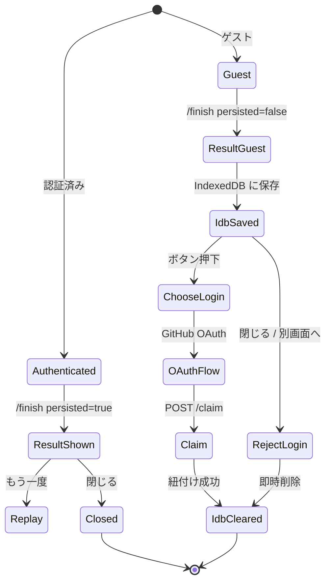
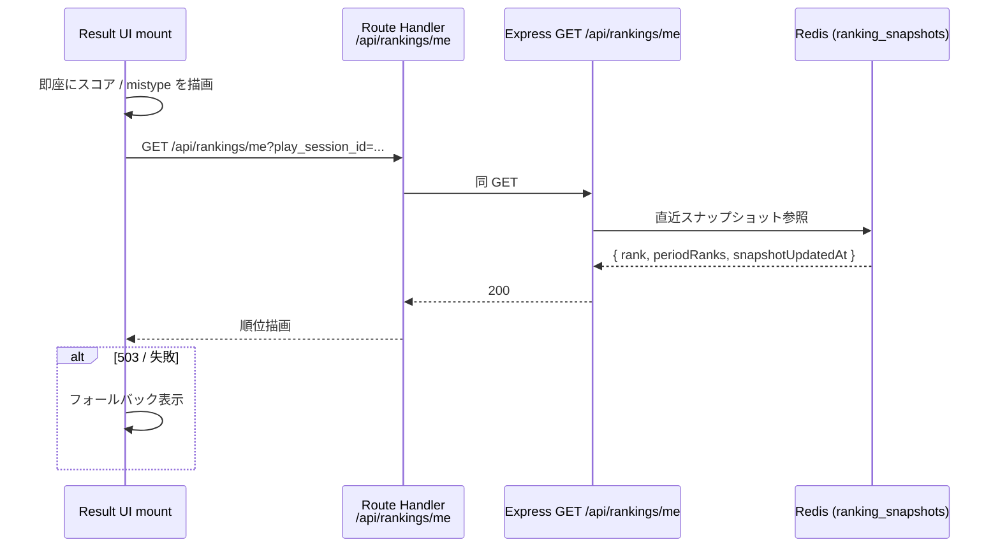

# step5: Web リザルト画面 + ゲスト IndexedDB バッファ

step4 で `/finish` を叩いたあとに表示される **リザルト画面** を実装する。スコア・正確率・出題数 / 完走数・ニガテ文字（mistype）・repo コメント・順位を表示し、シェアボタンと再プレイ導線を提供する。**ゲストモードのバッファリング**もここで完結させる：ゲストの場合は DB に書き込まれない（`/finish` レスポンスの `persisted=false`）ため、IndexedDB に一時保存し、「ログインして記録を残す」を押されたら `/api/play-sessions/claim` でアカウントに紐付ける。

step4 と同じ `/play/[sessionId]` ページ上で **画面切替（phase=result）** として実装する。Router 遷移なし。

## 目次

- [対象画面・呼び出し API](#対象画面呼び出し-api)
  - [画面（Next.js Route）](#画面nextjs-route)
  - [呼び出す API](#呼び出す-api)
  - [呼び出さない（仕様メモ）](#呼び出さない仕様メモ)
- [リザルト画面のレイアウト](#リザルト画面のレイアウト)
- [ゲストフロー（IndexedDB）](#ゲストフローindexeddb)
  - [処理の流れ](#処理の流れ)
  - [IndexedDB スキーマ](#indexeddb-スキーマ)
- [順位フェッチ（遅延描画）](#順位フェッチ遅延描画)
- [エンジニアグレード進捗の計算](#エンジニアグレード進捗の計算)
- [対応内容](#対応内容)
- [動作確認](#動作確認)
- [次の step での利用](#次の-step-での利用)

## 対象画面・呼び出し API

### 画面（Next.js Route）

| Route | 区分 | 概要 |
|---|---|---|
| `/play/[sessionId]`（phase=result） | Client（既存ツリー） | リザルト UI 一式 |
| `/api/play-sessions/claim` | Route Handler（新規） | ゲスト → サインイン後にバッファを Express に送る proxy |

### 呼び出す API

| メソッド / パス | 呼び出すタイミング | 経路 | 認証 |
|---|---|---|---|
| `GET /api/rankings/me?play_session_id=...` | 認証済みリザルト表示直後（順位を遅延描画） | Client → Route Handler → Express | 必須 |
| `POST /api/play-sessions/claim` | ゲストが「ログインして記録を残す」を押下後の OAuth 完了時 | Client → Route Handler → Express | 必須（OAuth 直後の token を使う） |

> `GET /api/rankings/me` の **Express 側実装は score-ranking 機能の step**。本 step では Web 側のフェッチと「集計時刻併記 / 圏外表示」UI のみ実装する。Express 側が未実装なら 503 を握りつぶして「順位は集計後に表示されます」を出すフォールバック付き。

### 呼び出さない（仕様メモ）

`POST /api/play-sessions/:id/finish` は **step4 の `PlayLoop` 内で呼び出し済み**。リザルト画面はその **レスポンス（`FinishResult`）を props で受け取るだけ** で、追加で叩かない。

## リザルト画面のレイアウト

```
┌────────────────────────────────────────────┐
│ ◯◯ 秒の戦い、お疲れさまでした              │
│                                            │
│  ┌──────────┐  ┌──────────┐  ┌──────────┐ │
│  │ Score    │  │ Accuracy │  │ Chars    │ │
│  │   304    │  │  95.0%   │  │   320    │ │
│  └──────────┘  └──────────┘  └──────────┘ │
│                                            │
│  Engineer Grade: Junior Developer          │
│  次のグレードまで: あと 46 文字            │
│                                            │
│  順位（TypeScript・全期間）                │
│  ▸ 43 位 / 1000 (2026-06-07 03:00 時点)    │
│                                            │
│  よく間違える文字                          │
│  ▸ "l" × 2  ";" × 1  "{" × 1               │
│                                            │
│  ちなみに今回のリポジトリは…               │
│  ▸ vercel/next.js (★130k)                  │
│    The React Framework                     │
│                                            │
│  [もう一度プレイ]  [シェア]                │
└────────────────────────────────────────────┘
```

ゲスト時：

```
┌────────────────────────────────────────────┐
│ 同上スコア表示 + 「ログインして記録を残す」 │
│ ▸ GitHub でログイン                        │
│ ▸ ログインしないと、この記録は閉じた時点で │
│   消えます                                 │
└────────────────────────────────────────────┘
```

## ゲストフロー（IndexedDB）



### 処理の流れ

1. `/finish` 完了で `PlayScreen` が `phase=result` に遷移し `ResultScreen` をマウント
2. `result.persisted=false`（ゲスト）なら `saveGuestBuffer()` で IndexedDB に 1 レコード保存
3. スコア / accuracy / mistype / repo コメント / グレード進捗を即時描画（順位以外は同期表示）
4. `useEffect` で `GET /api/rankings/me?play_session_id=...` を Route Handler 経由で遅延 fetch
5. 順位取得成功なら「{rank} 位 / 1000（{snapshot_updated_at} 時点）」を描画、503 / 失敗時は「集計後に表示されます」フォールバック
6. 圏外（`rank=null`）の場合は順位の代わりにグレードと累計打鍵を表示
7. ゲストの場合は `GuestLoginPanel` を表示
8. 「GitHub でログイン」押下 → OAuth フロー → callback で `claimGuestBuffer()` 実行 → `POST /api/play-sessions/claim` で DB に紐付け
9. claim 成功で IndexedDB を `clear()`
10. 「記録しない」押下 / `beforeunload` イベントでも IndexedDB を即時 `clear()`

### IndexedDB スキーマ

| Database | `typing-royale` |
|---|---|
| Object Store | `guest_play_buffer` |
| KeyPath | `sessionId` |

各レコード：

```typescript
type GuestPlayBufferRecord = {
  sessionId: string  /** /solo で発行された session_id */
  finishedAt: number  /** Date.now() */
  payload: {
    typed_chars: number
    accuracy: number
    keystroke_log: KeystrokeEntry[]
    /** /finish のレスポンスから流用したサマリ（リザルト画面再描画用） */
    result: FinishPlaySessionResponse
    repo_info: RepoInfo
  }
}
```

**寿命**：原則 1 レコードのみ（最新セッション）。新しいプレイを開始した時点で過去のレコードは消す（`clear()`）。「閉じる」操作（unload / beforeunload）でも `clear()` を仕掛ける。

## 順位フェッチ（遅延描画）

| 観点 | 内容 |
|---|---|
| いつ | リザルト画面マウント直後、即時に `useEffect` で fetch |
| 何を | `GET /api/rankings/me?play_session_id={id}` |
| どう描く | 取得前は「順位を取得中…」、取得後は順位 + `snapshot_updated_at` 併記 |
| 圏外 | `rank: null` なら「圏外（1000 位以下）」+ グレードと累計打鍵で代替表示 |
| 失敗 | 「順位は集計後に表示されます」（score-ranking バッチ未実装フォールバック） |



## エンジニアグレード進捗の計算

| 入力 | 出力 |
|---|---|
| `current_grade` / `best_score`（`GET /api/user/lifetime-stats` 由来 — score-ranking 機能の API、本 step ではモックで OK） | `nextGrade`, `pointsToNext` |

score-ranking の閾値表（Intern 0 / Junior 100 / Mid 250 / Senior 400 / Staff 600 / Principal 800 / Distinguished 1000 / Fellow 1200）を `apps/web/src/libs/grade.ts` に持たせて純粋関数化する。閾値の正本は score-ranking 機能なので、コメントで「lifetime-stats API が出来たらそこから降ってきた値を使う」と書いておく。

## 対応内容

### `apps/web/src/app/play/[sessionId]/play-screen.tsx` の改修

step4 の `phase === "result"` ブロックを placeholder から `<ResultScreen />` に置き換える。`/finish` のレスポンスを受け取って渡せるよう、`PlayLoop` の `onFinished` シグネチャを変更：

```typescript
type Props = {
  problems: Problem[]
  sessionId: string
  /** finish 完了時に呼ばれる。result は authed なら API レスポンス、guest なら同等のオブジェクト */
  onFinished: (result: FinishPlaySessionResponse, payload: FinishPayload) => void
}
```

`PlayScreen` 側：

```typescript
const [result, setResult] = useState<FinishPlaySessionResponse | null>(null)
const [payload, setPayload] = useState<FinishPayload | null>(null)

/** ... */

if (phase === "playing") {
  return (
    <PlayLoop
      problems={start.problems}
      sessionId={sessionId}
      onFinished={(r, p) => { setResult(r); setPayload(p); setPhase("result") }}
    />
  )
}

if (phase === "result" && result && payload) {
  return (
    <ResultScreen
      isGuest={!result.persisted}
      payload={payload}
      repoInfo={start.repoInfo}
      result={result}
      sessionId={sessionId}
    />
  )
}
```

### `apps/web/src/app/play/[sessionId]/result-screen.tsx`（新規 Client Component）

```typescript
"use client"

import { useEffect, useState } from "react"

import { FinishPlaySessionResponse, StartSoloPlaySessionResponse } from "@repo/api-schema"

import { computeGradeProgress } from "@/libs/grade"
import { saveGuestBuffer, claimGuestBuffer, clearGuestBuffer } from "@/libs/guest-buffer"

import { MistypeList } from "./mistype-list"
import { RankingPanel } from "./ranking-panel"
import { RepoComment } from "./repo-comment"

type Props = {
  isGuest: boolean
  payload: FinishPayload
  repoInfo: StartSoloPlaySessionResponse["repo_info"]
  result: FinishPlaySessionResponse
  sessionId: string
}

export function ResultScreen({ isGuest, payload, repoInfo, result, sessionId }: Props) {
  /** ゲストならマウント時に IndexedDB に保存 */
  useEffect(() => {
    if (isGuest) {
      saveGuestBuffer({ sessionId, payload, repoInfo, result })
    }
    /** beforeunload / 画面離脱で バッファ削除 */
    const onUnload = () => { if (isGuest) clearGuestBuffer() }
    window.addEventListener("beforeunload", onUnload)
    return () => window.removeEventListener("beforeunload", onUnload)
  }, [isGuest, sessionId, payload, repoInfo, result])

  return (
    <main className="min-h-screen bg-zinc-50 px-6 py-10 dark:bg-black">
      <div className="mx-auto w-full max-w-2xl space-y-6">
        <h1 className="text-center text-2xl font-bold">120 秒の戦い、お疲れさまでした</h1>

        <ScoreCards result={result} />

        <RankingPanel isGuest={isGuest} sessionId={sessionId} />

        <MistypeList stats={result.mistype_stats} />

        <RepoComment repoInfo={repoInfo} />

        <footer className="flex justify-center gap-3">
          <a className="rounded bg-blue-600 px-4 py-2 text-sm text-white hover:bg-blue-700" href="/">
            もう一度プレイ
          </a>
          <ShareButton result={result} repoInfo={repoInfo} />
        </footer>

        {isGuest && <GuestLoginPanel sessionId={sessionId} />}
      </div>
    </main>
  )
}
```

### `apps/web/src/libs/guest-buffer.ts`（新規）

```typescript
"use client"

import { FinishPlaySessionResponse } from "@repo/api-schema"

const DB_NAME = "typing-royale"
const STORE = "guest_play_buffer"
const VERSION = 1

const openDb = (): Promise<IDBDatabase> => new Promise((resolve, reject) => {
  const req = indexedDB.open(DB_NAME, VERSION)
  req.onupgradeneeded = () => req.result.createObjectStore(STORE, { keyPath: "sessionId" })
  req.onsuccess = () => resolve(req.result)
  req.onerror = () => reject(req.error)
})

export type GuestBufferRecord = {
  finishedAt: number
  payload: FinishPayload
  repoInfo: StartSoloPlaySessionResponse["repo_info"]
  result: FinishPlaySessionResponse
  sessionId: string
}

export const saveGuestBuffer = async (input: Omit<GuestBufferRecord, "finishedAt">): Promise<void> => {
  const db = await openDb()
  await new Promise<void>((resolve, reject) => {
    const tx = db.transaction(STORE, "readwrite")
    /** 既存レコードはすべて消してから新しいのを 1 つだけ保持 */
    tx.objectStore(STORE).clear()
    tx.objectStore(STORE).add({ ...input, finishedAt: Date.now() })
    tx.oncomplete = () => resolve()
    tx.onerror = () => reject(tx.error)
  })
}

export const loadGuestBuffer = async (): Promise<GuestBufferRecord | null> => {
  const db = await openDb()
  return new Promise((resolve, reject) => {
    const tx = db.transaction(STORE, "readonly")
    const req = tx.objectStore(STORE).getAll()
    req.onsuccess = () => resolve((req.result as GuestBufferRecord[])[0] ?? null)
    req.onerror = () => reject(req.error)
  })
}

export const clearGuestBuffer = async (): Promise<void> => {
  const db = await openDb()
  await new Promise<void>((resolve, reject) => {
    const tx = db.transaction(STORE, "readwrite")
    tx.objectStore(STORE).clear()
    tx.oncomplete = () => resolve()
    tx.onerror = () => reject(tx.error)
  })
}

/**
 * サインイン完了後に Route Handler 経由で /claim を叩く
 * 成功したら IndexedDB をクリア
 */
export const claimGuestBuffer = async (): Promise<{ ok: true } | { error: string }> => {
  const record = await loadGuestBuffer()
  if (!record) return { ok: true }
  const res = await fetch("/api/play-sessions/claim", {
    body: JSON.stringify({
      accuracy: record.payload.accuracy,
      keystroke_log: record.payload.keystroke_log,
      session_id: record.sessionId,
      typed_chars: record.payload.typed_chars,
    }),
    headers: { "Content-Type": "application/json" },
    method: "POST",
  })
  if (!res.ok) return { error: "claim failed" }
  await clearGuestBuffer()
  return { ok: true }
}
```

### `apps/web/src/app/api/play-sessions/claim/route.ts`（新規 Route Handler）

ブラウザから Express API を直叩きできない方針のため、Route Handler 経由でプロキシする。**ゲストフロー専用**：OAuth 直後に呼ばれ、サーバー側で `play_sessions` を作成 + IndexedDB の内容を反映する。Express 側エンドポイントの実装は Phase 2（ゲスト対応）で行う（本 step は Web 側のみ）。

```typescript
import { NextRequest, NextResponse } from "next/server"

import { apiClient } from "@/libs/api-client"

export async function POST(req: NextRequest) {
  const body = await req.json()
  try {
    const res = await apiClient.post("/api/play-sessions/claim", body)
    return NextResponse.json(res)
  } catch {
    return NextResponse.json({ error: "claim failed" }, { status: 500 })
  }
}
```

### `apps/web/src/app/play/[sessionId]/guest-login-panel.tsx`（新規）

```typescript
"use client"

import { useState } from "react"

import { claimGuestBuffer, clearGuestBuffer } from "@/libs/guest-buffer"

export function GuestLoginPanel({ sessionId }: { sessionId: string }) {
  const [pending, setPending] = useState(false)

  const handleLogin = () => {
    setPending(true)
    /** OAuth flow に飛ぶ。戻り先で claim を実行する想定で
     *  redirect_uri に ?claim=1 を載せる。
     *  受け取った callback ページで claimGuestBuffer() を呼んでから / にリダイレクト */
    window.location.href = "/api/auth/github?redirect=/play/claim-callback"
  }

  const handleReject = async () => {
    await clearGuestBuffer()
    window.location.href = "/"
  }

  return (
    <section className="rounded-lg border border-amber-200 bg-amber-50 p-4 text-sm dark:border-amber-700 dark:bg-amber-950/30">
      <p className="font-semibold">この記録を残しますか？</p>
      <p className="mt-1 text-xs text-amber-900 dark:text-amber-200">
        ログインしないと、画面を閉じた時点で記録は消えます。
      </p>
      <div className="mt-3 flex gap-2">
        <button
          className="rounded bg-amber-700 px-3 py-1.5 text-white"
          disabled={pending}
          onClick={handleLogin}
        >
          GitHub でログインして記録を残す
        </button>
        <button
          className="rounded border border-amber-700 px-3 py-1.5 text-amber-900"
          onClick={handleReject}
        >
          記録しない
        </button>
      </div>
    </section>
  )
}
```

> OAuth コールバックの戻り口で `claimGuestBuffer()` を呼ぶ。コールバック画面は github-auth 既存のフローに依存するため、本 step では「OAuth 戻りで `?claim=1` クエリ付きの場合に claim を呼ぶ」のフックだけ追加する。

### `apps/web/src/libs/grade.ts`（新規 — 純粋関数）

```typescript
type Grade = {
  level: number
  name: string
  threshold: number
}

const GRADES: Grade[] = [
  { level: 1, name: "Intern", threshold: 0 },
  { level: 2, name: "Junior Developer", threshold: 100 },
  { level: 3, name: "Mid Developer", threshold: 250 },
  { level: 4, name: "Senior Engineer", threshold: 400 },
  { level: 5, name: "Staff Engineer", threshold: 600 },
  { level: 6, name: "Principal Engineer", threshold: 800 },
  { level: 7, name: "Distinguished Engineer", threshold: 1000 },
  { level: 8, name: "Fellow", threshold: 1200 },
]

export const computeGradeProgress = (bestScore: number): {
  current: Grade
  next: Grade | null
  pointsToNext: number | null
} => {
  const current = [...GRADES].reverse().find((g) => bestScore >= g.threshold)!
  const next = GRADES.find((g) => g.threshold > bestScore) ?? null
  return {
    current,
    next,
    pointsToNext: next ? next.threshold - bestScore : null,
  }
}
```

## 動作確認

### Lint / Build

```bash
pnpm lint && pnpm --filter web build
```

### Playwright MCP（必須）

| 観点 | 期待挙動 |
|---|---|
| 認証済みでフルプレイ → リザルト | スコア / 正確率 / mistype / repo コメント / 順位（or フォールバック）が表示 |
| `/finish` のレスポンスに `persisted=true` を返す状態で「もう一度」 | `/` に戻る |
| ゲスト用ダミーの `persisted=false` を流し込む | IndexedDB に 1 レコード作成される（DevTools > Application > IndexedDB で確認） |
| GuestLoginPanel の「記録しない」 | IndexedDB が即時 clear される |
| ブラウザ閉じる（beforeunload 発火） | IndexedDB が clear される |

### IndexedDB の保存・削除の単体テスト

`apps/web` 側に vitest を導入していない場合は手動確認のみ。導入済みなら `fake-indexeddb` を用意して `save → load → clear` の往復を検証する。

### before/after スクショ

新規ページのため after のみ。

- `docs/screenshots/typing-engine-result/result-authed-after.png`
- `docs/screenshots/typing-engine-result/result-guest-after.png`

## 次の step での利用

- **step6（API `/challenge-gods`）**: リザルト画面はそのまま流用可能（`mode` を意識せず `FinishResult` を表示）。`repo_info` は神が打った repo を継承するため UI 変更なし
- **score-ranking 機能の step**: `GET /api/rankings/me` の Express 側実装と `currentGrade` 自動判定。本 step はフォールバック前提で先行実装している
- **Phase 2（ゲスト対応 + `/api/play-sessions/claim` の Express 実装）**: 本 step の IndexedDB と Route Handler はそのまま使う。Express 側で `claim` エンドポイントを実装し、`/finish` と同等の DB 書き込みを行う
