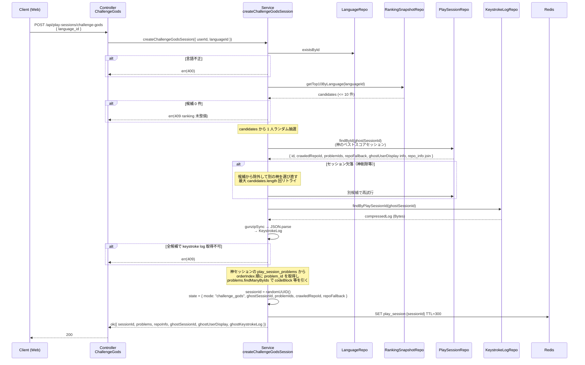

# step6: API `POST /api/play-sessions/challenge-gods`（神々に挑戦モード）

通常モード（`/solo`）と並列で動く、ゴースト併走モードのセッション開始 API。**該当言語のオールタイムトップ 10 からランダムに 1 人** を選び、その人の過去セッションの **問題シーケンス先頭 20 問 + repo_info を継承** してクライアントに返す。プレイ中のゴースト描画用にキーストロークログも同梱する（[`../ghost-battle/README.md`](../ghost-battle/README.md)）。

step2 の `/solo` と **多くを共有**：Redis ステート構造・PlaySessionStateRepository・PlaySession 書き込み（step3 の `/finish`）は同じものを再利用する。差分は **「repo を抽選する代わりにゴーストを抽選し、その人の過去 PlaySession から problemIds と repoInfo を引き写す」** 部分のみ。

## 目次

- [対象 API](#対象-api)
- [依存（重要）](#依存重要)
- [リクエスト](#リクエスト)
  - [Body](#body)
- [レスポンス](#レスポンス)
  - [200 OK](#200-ok)
  - [エラー](#エラー)
- [処理フロー](#処理フロー)
  - [処理の流れ](#処理の流れ)
- [神選定の詳細ロジック](#神選定の詳細ロジック)
- [Redis ステート](#redis-ステート)
- [対応内容](#対応内容)
- [動作確認](#動作確認)
- [次の機能・step での利用](#次の機能step-での利用)

## 対象 API

| 項目 | 値 |
|---|---|
| メソッド / パス | `POST /api/play-sessions/challenge-gods` |
| 認証 | **必須**（Bearer JWT） |
| 副作用 | Redis に揮発ステート 1 件作成（TTL 300 秒）。DB 書き込みなし |
| 呼び出し元 | apps/web 言語選択画面の「神々に挑戦」ボタン（step4 で disabled、本 step で有効化） |

## 依存（重要）

| 依存先 | 何を使うか | 本 step での扱い |
|---|---|---|
| **score-ranking 機能** | `ranking_snapshots`（言語別オールタイムトップ 10） | **必須前提**：このテーブルが空 / 未実装の場合は 409 Conflict |
| **step3** | `keystroke_logs.compressedLog`（gzip 解凍してクライアントに渡す） | 神の過去セッションの ID から JOIN で取得 |
| **step2** | `PlaySessionStateRepository` / `mode` / `ghostSessionId` の Redis ステート構造 | そのまま流用（`mode="challenge_gods"` を入れる差分のみ） |
| **ghost-battle 機能** | キーストロークログのデータ構造定義 | レスポンス契約として参照 |

> `ranking_snapshots` の実装が score-ranking 機能の step で完了するまで、本 step は **設計のみ確定 / 実装は score-ranking 完了後に着手** の段階にする。Web 側（step4 のボタン）は disabled のまま運用する。

## リクエスト

### Body

```json
{
  "language_id": 1
}
```

| フィールド | 型 | 必須 | 制約 | 説明 |
|---|---|---|---|---|
| `language_id` | number | ✓ | int / positive | プレイ言語 |

> `/solo` と同じ。神を指定するパラメータは無い（サーバーがランダム選定）。

## レスポンス

### 200 OK

```json
{
  "session_id": "...uuid...",
  "problems": [...20 問],
  "repo_info": {
    "owner": "facebook",
    "name": "react",
    "stars": 230000,
    "description": "...",
    "homepage": "https://react.dev",
    "topics": ["react"],
    "fallback": false
  },
  "ghost_session_id": 8842,
  "ghost_user_display": {
    "display_name": "kenta",
    "avatar_url": "https://...",
    "grade": "Principal Engineer",
    "best_score": 942
  },
  "ghost_keystroke_log": [
    { "t": 142.5, "p": 0, "ch": "c", "ok": true },
    "... 1500 entry まで"
  ]
}
```

| フィールド | 型 | 説明 |
|---|---|---|
| `session_id` | uuid | プレイヤー自身の Redis セッション識別子 |
| `problems` | array(20) | 神の過去セッションの先頭 20 問を **同じ順序で** 引き写し |
| `repo_info` | object | 神が打った repo の情報をそのまま継承（`fallback` は神セッションのもの） |
| `ghost_session_id` | number | DB の `play_sessions.id`。神の過去 1 セッション |
| `ghost_user_display` | object | 神の表示情報（グレード付き） |
| `ghost_keystroke_log` | array | 神のキーストロークログ全件。`keystroke_logs.compressed_log` を gzip 解凍 + JSON.parse |

### エラー

| Status | type | 条件 | クライアント挙動 |
|---|---|---|---|
| 400 | BAD_REQUEST | `language_id` が存在しない | エラー表示 |
| 401 | UNAUTHORIZED | 認証なし | サインインへ |
| 409 | CONFLICT | 該当言語のオールタイムトップ 10 が **不在 / 全員 keystroke log 取得不能** | 「神々に挑戦は近日公開予定」+ 「通常プレイ」ボタンへ誘導 |
| 500 | — | DB / Redis 障害 | リトライ |

## 処理フロー



### 処理の流れ

1. Body を Zod スキーマで検証
2. `languageId` の存在チェック（NG なら 400）
3. `RankingSnapshotRepository.getTopByLanguage` でオールタイムトップ 10 を取得
4. 自分自身（`req.userId`）を候補から除外、候補 0 件なら 409 CONFLICT
5. 候補リストからランダムに 1 人を抽選
6. その神の `bestPlaySessionId` から `findGhostSourceById` でセッション詳細（`problemIds` / `crawledRepoId` / `repo_info` / `repoFallback`）を取得
7. `keystroke_logs.compressed_log` を gunzip + JSON.parse して取得
8. セッション欠落 or log 取得不可なら次の候補にスキップ（最大候補数分リトライ）
9. 全候補で取得できなければ 409 CONFLICT（神々モード起動不能）
10. 神セッションの `problemIds` から `findManyByIds` で `codeBlock` 等の本体を取得し orderIndex 順に並べる
11. `sessionId` を UUID v4 で発行し、`mode="challenge_gods"` / `ghostSessionId` セットで Redis state を保存（TTL 300s）
12. クライアントに `{ session_id, problems, repo_info, ghost_session_id, ghost_user_display, ghost_keystroke_log }` を返却

## 神選定の詳細ロジック

| 観点 | 仕様 |
|---|---|
| 候補集合 | `ranking_snapshots` の **言語別オールタイムトップ 10**（[`../score-ranking/README.md`](../score-ranking/README.md)） |
| 候補から除外 | `publicRanking=false` のユーザー（そもそも snapshot に入らないのでフィルタ不要） |
| 候補から除外 | 自分自身（神々と自分が同じ問題セットを打つのは体験を損なうため、`ranking_snapshots.user_id !== req.userId` で外す） |
| 抽選 | `Math.floor(Math.random() * candidates.length)` で 1 人 |
| ベストセッション特定 | そのユーザーの `play_sessions` のうち **`languageId` 一致 + `score` 最大の 1 件** を `ghostSessionId` に採用 |
| keystroke log 欠落時 | 候補リストから当該ユーザーを外して再抽選（最大 candidates.length 回） |
| 全滅時 | 409 Conflict |

## Redis ステート

step2 の構造をそのまま使う。差分は `mode` と `ghostSessionId` のみ：

```json
{
  "userId": 42,
  "languageId": 1,
  "mode": "challenge_gods",
  "crawledRepoId": 17,
  "repoFallback": false,
  "ghostSessionId": 8842,
  "problemIds": [...神セッションから引き写した 20 問]
}
```

これにより、step3 の `/finish` は `mode` / `ghostSessionId` の値を見ずに **そのまま `play_sessions` に書き込み** できる（`mode` は state からそのまま流れる、`ghostSessionId` は FK で nullable）。`/finish` は本 step では **改修不要**。

## 対応内容

### `packages/schema/src/api-schema/play-session.ts` への追加

```typescript
/** ghost プレイヤーの表示情報 */
const ghostUserDisplaySchema = z.object({
  avatar_url: z.string().url().nullable(),
  best_score: z.number().int().nonnegative(),
  display_name: z.string(),
  grade: z.string(),
})

const keystrokeEntrySchema = z.object({  /** step3 で定義済みなら共有 */
  ch: z.string(),
  ok: z.boolean(),
  p: z.number().int().nonnegative().max(19),
  t: z.number().nonnegative(),
})

export const startChallengeGodsRequestSchema = z.object({
  language_id: z.number().int().positive(),
})

export const startChallengeGodsResponseSchema = z.object({
  ghost_keystroke_log: z.array(keystrokeEntrySchema),
  ghost_session_id: z.number().int().positive(),
  ghost_user_display: ghostUserDisplaySchema,
  problems: z.array(playSessionProblemSchema).length(20),
  repo_info: repoInfoSchema,
  session_id: z.string().uuid(),
})
```

### `apps/api/src/repository/prisma/ranking-snapshot-repository.ts`（新規）

> score-ranking 機能の step で実装される予定だが、本 step の Service が必要とする read-only interface を **先に定義** して、score-ranking 実装が完了するまでは「常に空配列を返すスタブ」を使う。

```typescript
import { PrismaClient } from "@repo/db"

export type RankingTopEntry = {
  bestPlaySessionId: number
  bestScore: number
  userId: number
  userDisplay: {
    avatarUrl: string | null
    currentGrade: string
    displayName: string
  }
}

export interface RankingSnapshotRepository {
  /**
   * 言語別オールタイムトップ N を返す（score 降順）
   * MVP では N=10
   */
  getTopByLanguage(languageId: number, limit: number): Promise<RankingTopEntry[]>
}

/** score-ranking 完成までの暫定スタブ。常に空を返す → 本 API は 409 を返す */
export class StubRankingSnapshotRepository implements RankingSnapshotRepository {
  async getTopByLanguage(): Promise<RankingTopEntry[]> {
    return []
  }
}
```

### `apps/api/src/repository/prisma/keystroke-log-repository.ts`（新規）

```typescript
import { gunzipSync } from "node:zlib"

import { PrismaClient } from "@repo/db"

import { KeystrokeLog } from "../../types/domain"

export interface KeystrokeLogRepository {
  findByPlaySessionId(playSessionId: number): Promise<KeystrokeLog | null>
}

export class PrismaKeystrokeLogRepository implements KeystrokeLogRepository {
  private _prisma: PrismaClient

  constructor(prisma: PrismaClient) {
    this._prisma = prisma
  }

  async findByPlaySessionId(playSessionId: number): Promise<KeystrokeLog | null> {
    const row = await this._prisma.keystrokeLog.findUnique({
      select: { compressedLog: true },
      where: { playSessionId },
    })
    if (!row) return null
    try {
      const decompressed = gunzipSync(row.compressedLog)
      return JSON.parse(decompressed.toString("utf8")) as KeystrokeLog
    } catch {
      return null
    }
  }
}
```

### `apps/api/src/repository/prisma/play-session-repository.ts` への追加

```typescript
export interface PlaySessionRepository {
  createWithChildrenAndUpdateStats(...): Promise<{ id: number }>

  /** /challenge-gods で神セッションの詳細を引く */
  findGhostSourceById(id: number): Promise<{
    crawledRepo: { description: string | null; homepage: string | null; name: string; owner: string; stars: number; topics: string[] }
    crawledRepoId: number
    id: number
    languageId: number
    /** play_session_problems を orderIndex 順に並べた problem_id 配列 */
    problemIds: number[]
    repoFallback: boolean
  } | null>
}
```

### `apps/api/src/service/play-session-service.ts` への追加

```typescript
export const createChallengeGodsSession = async (
  input: { languageId: number; userId: number },
  repo: {
    crawledRepoRepository: CrawledRepoRepository  /** repo_info 取得用 */
    keystrokeLogRepository: KeystrokeLogRepository
    languageRepository: LanguageRepository
    playSessionRepository: PlaySessionRepository
    playSessionStateRepository: PlaySessionStateRepository
    problemRepository: ProblemRepository
    rankingSnapshotRepository: RankingSnapshotRepository
  },
): Promise<Result<ChallengeGodsOutput>> => {
  /** 1. 言語存在チェック */
  if (!(await repo.languageRepository.existsById(input.languageId))) {
    return err(badRequestError("Invalid language_id"))
  }

  /** 2. トップ N 取得 → 自分自身を除外 */
  const top = await repo.rankingSnapshotRepository.getTopByLanguage(input.languageId, 10)
  const candidates = top.filter((t) => t.userId !== input.userId)
  if (candidates.length === 0) {
    return err(conflictError("No ghost candidates available"))
  }

  /** 3. ランダム抽選 + keystroke log 取得（欠落時は次を試す） */
  let ghost: { entry: RankingTopEntry; ghostSession: NonNullable<Awaited<ReturnType<typeof repo.playSessionRepository.findGhostSourceById>>>; keystrokeLog: KeystrokeLog } | null = null
  const pool = [...candidates]
  while (pool.length > 0 && ghost === null) {
    const i = Math.floor(Math.random() * pool.length)
    const [picked] = pool.splice(i, 1)
    const ghostSession = await repo.playSessionRepository.findGhostSourceById(picked.bestPlaySessionId)
    if (!ghostSession) continue
    const keystrokeLog = await repo.keystrokeLogRepository.findByPlaySessionId(picked.bestPlaySessionId)
    if (!keystrokeLog) continue
    ghost = { entry: picked, ghostSession, keystrokeLog }
  }
  if (ghost === null) {
    return err(conflictError("No usable ghost sessions"))
  }

  /** 4. 問題 codeBlock 等を取得（神セッションの problemIds から） */
  const fullProblems = await repo.problemRepository.findManyByIds(ghost.ghostSession.problemIds)
  const orderedProblems: PlaySessionProblem[] = ghost.ghostSession.problemIds.map((pid, i) => {
    const p = fullProblems.find((x) => x.id === pid)!
    return {
      charCount: p.charCount,
      codeBlock: p.codeBlock,
      functionName: p.functionName,
      id: pid,
      lineCount: p.lineCount,
      orderIndex: i,
      sourceUrl: p.sourceUrl,
    }
  })

  /** 5. Redis ステート保存 */
  const sessionId = randomUUID()
  const state: PlaySessionState = {
    crawledRepoId: ghost.ghostSession.crawledRepoId,
    ghostSessionId: ghost.ghostSession.id,
    languageId: input.languageId,
    mode: "challenge_gods",
    problemIds: orderedProblems.map((p) => p.id),
    repoFallback: ghost.ghostSession.repoFallback,
    userId: input.userId,
  }
  await repo.playSessionStateRepository.save(sessionId, state, PLAY_SESSION_TTL_SECONDS)

  return ok({
    ghostKeystrokeLog: ghost.keystrokeLog,
    ghostSessionId: ghost.ghostSession.id,
    ghostUserDisplay: {
      avatarUrl: ghost.entry.userDisplay.avatarUrl,
      bestScore: ghost.entry.bestScore,
      displayName: ghost.entry.userDisplay.displayName,
      grade: ghost.entry.userDisplay.currentGrade,
    },
    problems: orderedProblems,
    repoInfo: { ...ghost.ghostSession.crawledRepo, fallback: ghost.ghostSession.repoFallback },
    sessionId,
  })
}
```

> 必要な import / 型定義（`RankingTopEntry`, `ChallengeGodsOutput`）は適宜追加。`ProblemRepository.findManyByIds` は **step3 で `codeBlock` のみ select する形に最小化**しているため、本 step の用途に合わせて `select` を拡張する：`{ id, codeBlock, functionName, charCount, lineCount, sourceUrl }`。step3 側のテストは select 拡張で壊れないこと（拡張するだけのため）。

### `apps/api/src/controller/play-session/start-challenge-gods.ts`（新規）

`StartSolo` と同じ構造。レスポンスを `startChallengeGodsResponseSchema.parse` で整形して返す。

### `apps/api/src/routes/play-session-router.ts` への追加

```typescript
type PlaySessionRouterControllers = {
  finish?: ...
  startChallengeGods?: PlaySessionStartChallengeGodsController
  startSolo?: ...
}

if (controllers.startChallengeGods) {
  const controller = controllers.startChallengeGods
  router.post("/challenge-gods", async (req, res) => controller.execute(req, res))
}
```

### `apps/api/src/index.ts` の DI 追加

```typescript
const keystrokeLogRepository = new PrismaKeystrokeLogRepository(prisma)
/** score-ranking 完成までは Stub。Phase 4 で PrismaRankingSnapshotRepository に差し替え */
const rankingSnapshotRepository: RankingSnapshotRepository = new StubRankingSnapshotRepository()

const playSessionStartChallengeGodsController = new PlaySessionStartChallengeGodsController(
  crawledRepoRepository,
  keystrokeLogRepository,
  languageRepository,
  playSessionRepository,
  playSessionStateRepository,
  problemRepository,
  rankingSnapshotRepository,
)

app.use("/api/play-sessions", playSessionRouter({
  finish: ...,
  startChallengeGods: playSessionStartChallengeGodsController,
  startSolo: ...,
}))
```

### `apps/web/src/app/actions.ts` の改修

step4 の Server Action 内で `mode === "challenge_gods"` 分岐を実装。

```typescript
if (mode === "challenge_gods") {
  try {
    const res = await apiClient.post<StartChallengeGodsResponse>(
      "/api/play-sessions/challenge-gods",
      { language_id: languageId },
    )
    return {
      ghostKeystrokeLog: res.ghost_keystroke_log,
      ghostSessionId: res.ghost_session_id,
      ghostUserDisplay: res.ghost_user_display,
      problems: res.problems,
      repoInfo: res.repo_info,
      sessionId: res.session_id,
    }
  } catch (e) {
    /** 409 を判別したいが apiClient 現状は throw だけなので message からは無理。改善は別 PR */
    return { error: "「神々に挑戦」はまだ利用できません。" }
  }
}
```

### `apps/web/src/app/play/[sessionId]/play-screen.tsx` の改修

`sessionStorage` のキャッシュに `ghostKeystrokeLog` / `ghostSessionId` / `ghostUserDisplay` を含める。プレイ画面（`PlayLoop`）にも併走 UI 用 props を追加。本 step では併走 UI 自体は ghost-battle 機能の step で実装するため、**ヘッダーに「神：xxx 文字」を表示するだけの最小実装**にとどめる。

## 動作確認

### Service ユニットテスト

| 観点 | 期待 |
|---|---|
| 正常系：トップ 10 から自分以外を 1 人選び、神セッションから problemIds + repoInfo + keystrokeLog が返る | `mode="challenge_gods"`、`ghostSessionId` がセット |
| 自分自身が含まれる候補は除外される | candidates 1 件のみ・それが自分の場合は 409 |
| 神セッションが欠落（PlaySession 削除）→ 次の候補にスキップ | 全候補欠落で 409 |
| keystroke log の gunzip 失敗（破損データ）→ 次の候補にスキップ | 同上 |
| `ranking_snapshots` 空（Stub）の場合、即 409 | クライアントはボタン無効化動作 |

### Controller インテグレーションテスト

実 DB + Redis。事前に `users` / `languages` / `crawled_repos` / `problems` を seed → `play_sessions` と `keystroke_logs`（gzip 圧縮済み）を仕込む → モック化した `RankingSnapshotRepository` を Controller に DI して 200 のフローを通す。Stub から実装に切り替わる前は **本テストはスキップ可**（`describe.skip` で明示）。

### 手動 curl

```bash
TOKEN=$(curl -s -X POST http://localhost:8080/api/auth/dev-login | jq -r .access_token)
curl -X POST http://localhost:8080/api/play-sessions/challenge-gods \
  -H "Authorization: Bearer $TOKEN" \
  -H "Content-Type: application/json" \
  -d '{"language_id":1}' | jq .

/** ranking_snapshots 未整備時：HTTP 409 */
```

### Lint / Build / Test

```bash
pnpm lint && pnpm build && cd apps/api && pnpm test
```

## 次の機能・step での利用

- **ghost-battle 機能の step**: プレイ画面のゴースト併走 UI 本実装（横並び累計文字数 / 差分バー / 神のサマリ）。本 step でレスポンスに同梱した `ghost_keystroke_log` を `requestAnimationFrame` で再生して「神の現在文字数」を計算する
- **score-ranking 機能の step**: `StubRankingSnapshotRepository` を `PrismaRankingSnapshotRepository` に差し替え、`ranking_snapshots` テーブルからの実取得に切り替える。本 step で Service / Controller / Web 連携は完成しているため、差し替えだけで「神々に挑戦」が即時有効化される
- **typing-engine 完成判定**: 本 step 完了で「typing-engine の API/UI 一連」は実装完了。残るは外部機能（score-ranking / ghost-battle）の連携待ち
