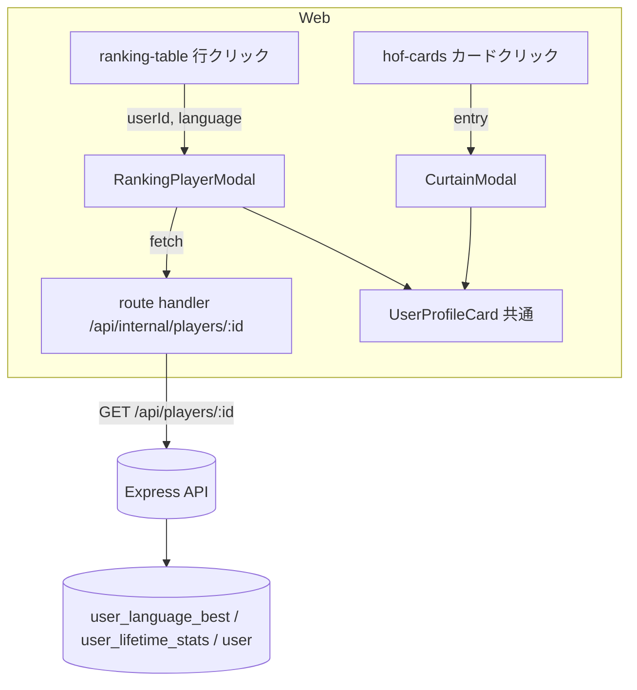

# 統一プロフィールカード（ランキング / 殿堂入りの選択時表示の統一）設計

## 背景

他ユーザーを「選択したとき」に表示される内容が、ランキングと殿堂入りで異なっている。

- **ランキング** (`/ranking`): 行クリックで `/players/{id}` ページへ遷移。テーブルには `score / accuracy / played_at` のみ。
- **殿堂入り** (`/hall-of-fame`): カードクリックで `CurtainModal`（カーテン/王冠演出）を開く。`score / typed_chars / accuracy / favorite_repo_url` を表示。

要望:

1. 選択時に表示する**内容**をランキング/殿堂入りで統一し、**見せ方（スタイル）だけ**を変える。
2. **ベストスコア / 正解率 / 最高打点数** を表示し、**ラベル**（= グレード）も付ける。
3. repository はデフォルトで `github.com/{username}` を **DB に初期保存**し表示する。任意で好きなリポジトリに変更可能。
4. GitHub Achievements は公式 API が無いため**対応しない**（`github.com/{username}` への自動リンクで代替）。

## 決定事項

| 論点 | 決定 |
|---|---|
| クリック挙動の統一 | 両方モーダル表示。殿堂入り=カーテン演出、ランキング=プレーン。中身は共通。 |
| ラベル | グレード（`current_grade`） |
| repository デフォルト | サインアップ時に `https://github.com/{login}` を `favoriteRepoUrl` に**初期保存**。ユーザーが任意変更可。運用前のためバックフィル不要。 |
| カードのスコア出どころ | **オールタイムベスト（`user_language_best`）で統一**。ランキングから開いても殿堂入りから開いても中身が完全一致する。表の行は従来通り月間スコア。 |
| Achievements | 対応しない。 |

## アーキテクチャ

### データの単一ソース

選択時カードは常に「その言語のオールタイムベスト + 通算グレード + repository」を表示する。これは `GET /api/players/:userId`（`user_language_best` + `user_lifetime_stats` ベース）が提供できる。月間スナップショットには `typed_chars` / `best_play_session_id` が無いため、ランキング由来でもこのエンドポイントから取得して統一する。



- **殿堂入り**: エントリが既に全フィールド（score/accuracy/typed_chars/favorite_repo_url/grade/best_play_session_id/rank）を持つため、エントリを正規化して `UserProfileCard` に渡す（追加 fetch 不要、カーテン演出を即時表示）。
- **ランキング**: 行クリックで `RankingPlayerModal` を開き、`GET /api/players/:id`（route handler 経由）を fetch → 対象言語の `language_bests` を取り出して正規化 → `UserProfileCard` に渡す。順位（月間 rank）は行から prop で渡す。

### 共通コンポーネント

`UserProfileCard`（presentational, props のみで描画）

正規化データ型（web 内のローカル view 型）:

```ts
type UserProfileCardData = {
  avatarUrl: string | null
  bestPlaySessionId: number | null  // リプレイリンク用（無ければ非表示）
  accuracy: number                   // 0..1
  favoriteRepoUrl: string | null     // null 時は github.com/{username} にフォールバック
  gradeSlug: string                  // ラベル
  rank: number                       // 表示文脈の順位（月間 or オールタイム）
  rankLabel: string                  // 例 "TS オールタイム #1" / "TS 今月 #3"
  score: number
  typedChars: number
  userId: number
  username: string
}
```

表示要素:

- アバター + `@username`
- 順位バッジ + **グレードバッジ（ラベル）**
- stat-row: **ベストスコア**（score）/ **正解率**（accuracy %）/ **最高打点数**（typedChars）
- repository リンク: `favoriteRepoUrl ?? https://github.com/{username}`（`github.com` は `owner/repo` 短縮、プロフィール URL は `@username` 表示）
- リプレイリンク（`bestPlaySessionId` がある場合）
- 「プレイヤー詳細を見る」→ `/players/{userId}`

ラベル文言は要望に合わせる: **ベストスコア / 正解率 / 最高打点数**（現状の殿堂入りは「最高文字数 / 最高正確率」だが統一する）。

### ラッパー

- `CurtainModal`（既存・改修）: 演出はそのまま、内側の手書き stat-row を `UserProfileCard` に置換。`entry` → `UserProfileCardData` 変換を行う。`rankLabel = "TS オールタイム #{rank}"`。
- `RankingPlayerModal`（新規）: プレーンなモーダルオーバーレイ。マウント時に fetch、ローディング表示 → 解決後 `UserProfileCard`。`rankLabel = "{言語略} 今月 #{rank}"`。

## バックエンド変更

### packages/schema

- `api-schema/player.ts`: `playerUserSchema` に `favorite_repo_url: z.string().nullable()` を追加。
- `pnpm build` を実行。

### apps/api

- プレイヤー詳細（`player-service` / `player` controller / 関連 repository）: レスポンスの `user` に `favoriteRepoUrl` を含める。`PublicProfileUser`（または取得経路）に `favoriteRepoUrl` を追加。
- ユーザー作成（GitHub OAuth）:
  - `user-repository.ts` の `CreateUserInput` に `favoriteRepoUrl?: string` を追加し、`create` で渡す。
  - `auth-service.ts` の `authenticateWithGithub` で `favoriteRepoUrl: \`https://github.com/${githubUser.login}\`` を設定。
- テスト: player 詳細の Controller integration で `favorite_repo_url` を含む契約に更新。auth の正常系で `favoriteRepoUrl` が初期保存されることを確認。

### apps/web

- `app/api/internal/players/[userId]/route.ts`（新規 route handler）: `GET /api/players/:id` をプロキシ。
- `app/hall-of-fame/curtain-modal.tsx`: 内側を `UserProfileCard` に置換。
- `app/hall-of-fame/hof-cards.tsx`: 変更最小（クリックで CurtainModal を開く既存動作維持。カード自体の表示は据え置き or 軽微調整）。
- `components/ranking-table.tsx`: 行クリックを `/players/{id}` 遷移 → `RankingPlayerModal` を開く形に変更（`"use client"` 化、または親に状態を持たせる）。`language` を受け取れるよう props 追加。
- `app/ranking/page.tsx`: `RankingTable` に `language` を渡す。
- `components/user-profile-card.tsx`（新規）: 共通カード。
- `app/ranking/ranking-player-modal.tsx`（新規）: fetch ラッパー。
- repository 表示の共通整形（`owner/repo` 短縮 + プロフィール URL の `@username` 表示）を `libs` に切り出して両モーダルで共有（現状 `curtain-modal` / `hof-cards` に重複している `formatRepoUrl` / `formatGithubLabel` を統合）。

## エラーハンドリング

- `RankingPlayerModal` の fetch 失敗: モーダル内にエラー文言を表示し、「プレイヤー詳細を見る」リンクは残す（/players ページへ誘導）。
- 対象言語の `language_bests` が空（理論上発生しないが防御）: スコア系を `-` 表示にフォールバック。
- `favoriteRepoUrl` が null（既存 null ユーザー）: `https://github.com/{username}` にフォールバック。

## テスト

- API: player-service ユニット（`favoriteRepoUrl` を含む）、player controller integration（レスポンス契約）、auth controller integration（GitHub 新規作成時に `favoriteRepoUrl` が初期保存される）。
- Web: Playwright で `/ranking` 行クリック → モーダル表示 / `/hall-of-fame` カードクリック → カーテンモーダル表示、両方で同一項目（ベストスコア/正解率/最高打点数/グレード/リポジトリ）が出ることを確認。before/after スクショを PR に添付。

## スコープ外

- ホーム画面の monthly-top-card、my-ranking-sidebar の挙動統一（今回は `/ranking` テーブルと `/hall-of-fame` に限定）。
- GitHub Achievements の取得・表示。
- 月間スナップショットへの `typed_chars` 列追加（オールタイムベスト統一により不要）。
