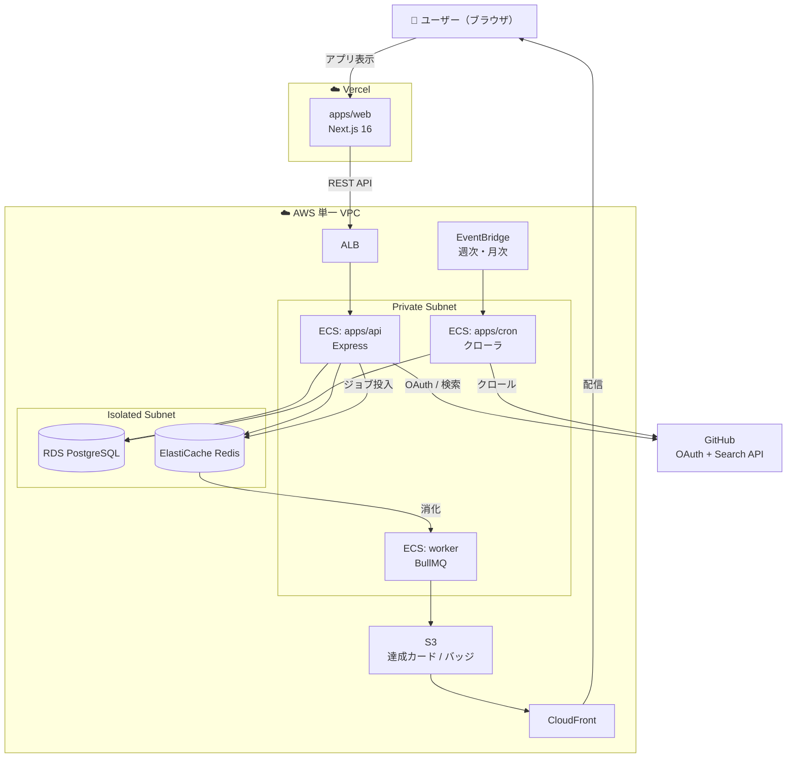

> この記事は下書きです。`published: false` のまま、内容を取捨選択してから公開してください。
> 各セクション冒頭の `> 【メモ】` は執筆用の補足です。公開前に削除してください。

---

## 自己紹介

> 【メモ】ここは事実ベースで埋めてください。以下はテンプレ。実務年数・得意領域・所属（任意）・なぜ個人開発するのか、を 3〜5 行で。

はじめまして、**＿＿＿（ハンドルネーム）** と申します。
普段は ＿＿＿（フロントエンド / バックエンド / フルスタック など）を中心に開発しています。

個人開発では「自分が毎日触りたくなるもの」を基準にプロダクトを作っており、今回はその一つである **TypingRoyale（タイピングロワイヤル）** という Web サービスについて、**プロダクトの狙い**と**技術的な中身**を、実装レベルまで掘り下げて紹介します。

「タイピングゲーム」と聞くと単純な見た目ですが、内部は

- リアルタイム入力判定エンジン
- 過去プレイの「ゴースト対戦」/「リプレイ」
- OSS から問題を自動生成するクローラ
- これらを支えるモノレポ + AWS インフラ

と、フロントからインフラまで一通りの技術が詰まっています。全部書くと長いので、気になるところだけ拾い読みしてもらえれば嬉しいです。

---

## TypingRoyale とは

> 【メモ】公開 URL / スクショ / GIF をここに貼ると一気に伝わります。`docs/screenshots/` に素材あり。

**TypingRoyale** は、**GitHub 上の OSS の「実コード」を題材にしたエンジニア向けタイピングゲーム**です。

一言でいうと「**寿司打のコード版**」。お題が日本語の単語ではなく、`MIT` / `Apache-2.0` / `BSD` などの寛容ライセンスで公開されている本物の OSS のソースコード（関数本体）になっています。

### コア体験

- **120 秒**の制限時間でひたすらコードを打鍵する
- お題は OSS から自動抽出した**関数単位のコード**を連続出題
- 打鍵数 × 正確率で**スコア**が決まり、**言語別ランキング**に反映される
- スコアに応じて **Intern → … → Fellow** の **8 段階エンジニアグレード**が昇格していく

### "ロワイヤル" たるゆえん（競技性）

単なる自己ベスト更新で終わらせないために、競技性を全面に押し出しています。

| 機能 | 内容 |
| --- | --- |
| **言語別ランキング** | TypeScript / JavaScript ごとに全期間 + 月間ランキング |
| **神々に挑戦（ゴースト対戦）** | ランキング上位プレイヤーの過去プレイと、**同じ問題シーケンスで併走**できる |
| **リプレイ閲覧** | 上位入賞プレイのキーストロークを**そのまま再生**して観戦できる |
| **特典（リワード）** | GitHub プロフィールに貼れる**動的 SVG バッジ**、**達成カード PNG**、**Hall of Fame** |

### ポジショニング

一般タイピング市場は寿司打・e-typing がすでに一強です。そこには参入せず、**「コーディングタイピング」という未開拓ニッチ**に的を絞りました。

| 項目 | 既存タイピングサイト | TypingRoyale |
| --- | --- | --- |
| 題材 | 日本語の単語・文章 | **OSS の実コード** |
| ターゲット | 一般 | **エンジニア（GitHub 利用層）** |
| 特典 | サイト内ランキング | **GitHub プロフィールが豪華になる特典** |
| 競争性 | 個人スコア中心 | **言語別ランキング + ゴースト対戦 + リプレイ** |

---

## なぜ作ったのか（背景）

> 【メモ】ここはあなたの一次体験で上書きするほど刺さります。下記は資料から組んだ「もっともらしい」ストーリー。

### 1. 「タイピング練習」と「コードを書く速さ」は別物だった

エンジニアが普段打つのは日本語の文章ではなく、`const`, `=>`, `{}`, `;`, `( )`, インデント、記号まみれのコードです。
一般的なタイピングゲームをいくら練習しても、**記号・キャメルケース・括弧の対応といった「コード特有の打鍵」は鍛えられません**。「コードを題材にしたタイピングなら、実務の指の動きにそのまま効くのでは？」というのが出発点でした。

### 2. どうせ打つなら「本物のコード」がいい

自前で問題文を用意すると、どうしても不自然な練習用コードになります。そこで **GitHub の Star 上位 OSS から実際の関数を抜き出して出題**することにしました。打鍵しながら「有名 OSS はこう書いているのか」という学びが副産物として得られます。リザルト画面では**実際に打ったファイルの GitHub パーマリンク**も表示され、そのまま読みに行けます。

### 3. エンジニアにとっての「ご褒美」を設計したかった

スコアが伸びても画面の中で完結すると飽きます。そこで成果が **GitHub プロフィール（README バッジ・達成カード）として外に出る**設計にしました。「練習のモチベーション = 自分の見栄えが良くなる」を回路として組み込んでいます。

### 4. 技術的に面白いから

正直、これが一番の理由かもしれません。リアルタイム入力判定、ゴースト対戦、クローラ、モノレポ、IaC ……と、**一つのプロダクトに学びたい技術を全部詰め込める**題材でした。以降はその中身の話です。

---

## どう作ったか：AI（Claude Code）を主軸にした開発と品質担保

> 【メモ】このセクションは「個人開発 × AI 駆動開発」の知見として独立しても読まれやすい部分です。事実ベースで書いていますが、体感や失敗談を足すとより刺さります。

このプロダクトは、**AI コーディングエージェント（Claude Code）を開発の主軸に据えつつ、"AI に丸投げしない" ための仕組みを repo 側に作り込む**という方針で進めました。生成 AI でコードを書くこと自体は簡単ですが、**個人開発で一番怖いのは「動くけど一貫性のない巨大な泥団子」になること**です。そこを構造で防ぎにいったのが今回のテーマです。

### 1. 「実装の前に必ず設計書を書く」スペック駆動開発

いきなりコードを書かせず、機能ごとに **`docs/spec/{feature}/` に設計書を先に作る**ルールにしました。実際、現在 19 個の機能スペックがあります。

```
docs/spec/typing-engine/
├── README.md                       # 人間向け：背景・全体像・Mermaid 図
├── step1-db-typing-engine.md       # AI 実装用：DB 設計の手順
├── step2-api-solo-session.md       # 〃 API（セッション開始）
├── step3-api-finish-session.md     # 〃 API（スコア精算）
├── step4-web-language-select-and-play.md
├── step5-web-result-and-guest-buffer.md
└── step6-api-challenge-gods.md     # 〃 ゴースト対戦
```

ポイントは **README（人間が読む設計）と step ファイル（AI が実装する手順）を分けている**こと。README で「なぜ・何を」を Mermaid 図つきで固め、step ファイルに「対応内容・コード例・動作確認」まで落とし込む。そして **1 step = 1 PR** の粒度に保ちます。

こうすると、

- 実装前に**自分（人間）が仕様をレビューできる**（AI の暴走を設計段階で止められる）
- AI は**毎回ブレない手順書**に沿って実装する
- レビュー単位が小さく**差分が追える**

という三拍子が揃います。「設計を言語化するコスト」を払う代わりに「手戻り」を消す、というトレードを選びました。設計フェーズ自体も AI と壁打ちしながら詰めています。

### 2. デザインは「クラッシュ・ロワイヤル」を参考に、`/deep-research` → HTML モックで固める

> 【メモ】Clash Royale のスクショと自作モックを並べると説得力が出ます（引用は権利に配慮して）。

UI のトーンは、スマホゲームの **クラッシュ・ロワイヤル（Clash Royale）** を参考にしました。**「TypingRoyale」という名前自体がそのオマージュ**で、エンジニアグレードの昇格・ランキング・ゴースト対戦という競技性を、あのゲームのような「リッチで、達成感が気持ちいい UI」で表現したかったからです。

ただ「クラロワっぽくして」と言葉で伝えても AI はうまく再現できません。そこで**設計の最初の段階で `/deep-research`（複数のソースを横断してリサーチ・要約する仕組み）を使い、Clash Royale のデザイン言語をリサーチ**させました。配色（深い背景にゴールド主体のアクセント、リッチなグラデーション）、カードやバッジの質感、昇格演出のトーン、フォントの太さ……といった**「何がそれっぽさを作っているのか」を言語化**してもらい、それをデザイン方針として固定しました。

その方針をもとに、**いきなり Next.js で実装せず、まず素の HTML/CSS で全画面のモックを作りました**。実際 `docs/mocks/` には 20 枚近い HTML モック（全画面共通の `styles.css` 付き）が並んでいます。

```
docs/mocks/
├── styles.css              # 全モック共通のデザイントークン
├── top.html / index.html   # トップ
├── language-select.html    # 言語選択
├── play.html / play-ghost.html   # プレイ / ゴースト対戦
├── result.html             # リザルト
├── ranking.html / hall-of-fame.html
├── mypage*.html / player-detail.html
├── modal-*.html            # 各種モーダル（達成 / ログイン / ゴースト結果 …）
└── ...
```

HTML モックを先に作る利点は、

- **フレームワークの都合に縛られず、見た目だけを高速に試行錯誤できる**
- 全画面を横並びで眺めて、**色・余白・コンポーネントの一貫性を実装前に揃えられる**
- 確定したモックが、そのまま**実装の "正解画像" 兼デザイン仕様**になる

こと。`/deep-research` で**「参考にしたい世界観」を言語化** → **HTML モックで具体化** → **承認後に実装、という順序**にしたことで、「実装しながらデザインに迷う」手戻りを大きく減らせました。デザインのトーンという曖昧なものを、AI が扱える形（リサーチ結果 + モック）に変換するのが狙いです。

### 3. プロジェクトのルールを `CLAUDE.md` に集約し、AI に毎回守らせる

AI に毎回プロンプトで規約を伝えるのは非現実的なので、**ルールを `CLAUDE.md` というファイルに書き、AI が常に参照する**構成にしました。ルートに加えて、**各アプリ・パッケージごとに合計 9 個**置いています。

```
CLAUDE.md                  # モノレポ全体方針・命名規則・lint ルール
apps/web/CLAUDE.md         # Web 固有（Server Component 優先・データ取得方針）
apps/api/CLAUDE.md         # レイヤード / Result 型 / テスト戦略 / DI assembly
apps/cron/CLAUDE.md        # クローラの実行モデル
infra/terraform/CLAUDE.md  # IaC のモジュール設計
packages/schema/CLAUDE.md  # スキーマ命名規則
...
```

ここに「セミコロン禁止」「ダブルクオート」「import の並び順」「オブジェクトキーのアルファベット順」「関数名は処理内容が明確にわかる名前にする」といった**コードスタイルから、アーキテクチャ方針まで**を明文化しています。結果として、**AI が書こうが人間が書こうがコードの見た目と構造が揃う**。個人開発でありがちな「書いた時期によってスタイルがバラバラ」を防げます。

### 4. 「型」と「アーキテクチャ」で AI のミスを構造的に潰す

前述の **レイヤード構成 / `Result<T>` 型 / Zod スキーマ共有** は、品質保証の観点でも効きました。

- **Zod スキーマをフロント・バックで共有** → AI が API のレスポンス形を間違えても、`parseResponse` の runtime 検証で弾かれる
- **`Result<T>` 型** → エラーハンドリング漏れが型に出る
- **Repository でドメイン型に変換** → DB スキーマ変更の影響範囲が閉じる

「AI は時々それっぽい嘘をつく」前提で、**間違いがコンパイル時 or runtime で必ず表面化する設計**にしておく。これが個人 × AI 開発での一番の保険でした。

### 5. レビューを専門サブエージェントに分担させる

実装後のレビューも AI に任せていますが、**1 つの汎用 AI ではなく、観点ごとに特化した「サブエージェント」**を使い分けています。repo にはこんな専門エージェントを定義しています。

| サブエージェント | 役割 |
| --- | --- |
| `code-reviewer` | 品質・保守性の一般レビュー |
| `security-auditor` / `security-reviewer` | OWASP・シークレット・SSRF 等の脆弱性 |
| `silent-failure-hunter` | 握りつぶされたエラー・不適切な握り潰しを検出 |
| `type-design-analyzer` | 型設計（不変条件の表現・カプセル化） |
| `build-error-resolver` | ビルド / 型エラーを最小差分で解消 |

人間 1 人だと見落とす観点を、**複数の視点で多重チェック**する体制です。独立した観点に分けることで、「とりあえず LGTM」になりがちな AI レビューに緊張感を持たせています。

### 6. フロントは「ビルドが通った」で終わらせず、実画面を確認する

Web の変更は **`pnpm build` が通っただけでは "動作確認済み" としない**ルールにしました。**Playwright（ブラウザ自動操作の MCP）で実際に画面を開き、コンソールエラーや hydration エラーを確認し、before/after のスクリーンショットを撮って PR に貼る**ところまでをワンセットにしています。

AI は「型は通るが画面が壊れている」コードを書くことがあるので、**実際にブラウザで描画させて目視する**工程を必須化したわけです。

### 7. PR 作成と CI も AI のループに組み込む

PR は**フォーマット（背景 / 対応内容 / 補足 / test plan）を固定**し、作成後は **CI をバックグラウンドで監視して、PR 起因の失敗を検出したら自動で修正コミットを作る**ところまで自動化しています（マージだけは人間が判断）。

### 8. 並行エージェントで開発を多重化する

機能が独立している場合は、**git worktree で隔離した複数のエージェントを並行で走らせる**運用もしています（実際 repo には作業用 worktree が複数あります）。その際の事故（差分の混線・ブランチ衝突）を避けるため、「自分の差分だけを commit する」「PR は infra とアプリで分割する」といった運用ルールも蓄積しています。

### まとめ：AI に「任せる所」と人間が「握る所」

整理すると、こういう線引きで進めました。

| フェーズ | 主担当 | 補足 |
| --- | --- | --- |
| 何を作るか（プロダクト判断） | **人間** | ポジショニング・優先順位は人間が決める |
| 設計（spec の方向づけ） | 人間 + AI | AI と壁打ちし、最終判断は人間 |
| 設計書の清書（README / step） | **AI** | 決めた方針を構造化された文書に落とす |
| 実装 | **AI** | spec + CLAUDE.md に沿って実装 |
| レビュー | AI（多観点）+ 人間 | 専門サブエージェント + 最終目視 |
| 動作確認 | **AI（Playwright）** | 実画面 + スクショ必須 |
| マージ・リリース判断 | **人間** | ここは AI に渡さない |

**「AI に速く書かせる」より「AI が一貫して正しく書ける足場を repo に作る」ことに投資した**、というのが今回の開発手法の肝でした。spec・CLAUDE.md・型・サブエージェント・実画面確認という多層のガードレールがあることで、個人開発でもプロダクト全体の品質と一貫性を担保できています。

---

## 技術スタック全体像

| レイヤ | 採用技術 |
| --- | --- |
| モノレポ | **Turborepo + pnpm workspace** |
| Web（フロント） | **Next.js 16（App Router）/ React 19 / Tailwind CSS v4** |
| API | **Express 5 / TypeScript / レイヤードアーキテクチャ** |
| DB | **PostgreSQL（Prisma 7）** |
| キャッシュ / セッション | **Redis（ioredis）** |
| ジョブキュー | **BullMQ** |
| バッチ / クローラ | **ECS Scheduled Task（GitHub クローラ）** |
| スキーマ共有 | **Zod（`@repo/api-schema`）** |
| インフラ | **AWS（ECS Fargate / RDS / ElastiCache / S3 / CloudFront / ALB）+ Vercel** |
| IaC | **Terraform** |
| CI/CD | **GitHub Actions（OIDC）** |

ここからが本題です。技術的に面白いと思うポイントを順番に掘っていきます。

---

## 技術ポイント① モノレポ構成と「app を割る」判断

Turborepo + pnpm workspace のモノレポです。ディレクトリ構成はこうなっています。

```
typing-royale/
├── apps/
│   ├── web/     # Next.js 16 — ユーザー向け Web（Vercel）
│   ├── admin/   # Next.js 16 — 運営管理ダッシュボード
│   ├── api/     # Express 5 — REST API（ECS Fargate Service）
│   └── cron/    # GitHub クローラ等のバッチ（ECS Scheduled Task）
├── packages/
│   ├── schema/  # @repo/api-schema — Zod スキーマ・型定義（全アプリ共有）
│   └── db/      # @repo/db — Prisma スキーマ / Client / Repository
└── infra/terraform/   # AWS IaC
```

### なぜ `api` と `cron` を分けたか

ここが設計判断のポイントです。「同じ DB を触るんだから 1 つのアプリでいいのでは？」と最初は思いますが、**責務と実行モデルが違う**ので分離しました。

- **api** … HTTP リクエストを捌く**常駐サービス**
- **cron** … 定期的に起動して終わる**バッチ（Scheduled Task）**

cron 側は GitHub クロール時に **TypeScript Compiler API（AST パーサ）**という重い依存を持ちます。これを api のバンドルに混ぜたくない。Docker image と ECR リポジトリを分けることで、**CI / デプロイも独立**し、api のコールドスタートも軽く保てます。

一方で **Prisma スキーマと Repository 層は `packages/db` に共通化**し、同じデータモデルを api / cron 双方で使い回しています（DRY）。「分けるところは分け、共有するところは共有する」のバランスです。

---

## 技術ポイント② 共通パッケージは「factory のみ export」する DI 設計

`packages/` の共通基盤（DB / Redis など）は、**シングルトンを持たず、factory 関数だけを export する**方針で統一しています。

```ts
// packages/db/src/client.ts
export const createPrismaClient = (options = {}): PrismaClient => {
  const adapter = new PrismaPg(options.url ?? buildConnectionString())
  const base = new PrismaClient({ adapter })

  // read replica があれば extends（なければそのまま返す）
  const replicaUrl = options.replicaUrl ?? process.env.DATABASE_REPLICA_URL
  if (!replicaUrl) return base
  const replica = new PrismaClient({ adapter: new PrismaPg(replicaUrl) })
  return base.$extends(readReplicas({ replicas: [replica] })) as unknown as PrismaClient
}
```

ポイントは「**パッケージ側で `new PrismaClient()` を実行しない**」こと。
import しただけで DB 接続が走ると、テストや CLI が意図せず DB を掴んでしまいます。factory にしておけば、**各 app の `src/index.ts` で 1 回だけ生成して Repository に注入（DI）**できます。

```ts
// apps/api/src/index.ts（DI assembly）
const prisma = createPrismaClient()
const redis = createRedisClient()

const memoRepository = new PrismaMemoRepository(prisma)
const refreshTokenRepository = new IoRedisRefreshTokenRepository(redis)

const memoListController = new MemoListController(memoRepository)
// ... Controller を Router に渡す

process.on("SIGTERM", async () => {
  server.close(async () => {
    await Promise.all([prisma.$disconnect(), redis.quit()])
  })
})
```

ライフサイクル（生成・破棄）は**アプリが責任を持つ**。共通パッケージは「作り方」だけを知っている。この境界の引き方が、後から worker / cron を足すときにそのまま効いてきました。

---

## 技術ポイント③ API はレイヤード + `Result<T>` 型

API（Express）は **Controller / Service / Repository** の 3 層に分け、エラーは例外ではなく **`Result<T>` という値**で扱います。

### Result 型でエラーを「値」にする

```ts
// packages/errors
export type Result<T> =
  | { ok: true; value: T }
  | { ok: false; error: ApiError }

export const ok  = <T>(value: T): Result<T> => ({ ok: true, value })
export const err = <T = never>(error: ApiError): Result<T> => ({ ok: false, error })

export const notFoundError = (message: string): ApiError =>
  ({ statusCode: 404, type: "NOT_FOUND", message })
```

ルールはシンプルです。

- **業務エラー（4xx 相当）** … `Result` で返す（「メモが見つからない」など想定内）
- **想定外エラー（DB 障害など）** … `throw` する（共通の例外ハンドラで 500）

Service はこうなります。

```ts
export const getMemoById = async (
  id: number,
  repo: { memoRepository: MemoRepository },
): Promise<Result<Memo>> => {
  const memo = await repo.memoRepository.findById(id)
  if (!memo) return err(notFoundError("Memo not found"))
  return ok(memo)
}
```

Controller は `Result` を見て HTTP に変換するだけ。

```ts
const result = await service.memo.getMemoById(id, { memoRepository: this.memoRepository })
if (!result.ok) return sendError(req, res, result.error) // statusCode をそのまま 4xx に

const response = parseResponse(getMemoResponseSchema, toResponse(result.value))
return res.status(200).json(response)
```

例外と値を分離すると、**Service ロジックを api / cron 横断で安全に再利用**でき、「どこで何が失敗しうるか」が型から読めるようになります。

### Zod スキーマをフロント・バックで共有する

リクエスト / レスポンスの契約は `@repo/api-schema` に **Zod スキーマ**として一元定義し、フロントもバックも**同じ型**を `z.infer` で共有します。

```ts
// packages/schema/src/api-schema/play-session.ts
export const startSoloPlaySessionResponseSchema = z.object({
  session_id: z.number(),
  problems: z.array(z.object({
    id: z.number(),
    code_block: z.string(),  // OSS のソースコード片
    char_count: z.number(),
    order_index: z.number(),
  })),
})
export type StartSoloPlaySessionResponse =
  z.infer<typeof startSoloPlaySessionResponseSchema>
```

Controller は `parseRequest` / `parseResponse` で**入口と出口の両方を runtime 検証**。レスポンスがスキーマとズレたら 500 で弾くので、「フロントの型と実際のレスポンスが食い違う」事故が構造的に起きません。

---

## 技術ポイント④ タイピングエンジン（ここが本丸）

ゲームの心臓部、`apps/web` のカスタムフック `use-typing-engine.ts` です。キー入力を 1 打ごとに判定し、combo / スコア / ログを更新します。

### 1 打鍵を構造化して記録する

```ts
type KeystrokeEntry = {
  elapsedMs: number    // ゲーム開始からの経過ミリ秒
  inputChar: string    // 入力文字
  isCorrect: boolean   // 正解判定
  problemIndex: number // 何問目か
}
```

この `KeystrokeEntry` の配列こそが、後述する**ゴースト対戦・リプレイ・チート検証のすべての基盤**になります。「画面の見た目」ではなく「打鍵イベントの列」をデータとして残すのがこのプロダクトの背骨です。

### IME 対応

日本語環境では変換中のキーを拾ってはいけません。`compositionstart` / `compositionend` でフラグを立て、変換中は `keydown` を即 return します。

```ts
const onCompositionStart = () => setImeOn(true)
const onCompositionEnd   = () => setImeOn(false)
// keydown ハンドラ冒頭: if (imeOnRef.current) return
```

### 改行とインデントの自動スキップ

コードは改行やインデントが大量にあります。これを全部打たせると苦行なので、**カーソルが改行（`\n`）に来たら、その改行と直後のインデント（行頭の空白）を自動スキップ**します。

```ts
const advanceAcrossNewlineAndIndent = () => {
  const problem = problems[problemIndexRef.current]
  if (problem.code_block[cursorPosRef.current] !== "\n") return
  while (true) {
    const ch = problem.code_block[cursorPosRef.current]
    if (ch !== " " && ch !== "\t" && ch !== "\n") return
    consumeOneAsSkipped(problem, ch) // スキップ分は打鍵数に数えない
  }
}
```

たとえば

```ts
function hello(
  name: string
) {
```

で `hello(` の `(` を打った瞬間、改行と次行のインデントが消費され、次の打鍵は `name` の `n` に当たります。**行中のスペース 1 個は飛ばさない**（コードとして意味があるため）など、地味な線引きが体験を左右します。手動で空白を飛ばしたい場合は **Shift+Enter** で次の非空白までスキップできます。

### Backspace は無効（あえて）

```ts
if (e.key === "Backspace") { e.preventDefault(); return }
```

ミスっても**戻れない**仕様です。「正しい文字が打たれるまでカーソルは進まない」。タイムアタックとしての緊張感を優先しました。

### combo / tier による演出

正解で combo を加算、ミスで 0 にリセット。累計打鍵数が 100 / 200 / … と閾値を超えるたびに **tier** が上がり、SE と画面フラッシュで達成感を出します。

```ts
const newTier = typedChars >= 500 ? 6 : typedChars >= 400 ? 5
  : typedChars >= 300 ? 4 : typedChars >= 200 ? 3 : typedChars >= 100 ? 2 : 1
if (newTier > tierRef.current) {
  tierRef.current = newTier
  playTierUp()
  triggerFlash("tier-up", 700)
}
```

### combo マイルストーンで「時間ボーナス」

combo 30 / 60 / 90… に到達すると残り時間が増えます。これがタイムアタックの駆け引きを生みます。

```ts
// apps/web/src/libs/combo-time-bonus.ts
export const comboToReward = (combo: number): number | null => {
  if (combo === 30) return 1
  if (combo === 60) return 2
  if (combo >= 90 && combo % 30 === 0) return 3
  return null
}
```

> 【重要】このロジックは**サーバーの `/finish` にも同じ実装**が存在します。クライアントは演出のために計算し、**サーバーは送られてきた keystroke ログから時間ボーナスを再計算**してスコアを精算します。

### パフォーマンス：ref と state の分離

毎フレーム更新する値（カーソル位置・combo・ログ）は **`useRef`** に持ち、再レンダリングが必要な分だけ **`useState`** に反映します。React の再描画を打鍵ごとに走らせると重いので、「内部状態は ref、画面は差分だけ state」という割り切りです。

---

## 技術ポイント⑤ チート対策：サーバーで全部「再計算」する

クライアントから送られてくるスコアは**一切信用しません**。`/finish` に送るのは**スコアではなく keystroke ログそのもの**です。

```ts
const keystrokeLogs = logRef.current.map((e) => ({
  elapsed_ms: e.elapsedMs,
  input_char: e.inputChar,
  is_correct: e.isCorrect,
  problem_index: e.problemIndex,
}))
// POST /api/play-sessions/{id}/finish  もしくは  /guest/finish
```

サーバーは出題した問題（正解列）を持っているので、

1. 送られた打鍵ログを正解列と突き合わせて**正解数・正確率を再計算**
2. **combo / 時間ボーナスもサーバー側ロジックで再計算**
3. その結果として**スコアを確定**し、ランキング・報酬・グレードに反映

します。クライアントは「演出のための先行計算」をしているだけで、**真実はサーバーが握る**構造です。打鍵ログを残す設計が、そのままチート耐性になっています。

---

## 技術ポイント⑥ ゴースト対戦「神々に挑戦」

ランキング上位者の過去プレイと**同じ問題で併走**するモードです。動画ではなく、**保存済みの keystroke ログを時間軸で再生**することで相手（ゴースト）を再現します。

```ts
// use-ghost-playback.ts（rAF tick の中）
const tick = () => {
  const elapsed = performance.now() - startAtRef.current
  // elapsed_ms <= 経過時間 のログをすべて消費して、ゴーストの進捗を進める
  while (ghostCursor < ghostLog.length
         && ghostLog[ghostCursor].elapsed_ms <= elapsed) {
    const entry = ghostLog[ghostCursor]
    if (entry.is_correct) ghostTypedChars += 1
    ghostCursor += 1
  }
  raf = requestAnimationFrame(tick)
}
```

肝は **`performance.now()` を基準にした時刻同期**です。自分のカウントダウンとゴーストの再生開始点（`startAtRef`）を揃えることで、「あの人はこのタイミングでここまで打っていた」が**ミリ秒精度で並走**します。結果画面では文字数の進捗を横棒（race bar）で可視化し、勝敗（🏆 / 🤝 / 😢）を出します。

動画化していないので、**サーバーに持つのはログ（JSON）だけ**。ストレージも転送量も軽く、しかも**自分のプレイもそのままゴーストになりうる**のが綺麗なところです。

---

## 技術ポイント⑦ リプレイ（動画ファイル不要）

ゴーストと同じ仕組みを「観戦」に転用したのがリプレイです。上位入賞プレイの keystroke ログを再生して、**打鍵の軌跡をそのまま再描画**します。

- **0.5 / 1 / 1.5 / 2 倍速**の再生速度切り替え
- 任意の時刻への**シーク**
- combo 時間ボーナス発火を**事前計算**して `+1s` 等のポップアップを再現

```ts
const tick = () => {
  if (!paused) playTime += (now - lastWall) * speed // 倍速ぶん時間を進める
  while (cursor < logs.length && logs[cursor].elapsed_ms <= playTime) {
    // カーソル・combo・正確率を更新
    cursor += 1
  }
}
```

**動画（mp4 / GIF）を一切持たずに「観戦」を成立させている**のが個人的に気に入っている点です。データは打鍵ログのみ。再生はクライアントの仕事。

---

## 技術ポイント⑧ 効果音を「コードで合成」する（Web Audio API）

SE は **MP3 / WAV を一切持たず、Web Audio API で実行時に合成**しています（`libs/sound-fx.ts`）。

理由は 3 つ：**バンドル容量ゼロ / 著作権リスクゼロ / combo に応じて音色を動的に変えられる**。

```ts
// combo（tier）に応じて 6 段階で音色が変わる
const KEYHIT_TIER_TABLE = [
  { clickFreq: 2400, octaveBoost: 0, oscType: "triangle" }, // tier1
  // ...
  { clickFreq: 3900, octaveBoost: 2, oscType: "square"   }, // tier6: 派手
]
```

正解打鍵は「メカニカルなクリック音（バンドパスしたノイズバースト）」＋「ペンタトニックスケールから選ぶピッチアクセント」の 2 レイヤー。combo が伸びるほどオクターブが上がり、**打てば打つほど音が上昇していく**気持ちよさを作っています。ミスは低音の down-sweep で「うっ」となる音。tier アップ時は sweep + メジャートライアド。

ブラウザの autoplay ポリシー対策として、**初回 keydown で `AudioContext.resume()`** を呼び、ノイズバッファはキャッシュして使い回しています。

---

## 技術ポイント⑨ 問題プール：OSS を自動クロールして AST で関数を抽出

お題は人手で用意していません。**週次のバッチ（`apps/cron`）が GitHub から自動収集**します。

### パイプライン

```
GitHub Search API（star 上位 + 寛容ライセンスで絞り込み）
   ↓
リポジトリのメタ情報 + HEAD コミット SHA を取得
   ↓
Git Tree API でソースファイル一覧（node_modules / *.d.ts / test を除外）
   ↓
raw.githubusercontent.com からファイル本文を取得
   ↓
TypeScript Compiler API で AST を解析し「関数本体」を抽出
   ↓
コメント除去 → astHash（SHA-256）で重複排除 → problems テーブルへ INSERT
```

検索クエリはこんなイメージです。

```
language:TypeScript license:(MIT OR Apache-2.0 OR BSD-3-Clause OR ISC)
stars:>=250 pushed:>2024-01-01
```

### こだわりポイント

- **ライセンス検証を二重で行う**：検索フィルタに加え、リポジトリ取得後に `spdx_id` を再チェックし、許可ライセンス以外は弾く。月次の**ライセンス再検証バッチ**も別途回す。
- **AST ベースの抽出**：正規表現ではなく TypeScript Compiler API を使い、「関数」として意味の通る単位だけを切り出す。
- **重複排除**：コメントを除去したコードの **SHA-256（`astHash`）** を取り、`(languageId, astHash)` でユニーク制約。よくある定型関数が大量に被るのを防ぐ。
- **トレーサビリティ**：抽出元のファイルパス・行番号・**GitHub パーマリンク**を保存し、リザルト画面で「今打ったコードはこれ」と辿れる。
- **実行履歴**：`CrawlerRun` / `CrawlerRunItem` テーブルに、どの run でどのリポジトリを何件処理したかを記録。失敗も `status: "failed"` で残す。

問題ソースが**単一パイプラインに統一**されているため、「全プレイがランキング対象（出題条件が同じ）」という公平性も担保できます。

---

## 技術ポイント⑩ 報酬生成は BullMQ Worker へ逃がす

達成カード PNG や 3D アイコンといった**重い画像生成**は、API リクエストの中で同期実行しません。`/finish` 時には「**生成待ち（pending_rewards）**」として返し、実体は **BullMQ のジョブ**として Worker（別の ECS サービス）が非同期で作って S3 に置きます。

```ts
const bullConnection = createRedisClient({
  options: { maxRetriesPerRequest: null }, // BullMQ 専用設定
})
const generateRewardQueue = new BullMQJobQueue(bullConnection, GENERATE_REWARD_QUEUE_NAME)
```

API は速いレスポンスを返すことに集中し、生成失敗のリトライは Worker 側に閉じ込める。**「同期 API」と「非同期ジョブ」をインフラレベルで分離**しています。SVG バッジは動的生成 + CloudFront でキャッシュ配信です。

---

## インフラ構成（ざっくり）

> 【メモ】ここは「簡単に」とのことなので図 + 数行に留めています。詳細は別記事に切り出すのもアリ。

方針はシンプルで、**「web だけ Vercel、それ以外（API / cron / DB / Redis / Storage）は AWS の単一 VPC に寄せる」**。同 VPC で完結させてデータ転送料を抑え、運用ベンダーを 1 つに集約する狙いです。

- **web** … Vercel（Next.js 16 ネイティブ体験 + PR プレビューの DX を優先）
- **api / worker** … ECS Fargate Service（常駐）
- **cron** … ECS Scheduled Task（EventBridge で週次・月次起動）
- **DB** … RDS PostgreSQL（読み中心の素直なワークロードなので Aurora ではなく Standard で十分）
- **Redis** … ElastiCache（同 VPC で低レイテンシ、cross-cloud egress ゼロ）
- **Storage / CDN** … S3 + CloudFront（達成カード・バッジ配信）
- **IaC / CI/CD** … Terraform + GitHub Actions（OIDC で long-lived key を持たない）



本番は Blue/Green デプロイ + 承認ゲート、RDS Multi-AZ など、dev とは別の堅牢化を入れていますが、詳細は割愛します。

---

## まとめ

TypingRoyale は「**OSS の実コードを打つ**」という一点から、

- **打鍵イベントを構造化して残す**設計（→ ゴースト・リプレイ・チート対策が全部これで成立）
- **サーバーで再計算**するスコア精算
- **OSS を AST で自動収集**する問題パイプライン
- **factory + DI / Result 型 / Zod スキーマ共有**で揃えたモノレポ
- **AWS + Vercel** のハイブリッドインフラ

まで、フロントからインフラまで一通りの技術が詰まったプロダクトになりました。

「タイピングゲーム」という見た目の素朴さに反して、**"打鍵をデータとして扱う"** という一本の軸が、機能を芋づる式に生み出していくのが作っていて一番面白かった点です。

> 【メモ】公開時はここに「ぜひ遊んでみてください + URL」「GitHub リポジトリ（公開するなら）」「フィードバック歓迎」などの締めを追加。

---

## やってみての感想

> 【メモ】ここはご自身で数行書く予定の枠です。以下は書き出しのきっかけ用の問い。不要なら削除してください。
>
> - AI 駆動開発を通してやってみて、一番「良かった／効いた」と感じたことは？
> - 逆に大変だったこと・ハマったこと（AI の暴走、設計に時間を取られた、等）は？
> - 個人開発でここまで作れた手応え、次に作る人へのアドバイスは？

＿＿＿（ここに数行）

---

> 【執筆メモ：ボリューム調整の指針】
> - 長すぎる場合、まず削る候補：⑧音響 / ⑩報酬Worker（小ネタなので独立記事化も可）
> - 残すと刺さる中核：④タイピングエンジン / ⑤チート対策 / ⑥ゴースト / ⑨クローラ
> - 自己紹介・背景は必ずあなたの一次体験で上書きを（テンプレのままだと弱い）
