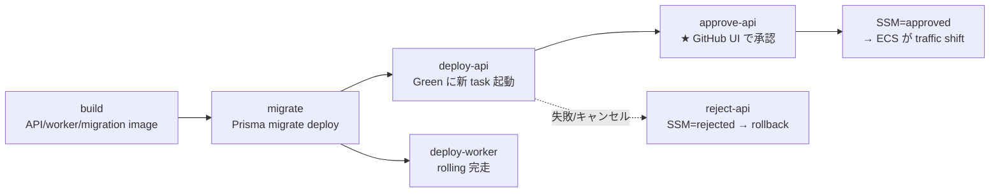

# infra

本リポジトリのインフラ構成を管理するディレクトリ。実装の詳細・モジュール構造は [`infra/terraform/CLAUDE.md`](terraform/CLAUDE.md)、サービス選定とコスト試算は [`docs/infra.md`](../docs/infra.md) を参照。

## 構成

```
infra/
└── terraform/   # AWS Infrastructure as Code (VPC / ECS / RDS / ElastiCache / ALB / ACM / Route53)
```

将来 Kubernetes manifests や Helm chart などを追加する場合もこのディレクトリ配下に置く想定。

## AWS インフラのセットアップ

`infra/terraform/` を実 AWS アカウントにデプロイする手順。**テンプレートから fork した直後 / 新しい AWS アカウントに dev・prd を立てるとき** に一度だけ実施する。

### 目次

- [前提](#前提)
- [1. プロジェクト名のリネーム（テンプレート流用時のみ）](#1-プロジェクト名のリネームテンプレート流用時のみ)
- [2. Bootstrap（S3 tfstate バケット）](#2-bootstraps3-tfstate-バケット)
- [3. Account（OIDC / GitHub Actions IAM role / ECR）](#3-accountoidc--github-actions-iam-role--ecr)
- [4. GitHub Environments のセットアップ](#4-github-environments-のセットアップ)
- [5. env/dev のデプロイ](#5-envdev-のデプロイ)
- [6. env/prd のデプロイ](#6-envprd-のデプロイ)
- [トラブルシューティング](#トラブルシューティング)

### 前提

- AWS アカウント作成済み + IAM ユーザー（管理者権限）。`aws configure` でローカルに資格情報設定済み
- 必要なツール: `brew install terraform tflint trivy`（Terraform 1.12 以降推奨）
- GitHub リポジトリを fork し、最終的な repo 名（例: `kentakki416/typing-royale`）に rename 済み

### 1. プロジェクト名のリネーム

- [ ] `project-template` を実プロジェクト名に置換しておく。**OIDC trust policy で GitHub repo 名を一致判定するため、`github_repository` の更新は CI 復旧の必須条件**。

### 2. Bootstrap（S3 tfstate バケット）

- [ ] remote backend に使う S3 バケットを 1 回だけ作る。state lock は Terraform 1.10+ の S3 ネイティブロック（`use_lockfile = true`）で同バケットのロックファイルを使うため、DynamoDB テーブルは作らない。

```bash
# ローカルでterraform applyを実行する
cd infra/terraform/aws/bootstrap
terraform init
terraform plan
terraform apply
```

### 3. Account（OIDC / GitHub Actions IAM role / ECR）

- [ ] AWS アカウント単位で共有するリソース（OIDC プロバイダ・GitHub Actions IAM role・ECR リポジトリ）を作る。

```bash
# ローカルでterraform applyを実行する。(tfstateはs３に保存)
cd ../account
terraform init   # bootstrap で作った S3 backend に接続
terraform plan
terraform apply

# 出力された role ARN を取得
terraform output -raw github_actions_dev_role_arn
terraform output -raw github_actions_prd_role_arn
terraform output -raw ecr_api_repository_url
```

### 4. GitHub Environments のセットアップ

GitHub Settings → Environments で以下を作成し、各 Environment に **Secret `AWS_ROLE_ARN`** として Step 3 の出力値を登録する。

| Environment | 用途 | Required reviewers | `AWS_ROLE_ARN` の値 |
|---|---|---|---|
| `dev` | env/dev の plan/apply・Docker push・ECS deploy（rolling） | 不要 | `github_actions_dev_role_arn` |
| `prd` | env/prd の plan/apply・Docker push・migration / worker デプロイ | 任意（運用ポリシー次第） | `github_actions_prd_role_arn` |
| `prd-api-approval` | prd の API Blue/Green 切替承認ゲート（GitHub UI で承認ボタンを押すと SSM=approved → ECS が production traffic shift） | **必要**（本番管理者） | `github_actions_prd_role_arn` |

登録後、Pull Request を作ると Terraform CI（`Terraform AWS Env CI`）の OIDC 認証が成功するようになる。

### デプロイ戦略（dev / prd の違い）

| 環境 | ECS API のデプロイ | ワークフロー | 用途 |
|---|---|---|---|
| `dev` | **ローリングデプロイ**（`wait-for-service-stability=true` で完走待ち） | `deploy-aws-dev.yml` | 高速反復を優先。承認ゲート・bake time なし |
| `prd` | **Blue/Green デプロイ**（test listener (9000) で事前検証 + bake time 10 分 + 承認ゲート） | `deploy-aws-prd.yml` | 本番切替の安全性を優先。`prd-api-approval` Environment の Required reviewers が承認した後に production traffic shift |

prd の Blue/Green フロー (`deploy-aws-prd.yml`):



詳細は ALB / ECS workload モジュール定義（`infra/terraform/aws/modules/alb/` と `modules/ecs-workload/`）を参照。dev で Blue/Green を試したくなった場合は `env/dev/main.tf` の `enable_blue_green` を `true` に戻し、ALB SG に port 9000 ingress と `test_listener_allowed_cidrs` 変数を再度追加する。

### 5. env/dev のデプロイ

以降は GitHub Actions の workflow_dispatch から実行する。ローカル apply は不要。

```
Actions → "Terraform AWS Env Apply" → Run workflow → environment: dev
```

apply 完了後、`scripts/seed-secrets.sh` で `DATABASE_URL` / `REDIS_HOST` / `GOOGLE_CLIENT_ID` などを Secrets Manager の `/typing-royale-dev/app` に投入する（Terraform は「箱」だけ作って中身は手動投入する方針）。

API の Prisma マイグレーションは `aws ecs run-task` 経由で migration task を起動する。詳細手順は [`apps/api/README.md` のセットアップ手順](../apps/api/README.md#セットアップ) を参照。

### 6. env/prd のデプロイ

prd は事前にドメイン関連の手動セットアップが必要。

1. **Route53 hosted zone** を Console で作成（例: `typing-royale.com`）し、発行された NS をレジストラに登録（DNS 検証に必須、伝播に最大 48h）
2. `infra/terraform/aws/env/prd/terraform.tfvars`（gitignore 済み）を作成、または GHA `-var` で渡す:
   ```hcl
   domain_name   = "typing-royale.com"
   subdomain     = "prd"
   api_subdomain = "api"
   ```
3. **インフラ apply**（prd Environment の Required reviewers で承認待ちになる）:
   ```
   Actions → "Terraform AWS Env Apply" → Run workflow → environment: prd
   ```
4. apply 完了後、Secrets Manager `/typing-royale-prd/app` に手動投入:
   - `DATABASE_URL` = `postgresql://typingroyale:<password>@<rds_address>:5432/typing_royale?sslmode=require`
     - `<password>` は `terraform output -raw rds_master_user_secret_arn` から取れる Secrets Manager の値
   - `REDIS_HOST` = **`rediss://<redis_address>:6379`**（TLS 有効化のため `rediss://` プレフィックス必須）
   - `GOOGLE_CLIENT_ID` / `GOOGLE_CLIENT_SECRET` / `LIVEKIT_*` / `FRONTEND_URL` 等の外部サービス連携 secret
5. **アプリ deploy**（`deploy-aws-prd.yml`、Blue/Green + 承認ゲート）:
   ```
   Actions → "Deploy to AWS prd" → Run workflow
   ```
   - build → migrate → deploy-api (Green に新 task 起動) → **approve-api**（Actions UI で承認）→ ECS が production traffic shift → bake 10 分後完了
   - 並行して deploy-worker が rolling で完走
6. ECS API service が ALB target group A に登録され healthy になることを確認
7. worker の `desired_count` を 0 → 1 に上げて apply（初回 image push 後の安全策。`var.ecs_worker_desired_count` を導入してもよい）

### トラブルシューティング

| 症状 | 原因 | 対処 |
|---|---|---|
| GHA OIDC で `Could not load credentials from any providers` | `account/variables.tf` の `github_repository` が古い repo 名（trust policy も連動して古い） | Step 1 でリネーム → ローカルから `cd account && terraform apply` → GH Environment の `AWS_ROLE_ARN` を再登録 |
| `terraform init -lockfile=readonly` が `Provider dependency changes detected` | `.terraform.lock.hcl` が無いまたは古い | `terraform providers lock -platform=linux_amd64 -platform=linux_arm64 -platform=darwin_amd64 -platform=darwin_arm64` で 4 プラットフォーム分のハッシュを生成してコミット |
| `cached package does not match any of the checksums` | lock ファイルが macOS arm64 のみ持っていて Linux runner で照合失敗 | 同上 |
| ACM certificate validation が無限待機 | レジストラに NS レコードが反映されていない | Route53 から発行された NS を確認し、レジストラ側に正確に登録（伝播に最大 48h） |
| ALB target が all unhealthy | ECS task が起動失敗、または `/api/health` 応答せず | CloudWatch Logs `/ecs/typing-royale-{env}-api` を確認、Secrets Manager に必須キーが入っているか確認 |
| `Terraform Plan (prd)` で `data.aws_route53_zone.main` が error | hosted zone が AWS に作成されていない or `var.domain_name` が間違い | Route53 Console で `var.domain_name` と完全一致する hosted zone を作る |
